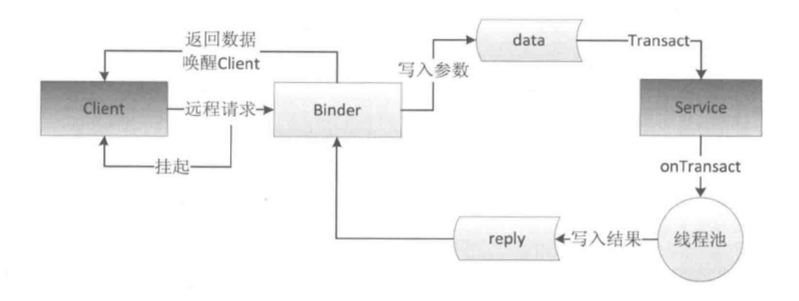
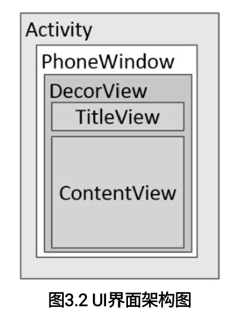

# Android进阶 笔记


### #1 Activity的生命周期和启动模式
##### 1.1 Activity的生命周期全面分析
- 典型情况下的生命周期分析
	- 生命周期
		- `onCreate()`：Activity正在被创建
		- `onDestroy()`：Activity即将被销毁
		- `onStart()`：正在被启动。Activity可见但处于后台，无法交互
		- `onStop()`：即将停止
		- `onResume()`：已经在前台
		- `onPause()`：正在停止
		- 只要是从`onStop()`到`onStart()`，中间一定经过`onRestart()`（不销毁就重启）
- 打开第二个Activity的生命周期
```
当前activity：activity1
准备启动activity2
------
Activity1	onPause()
Activity2	onCraete()>>onStart()>>onResume()
Activity1	onStop()
```
- 异常情况下的生命周期分析
	- 情况1：资源相关的系统配置发生改变导致Activity被杀死重建：例如横屏换竖屏
		- 系统会在`onDestroy()`执行前调用`onSaveInstanceState()`来保存当前Activity的状态
		- 系统会在新Activity调用`onCreate()`后执行`onRestoreInstanceState()`。系统会自动保存当前Activity的视图结构，并在此恢复，如EditText中用户输入的数据，ListView滚动的位置
		- 正常启动时，`onCreate()`传入的bundle为空
	- 情况2：资源内存不足导致低优先级的Activity被杀死
		- 对于Activity，处于后台且不可见的Activity优先级最低，系统会杀死Activity所在进程。杀死后仍通过bundle存储和恢复数据
		- 如果一个进程没有四大组件在运行，则很快被杀死
  - 令Activity屏蔽发生变化的系统配置（不杀死以重新创建）：给Activity指定configChanges属性
    ```groovy
    android:configChanges="orientation|ScreenSize"
    // 屏幕方向
    ```
    - 更多configChanges：p14


##### 1.2 Activity的启动模式
- Activity的LaunchMode④
	- standard：默认
	- singleTop：如果当前Activity已位于栈顶，则此Activity不会被重新创建（不会调用这个Activity的onCreate和onStart），同时它的`onNewIntent()`方法会被调用
	- singleTask：系统首先会寻找是否存在activityA想要的任务栈，如果不存在，则重新创建一个任务栈，然后将activityA加到栈中。如果存在且activityA在栈内，则在activityA上的Activity全部出栈。activityA的`onNewIntent()`方法会被调用
	- singleInstance：具有singleTask模式的所有特性，且此种模式的Activity只能单独地位于一个任务栈中
	- 特殊情况
		- 使用ApplicationContext去启动standard模式的Activity时会报错。解决方法是为待启动的Activity指定标志位FLAG_ACTIVITY_NEW_TASK，此时以singleTask模式启动该Activity
		- 若存在两个任务栈，前台任务栈有ActivityBA（顶》底），后台任务栈有ActivityDC。CD启动模式均为singleTask。当在前台请求启动D时，整个后台任务栈都会加载到前台中。当在前台请求C时，只有C会加载到前台中
- Activity所要的任务栈：与参数TaskAffinity相关，在Manifest中或intent中指定
	- :flags:
- Activity的Flags
	- FLAG_ACTIVITY_NEW_TASK：指定启动模式为singleTask
	- FLAG_ACTIVITY_SINGLE_TOP：指定启动模式为singleTop
	- FLAG_ACTIVITY_CLEAR_TOP：指被启动的Activity在栈中以上的所有Activity都出栈。若启动模式为standard，则该Activity先出栈再重新创建
	- FLAG_ACTIVITY_EXCLUDE_FROM_RECENTS：具有这个标记的Activity不会出现在历史列表中


##### 1.3 IntentFilter的匹配规则
- 需指定action、category和data信息，可以匹配多个。一个activity中也可以有多个intent-filter
- 匹配规则：:flags:


### #2 IPC机制
##### 2.1 进程简介
- IPC：Inter-Process Communication进程间通信
- 进程与线程
	- 线程是CPU调度的最小单元，是一种有限的资源。进程指一个执行单元，在PC和移动设备上指一个程序或app。一个进程可以包括多个线程
	- 任何一个系统都有IPC机制。Android中进程间通信并不完全继承自Linux，其方式包括了Binder、Socket等
- 使用多进程的场景
	- 因为某些原因需要运行在单独的进程中
	- 加大应用可使用的内存而使用多进程
	- ContentProvider或者其他直接获取其他应用的数据的方式
- 利用adb shell查看进程
	- `ps -A`
	- 从结果中匹配名字：`ps -A|grep com.***.***`

##### 2.2 Android中的多进程模式
- 开启多进程
	- 常规下只有一种方法：给四大组件指定`android:process`属性（在Manifest中）
	- 系统会为每个应用分配一个唯一的uid，具有相同uid的应用（或相同的ShareUID且相同签名）才能共享数据，相互访问
    ```xml
    :表示私有进程,在ps命令下完整进程名为[包名]:process
    android:process=":test2"
    ```
- 多进程机制
	- Android为每个进程分配了一个独立的虚拟机，不同的虚拟机在内存分配上有不同的地址空间，这导致在不同虚拟机中访问同一个类的对象会产生多份副本
- 多进程机制带来的问题
	- 无法通过内存来共享数据，静态成员和单例模式完全失效
	- 线程同步机制完全失效，因为锁的不是同一个对象
	- SharedPreference的可靠性下降，因为它不是线程安全的
	- App会多次创建（毕竟是多进程）
	- 需要通过IPC实现数据交互

##### 2.3 IPC基础概念介绍
- Serializable接口和Parcelable接口可以完成对象的序列化过程。当需要使用Intent和Binder传输数据时就需要用到序列化对象
- Parcelable接口
	- android提供的序列化方式，没Serializable那么简便，但效率高。主要用于内存序列化上
	- 只要实现了这个接口，一个类的对象就可以实现序列化并可以通过Intent和Binder传递
		- `private 构造器(Parcel in)`：用于反序列化
		- `writeToParcel()`：用于序列化
		- `describeContents()`：仅当前对象中存在文件描述符时返回1
	- 使用组合的情况：读取parcelable对象，需要传递当前线程的上下文类加载器
```java
private User(Parcel in){
	userId = in.readInt();
	userName = in.readString();
	isMale = in.readInt() == 1;
	book = in.readParcelable(
		Thread.currentThread()
		.getContextClassLoader());
}
```
- AIDL
    - Android Interface Definition Language安卓接口定义语言
    - SDK会自动为我们生成AIDL所对应的Binder类，包括了方法，以及用以标识方法的id
    - AIDL是Android提供快速生成Binder代码的工具。不使用AIDL手写Binder也是可行的
    - AIDL支持的数据类型
        - 基本数据类型
        - String和CharSequence
        - ArrayList，里面每个元素都必须能被AIDL支持
        - HashMap，key和value都需要被AIDL支持
        - Parcelable。若使用到了自定义的Parcelable对象，则需要新建一个同名的AIDL文件
        ```java
        // 在IBookManager.aidl中用到了Book这个类，
        // 所以必须要创建Book.aidl
        parcelable Book;
        ```

- Binder
	- 是Android中的一个类，实现了IBinder接口
	- 也是一种虚拟的物理设备，设备驱动是/dev/binder
	- Android独有的IPC方式
		- 普通Service中的Binder不涉及IPC
		- AIDL用到了Binder涉及IPC的部分
	- 成员
		- DESCRIPTOR
			- Binder的唯一标识
			- 一般用Binder的类名表示，如`"com.example.test.ISongServer"`
		- 方法的ID
			- 常量名为`TRANSACTION_方法名`
			- int类型
		- asInterface(android.os.IBinder obj)
			- 如果客户端和服务器端处于同一进程，则返回Stub对象
			- 否则返回Stub.Proxy对象
		- onTransact(int code, android.os.Parcel data, android.os.Parcel reply, int flags)
			- 运行在服务端中的Binder线程池中
			- 当客户端发起跨端请求时，该请求会通过系统底层封装后交由此方法处理
			- 变量code指定了目标方法(要调用的方法)
			- 变量data指定了目标方法所需的参数
			- 变量reply表示目标方法的返回值
			- 方法返回false时，表示请求失败
		- Proxy内部类
			- 在ServiceConnection中绑定时，IPC下通信方式会返回Proxy实例
			```java
			ISongServer server = ISongServer.Stub.asInterface(service);
			```
			- Proxy包含了aidl中声明的方法
				- 方法运行在客户端
				- 内部调用了transcat方法来发起远程调用
				- 发起请求时，当前线程会被挂起直到服务器端返回数据；返回数据时唤醒线程
- Binder工作机制
	- 
		- 当客户端发起请求时，当前线程将会挂起直到服务端进程返回数据
	- 服务器端Binder的异常终止
		- 方法1：设置死亡代理
			- 当服务器端Binder意外终止时会收到死亡代理的通知
			- 在客户端绑定远程服务后，使用linkToDeath设置死亡代理
			- 死亡代理是IBinder.DeathRecipient对象，当Binder死亡时，会调用其binderDied()方法。在该方法中可以
				- 使用unlinkToDeath解除对当前死亡代理的绑定
				- 重新绑定远程服务
		- 方法2：在`onServiceDisconnected()`中重新连接


##### 2.4 Android中的IPC方式
- Bundle
	- 使用Bundle在四大组件间通信（除ContentProvider）
	- Bundle通过Intent发送。因为Bundle实现了Parcelable接口，从而实现进程间传递数据，因此对数据类型有限制
- 文件（包括SharedPreferences）
	- Windows上如果一个文件被加入了排斥锁，则其他线程无法对其进行访问
	- Android基于Linux系统，使得其并发读写可以没有限制地进行，因此应该避开并发操作
	- 对文件格式无限制，但是难免避开并发性的问题。适用于对同步要求不高的进程之间通信
	- SharedPreference也属于文件的一种，但由于系统对其读写有一定的缓存策略，因此在多进程模式下，系统对它的读写并不可靠，面对高并发读写访问时，有很大几率会丢失数据
- 使用Messenger
	- 在不同进程之间传递Message对象。本质是AIDL
	- 只能通过Handler处理方法调用
	- 只能传输Bundle支持的数据类型
	- 在服务端中需要
		- 创建一个Service来处理客户端的连接请求
		- 创建一个Handler，并通过它来创建一个Messenger对象
		- 在Serivce的`onBind()`中返回这个Messenger对象底层的Binder
	- 在客户端中需要
		- 绑定服务端的Service，并使用其返回的IBinder对象创建一个Messenger
		- 通过Messenger，可以向服务端发送Message对象
	- 使用
		- 使用Message的replyTo回复消息给服务端
- 使用AIDL
	- 在服务端中需要
		- 创建Service用来监听客户端的连接请求
		- 创建一个AIDL文件用于暴露接口（提供方法但不实现）
		- 在Service中实现这些接口
		- 要注意存在并发冲突，比如使用CopyOnWriteArrayList来取代ArrayList
  ```aidl
  // aidl
  package com.example.servicetest;
  interface MyAIDLService {
  	int plus(int a, int b);
  	String toUpperCase(String str);
  }
  ```
  
  ```java
  // service
  @Override
  public IBinder onBind(Intent intent) {
      return mBinder;
  }
  
  MyAIDLService.Stub mBinder = new Stub() {
  
      @Override
      public String toUpperCase(String str) throws RemoteException {
          if (str != null) {
              return str.toUpperCase();
          }
          return null;
      }
  
      @Override
      public int plus(int a, int b) throws RemoteException {
          return a + b;
      }
  };
  ```
  - 在客户端中需要
      - 绑定Service并将其返回的Binder还原为AIDL接口所属的类型并调用AIDL提供的方法，就像往常使用普通service一样
  
  ```java
  @Override
  public void onServiceConnected(ComponentName name, IBinder service) {
      myAIDLService = MyAIDLService.Stub.asInterface(service);
      try {
          int result = myAIDLService.plus(3, 5);
          String upperStr = myAIDLService.toUpperCase("hello world");
          Log.d("TAG", "result is " + result);
          Log.d("TAG", "upperStr is " + upperStr);
      } catch (RemoteException e) {
          e.printStackTrace();
      }
  }
  ```
  
- aidl与监听者模式：如何实现解注册
	- 因为序列化前后的对象不是同一个对象，所以无法解注册
	- 使用`RemoteCallbackList`来删除跨进程listener的接口
		- 原理：尽管不是同一对象，但是两者皆具有Binder对象。通过一一比对后删除
- 在AIDL中进行权限验证：默认情况下，远程服务任何人都可以连接
	- 方法1：在`onBind()`中进行验证，验证不通过直接返回null
		- 在AndroidManifest中声明所需权限
		- 在需要得到该权限的应用中，在Manifest使用`<uses-permission ...>`声明权限
		- 在`onBind()`中检查，使用checkCallingOrSelfPermission()检查权限
	- 在服务端的onTranscat方法中进行验证
- 跨app的IPC
	- 在`Manifest`中，为service添加action
  ```xml
  <service
      android:name="com...MyService"
      android:process=":remote" >
      <intent-filter>
          <action android:name="com...MyAIDLService"/>
      </intent-filter>
  </service>
  ```
	- 将服务端的aidl连同原有的包路径一起拷贝到客户端
	- 在客户端中，intent要指定该action
	- Android5.0+还需要显性声明包名
  ```java
  Intent intent = new Intent("com...MyAIDLService");
  intent.setPackageName(this.getPackageName());
  bindService(intent, connection, BIND_AUTO_CREATE);
  ```
- 使用ContentProvider
	- 数据源访问方面功能强大，支持一对多并发数据共享。Binder是其底层实现
	- 将ContentProvider放在独立进程中时，Provider以及访问这个Provider的组件需要声明权限
	- `onCreate()`方法仍会在主线程中执行，其余方法则在单独的线程中执行
- 使用Socket套接字
	- 功能强大，但实现略麻烦
	- 流程
		- 当Service启动时，会在线程中建立TCP服务，然后等待客户端的连接请求
		- 当有客户端连接时，就会生成一个新的Socket

##### 2.5 Binder连接池
- 对于多个Binder时，每个Binder创建一个Service是不妥的，因为Service是一种系统资源
- 在客户端中使用Binder连接池，从而不需要创建多个Service
	- 没有专门的类提供Binder连接池的逻辑，需要自己实现

- 使用思路

  -   服务端提供一个queryBinder接口，用以根据业务模块特征(id)返回对应的Binder对象
  -   不同业务模块拿到所需的Binder对象后就进行远程方法调用
  -   Binder连接池的主要作用是将每个业务模块的Binder请求统一转发到远程service中执行
  -   概括：n个客户端AIDL接口、1个query、n个Binder、1个Sercice

  ```java
  // query
  @Override
  public IBinder queryBinder(int binderCode)throws ..{
      Ibinder binder = null;
      switch(binderCode){
          case BINDER_1:{
              // ...
          }
          case BINDER_2:{
              // ...
          }
      }
      return binder;
  }
  ```

  ```java
  // Binder连接池
  ```

  


### #3 View的事件体系

##### 3.1 View的基础知识
- 两个坐标系
	- Android坐标系：以屏幕左上角为原点
		- `getLocationOnScreen(int locaiotn[])`：返回View左上角在Android坐标系中的坐标
		- `getRawX()`、`getRawY()`：同上
	- 视图坐标系：以父视图左上角为原点
- View的位置参数：由四个顶点来决定
	- top, bottom：View到父视图顶部的距离
	- left, right：View到父视图左侧的距离
	- x, y：视图坐标系中左上角的坐标
	- translationX, translationY：top，left相对于父容器的偏移量。有如下参数关系：y = top + translationY
	- 这些参数都可以通过`get()`获取
- MotionEvent和TouchSlop
	- 典型的MotionEvent
		- ACTION_DOWN：下手接触
		- ACTION_MOVE：手指在移动
		- ACTION_UP：手松开
		- ACTION_OUTSIDE：手超出边界
		- ACTION_POINTER_DOWN：多点按下
		- ACTION_POINTER_UP：多点离开
	- 常见事件模板
	    - 点击事件：DOWN>>UP
	    - 滑动事件：DOWN>>MOVE>>UP
	- 可以通过MotionEvent对象获取点击事件发生的x和y坐标
	    - getX/getY：返回相对于当前View的左上角x和y坐标
	    - getRawX/getRawY：返回相对于手机屏幕左上角的x和y坐标
	- TouchSlop：常量，系统能识别出的被认为是滑动的最小距离
	    - 获取(Java中)
    ```java
    ViewConfiguration.get(getContext()) .getScaledTouchSlop()
    ```
    - 获取(源码中)：frameworks/base/core/res/res/values/config.xml文件中，config_viewConfigurationTouchSlop标签内
- VelocityTracker： 速度追踪
- GestureDetector：手势检测，用于辅助检测用户单击、滑动、长按、双击等行为
- Scroller：用于实现View内的弹性滑动


##### 3.2 View的移动(瞬间改变位置，跟手滑动)
- 使用layout() 或 使用offsetLeftAndRight()与offsetTopAndBottom()
```java
int offsetX = rawX - lastX;
int offsetY = rawY - lastY;
layout(getLeft()+offsetX,
	  getTop()+offsetY,
	  getRight()+offsetX,
	  getBottom()+offsetY);
```
- 使用View本身提供的scrollTo或scrollBy  
	- scrollTo()：表示移动到一个具体的坐标点
	- scrollBy()：表示移动的增量
	- 对View使用如上方法并不会令View移动，而是其所有子元素一起移动（如：子View、ImageView的drawable对象）。要使View动起来，应该在其父元素中使用该方法
	- mScrollX、mScrollY以向上向左为增加，与我们想要的相反，故需使用负数值
```java
int offsetX = rawX - lastX;
int offsetY = rawY - lastY;
((View)getParent()).scrollBy(-offsetX, -offsetY);
```
- 使用动画添加效果
	- 使用translationX, translationY属性
	- 使用View动画时，并不能真正改变View的位置
		- 当通过View动画将一个按钮向右移动后，点击新位置无法触发onClick事件
		- 因为view的位置信息（四个顶点）并不会随着动画而改变
		- 如果希望动画后的状态得以保留，还需要设置filAfter为true
	- 使用属性动画时，没有上述缺点
- 改变布局参数使得重新布局，即改变LayoutParams
	- 修改布局的margin，或者通过改变相邻view的宽高进行挤压
  ```java
  LinearLayout.LayoutParams layoutParams = (LinearLayout.LayoutParams) getLayoutParams();
  layoutParams.leftMargin = getLeft()+offsetX;
  layoutParams.topMargin = getTop()+offsetY;
  setLayoutParams(layoutParams);
  ```
  

##### 3.3 弹性滑动
- 使用Scroller
	- 通过`invalidate()`方法重绘View。Scroller本身并不能实现View的滑动，需要配合View的`computeScroll()`方法才能实现弹性滑动
	- `computeScroll()`不断查询动画时间是否达到duration，并不断更新下一个滑动至的位置
- 通过动画：这里的滑动同样针对的是View的内容
- 使用延时策略
	- 可以使用Handler或View的postDelayed()，亦或是线程的sleep()
	- 该方法无法精确地定时，原因是系统的消息调度也是需要时间的
    ```java
    private Handler mHandler = new Handler(){
        @Override
        public void handleMessage(@NonNull Message msg) {
            switch (msg.what){
                case MESSAGE_SCROLL_TO:
                    // 左移100px
                    mCount++;
                    if (mCount <= FRAME_COUNT){
                        float fraction = mCount/(float)FRAME_COUNT;
                        int scrollX = (int)(fraction*100);
                        view.scrollTo(scrollX, 0);
                        mHandler.sendEmptyMessageDelayed(MESSAGE_SCROLL_TO, DELAYED_TIME);
                    }
                    break;
            }
        }
    };
    ```


##### 3.4 View的事件方法机制
- 点击事件的分发过程由三个重要的方法共同完成
	- dispatchTouchEvent(MotionEvent ev)
		- 事件分发
		- 若当前view收到了点击事件，则该方法必定会被调用
		- 返回结果表示是否消耗当前事件，受当前View的onTouchEvent和下级的dispatchTouchEvent方法的影响
	- onInterceptTouchEvent(MotionEvent ev)
		- 事件拦截
		- 返回结果表示是否决定要拦截当前事件
		- ViewGroup才有该方法，View没有
	- onTouchEvent(MotionEvent ev)
		- 事件处理
		- 返回结果表示是否消耗当前事件
		- 如果不消耗，则在同一个事件序列中，当前View无法再接收到事件

  ```java
  // 伪代码
  public boolean dispatchTouchEvent(MotionEvent ev){
  	boolean consume = false;
      if(onInterceptTouchEvent(ev)){
          consume = onTouchEvent(ev);
      }else{
          consume = child.dispatchTouchEvent(ev);
      }
      return consume;
  }
  ```

- 点击事件传递规则
	- 滑动事件会在滑动起点处从最外部的ViewGroup一直传到最内部的View中。注意是滑动起点处
	- 点击事件的传递顺序：Activity>>Window>>View
    ```
    dispatchTouchEvent(group)>> id:2131231196 event:0
    onInterceptTouchEvent(group)>> id:2131231196 event:0
    dispatchTouchEvent(group)>> id:2131231197 event:0
    onInterceptTouchEvent(group)>> id:2131231197 event:0
    dispatchTouchEvent(text)>> id:2131231198 event:0
    onTouchEvent(text)>> id:2131231198 event:0
    onTouchEvent(group)>> id:2131231197 event:0
    onTouchEvent(group)>> id:2131231196 event:0
    ```
- 事件拦截
	- 正常情况下，一个事件序列只能被一个View拦截并消耗
	- 某个View一旦决定拦截，那么这一个事件序列都只能由它来处理都会直接交由其处理，并且它的onInterceptTouchEvent不会再被调用
- 事件处理
	- 某个View如果处理事件时不消耗ACTION_DOWN事件，那么同一事件序列都不会再交给它来处理，并且事件将重新交由它的父元素去处理
	- 如果View不消耗除ACTION_DOWN以外的其他事件，那么这个点击事件会消失，此时父元素的`onTouchEvent()`并不会被调用，并且当前View可以持续收到后续的事件，最终这些消失的点击事件会传递给Activity处理
	- View的`onTouchEvent()`默认都会消耗事件，除非它是不可点击的，即Clickable和LongClickable同时设置为false。当View是不可点击的，onClick()方法也不会被调用
	- View的enable属性不影响`onTouchEvent()`的返回值
	- 通过`requestDisalloeInterceptTouchEvent()`可以在子元素中干预父元素的事件分发过程，但是ACTION_DOWN事件除外
	- 如果一个View设置了OnTouchListener，则假若其中的onTouch()返回true，`onTouchEvent()`将不会被调用。可以说OnTouchListener的优先级比`onTouchEvent()`要高
- 事件分发的源码解析
	- Activity对点击事件的分发过程
	- Window对事件的分发过程
		- Window是抽象类，PhoneWindow是其的实现类。
		- 通过`superDispatchTouchEvent()`将事件传递给DecorView
	- 顶级View对点击事件的分发过程
	- View对点击事件的处理过程
		- 将view设置为disable仍会消耗点击事件
		- 消耗点击事件指的是`onTouchEvent()`返回true


##### 3.5 View的滑动冲突
- 常见的滑动冲突场景
	- 外部左右可滑动，内部上下可滑动
		- 例：左右切换fragment，上下滑动fragment中的内容
	- 外部上下可滑动，内部上下可滑动
	- 外部左右可滑动，内部左右可滑动，内部2上下可滑动
		- 前面两种场景的嵌套
- 滑动冲突的处理规则
- 滑动冲突的解决方式
	- 外部拦截法
		- 点击事件都先经过父容器的拦截处理，如果父容器需要此事件就拦截
		- 上述逻辑在父容器的`onInterceptTouchEvent()`中处理
		- 这种方法符合安卓中的事件分发机制
	- 内部拦截法
		- 父容器不拦截任何事件，所有的事件都传递给子元素，如果子元素需要就直接消耗掉，否则就交由父容器进行处理
		- 需要配合requestDisallowInterceptTouchEvent方法完成
		- 上述逻辑在子元素的`dispatchTouchEvent()`中处理
		- 除了子元素需要做处理外，父元素也要默认拦截除了ACTION_DOWN以外的其他事件


### #4 View的工作原理
##### 4.1 UI界面架构图

- ViewRoot
	- 用于连接WindowManager和DecorView的纽带
	- View的三大流程都是由ViewRoot完成的，是从ViewRoot的performTraversals方法开始的
- DecorView
	- 顶级View，是一个FrameLayout
	- 一般情况下内部包括了一个竖直方向的LinearLayout，包含了两部分：titlebar和android.R.id.content，后者由`setContentView()`指定布局
- 可以通过设置`requestWindowFeature(Window.FEATURE_NO_TITLE)`去除TitleView
	- 该方法一定要在调用`setContentView()`之前
- 程序在调用`setContentView()`后，ActivityManagerService会回调`onResume()`，此时系统才会把整个DecorView添加到PhoneWindow中


##### 4.2 LayoutInflater
- LayoutInflater用于加载布局
	- inflate()方法的参数
		- 当root参数不为null，会为view设置layout param
```kotlin
val button = LayoutInflater.from(context)
				.inflate(R.id.button, null, false)
```
- LayoutInflater内幕
```java
public View inflate(XmlPullParser parser, @Nullable ViewGroup root, boolean attachToRoot) {  
    synchronized (mConstructorArgs) {  
        // ...
        final Context inflaterContext = mContext;  
        final AttributeSet attrs = Xml.asAttributeSet(parser);  
        Context lastContext = (Context) mConstructorArgs[0];  
        mConstructorArgs[0] = inflaterContext;  
        View result = root;  

		// ...
        // 通过反射得到View的实例
		// Temp is the root view that was found in the xml  
		final View temp = createViewFromTag(root, name, inflaterContext, attrs);  
		ViewGroup.LayoutParams params = null;  

		if (root != null) {  
			if (DEBUG) {  
				System.out.println("Creating params from root: " +  
						root);  
			}  
			// Create layout params that match root, if supplied  
			params = root.generateLayoutParams(attrs);  
			if (!attachToRoot) {  
				// Set the layout params for temp if we are not  
				// attaching. (If we are, we use addView, below)    
				temp.setLayoutParams(params);  
			}  
		}  
		// 加载子元素  
		// Inflate all children under temp against its context.  
		rInflateChildren(parser, temp, attrs, true);  

		if (DEBUG) {  
			System.out.println("-----> done inflating children");  
		}  

		// We are supposed to attach all the views we found (int temp)  
		// to root. Do that now.                
		if (root != null && attachToRoot) {  
			root.addView(temp, params);  
		}  

		// Decide whether to return the root that was passed in or the  
		// top view found in xml.                
		if (root == null || !attachToRoot) {  
			result = temp;  
		}  
		
		// ...
        return result;  
    }  
}
```


##### 4.3 View的工作流程
- 三大流程的起点
	- 父View调用子View的绘制
	- 对于最外层的根视图，绘制起点是ViewRootImpl的成员方法performTraversals()中（该方法有700多行代码）
- MeasureSpec
	- 一个32位的int值
		- 高2位代表SpecMode测量模式
		- 低30位代表SpecSize测量大小
		- 通过将两者打包成一个int值来避免过多的对象内存分配
	- SpecMode
		- UNSPECIFIED
			- 父容器不对View有任何限制，要多大给多大。一般用于系统内部
		- EXACTLY
			- 当将控件属性指定为具体数值或match_parent时，系统使用该模式
		- AT_MOST
			- 对应于LayoutParams中的wrap_content
			- 父容器指定了一个可用大小SpecSize，View的大小不能大于这个值
- MeasureSpec和LayoutParams的对应关系
	- MeasureSpec的大小由父容器大小和LayoutParams共同决定
	- 在View测量的时候，系统会将LayoutParams在父容器的约束下转换成对应的MeasureSpec
- onMeasure(int widthMeasureSpec, int heightMeasureSpec)
	- 决定宽高，使用MeasureSpec来完成
	- View只需调用此方法即可完成测量过程
	- ViewGroup除了完成测量过程，还需要遍历调用所有子View的measure方法
	- 只有测量过程完成后，才能得到View的正确宽高，否则返回0
		- 可以通过view.post()的方式在view的外部获取view的宽高。获取时view的绘制过程必然已经完成
	- 这个方法在ViewGroup的measureChild()中被调用
	- 过程：从MeasureSpec中获取测量模式和大小
	- 自定义View时，如需支持wrap_content属性，需要重写该方法
- layout过程：确定位置
	- layout()方法用于设置view的位置。该方法会调用onLayout()方法
	- 在View中，onLayout()方法是空的。因为子视图的位置应该由父视图来决定
	- 当ViewGroup的位置被确定后，在onLayout中遍历所有子元素并调用其layout方法
	- 在自定义ViewGroup时，通常需要重写`onLayout()`方法来控制子View显示位置的逻辑
- getWidth()和getMeasureWidth()
	- 两者的值理论上一致
	- getMeasureWidth()在measure()后就可以得到有效值
	- getWidth()在layout()后才能得到有效值，其值为view的右坐标减去左坐标得到
- draw过程：绘制
	- 使用Canvas对象以进行绘制，bitmap对象则用于存储绘制在Canvas画布上的像素信息
	- 遵循如下步骤
		- 绘制背景background.draw(canvas)
		- 绘制自己onDraw()
		- 绘制children：dispatchDraw()
		- 绘制装饰onDrawScrollBars()
- 重绘过程invalidate内幕
	- 调用父View的invalidateChild()方法
	- 循环调用父View的ViewGroup的成员invalidateChildInParent()
	- 当循环到最外层的布局时，调用ViewRoot的成员invalidateChildInParent()
	- 最终通过handler，执行performTraversals()
	- 因为标志位的缘故，虽然重新执行了performTraversals()，但是不会执行measure和layout过程
- 使用requestLayout()使得View的绘制流程完完全全地重新开始，包括measure和layout过程

##### 4.4 View状态
- 常用状态
	- enabled
		- 表示View是否可用。可以通过setEnable()改变
		- 不可用的View无法响应onTouch事件
	- focused
		- 表示View是否得到焦点
		- 键盘、电视中能够通过上下左右按键使得View得到焦点
		- 手机中（貌似）需要自定义View来改变isFocusable()的结果才能保证能够得到焦点
	- window_focused
		- 表示当前窗口是否处于正在交互的窗口中
		- 该值由系统自动决定，程序不可以进行更改
	- selected
		- 表示View是否处于选中状态
		- 调用setSelected()改变该值
	- pressed
		- 表示View处于按下状态
		- 调用setPressed()改变该值
- 状态变更与Drawable的对接
	- 发生在View的成员drawableStateChanged()方法中


##### 4.5 Canvas
- Canvas是画图的api，真正的内存是Bitmap
- 坐标系
	- Canvas坐标系：坐标原点在View的左上角
	- 绘图坐标系
		- Canvas.drawXX()方法中的参数都是绘图坐标系的坐标
		- 默认与Canvas坐标系相同，但是该坐标系可以通过translate, rotate, scale等方法进行变换
- save和restore
	- save()用于将画布当前的坐标系状态保存
	- restore()用于将画布坐标系回到save()时的状态
- Paint
	- setARGB() 设置 Paint对象颜色，参数一为alpha透明值
	- setColor()
	- setAlpha() 设置alpha不透明度，范围为0~255
	- setAntiAlias() 抗锯齿
	- setTextScaleX()  文本缩放倍数，1.0f为原始
	- setTextSize()  设置字体大小
	- setStrokeWidth() 笔宽度
	- setUnderlineText()  设置下划线
	- setStrokeJoin() 笔刷转弯处的连接风格
	- setStrokeCap() 笔刷的图形样式(体现在线的端点上)
	- setDither() 抖动效果


##### 4.6 自定义View
- 比较重要的回调方法
	- `onFinishInflate()`：从XML加载组件后回调
	- `onSizeChanged()`：组件大小改变时回调
	- `onMeasure()`：回调该方法来进行测量
	- `onLayout()`：回调该方法来确定显示的位置
	- `onTouchEvent()`：监听到触摸事件时回调
- 自定义View的分类及示例
	- 继承View重写onDraw
		- 需要在onMeasure中让View支持wrap_content
		- 尽量不要在View中使用Handler，没必要
		- View中如果有线程或者动画，需要及时停止，参考View#onDetachedFromWindow
		- View带有滑动嵌套情形时，需要处理好滑动冲突
		- 在xml中支持其他自定义属性
	- 继承ViewGroup派生特殊的Layout
	- 继承特定的View（如TextView）
	- 继承特定的ViewGroup（如LinearLayout）


### #5 理解RemoteViews

- RemoteView提供了跨进程更新界面的操作

##### 5.1 RemoteViews的应用

- 通知栏上

- 桌面widget上

  - 定义widget界面
  - 定义widget配置信息
  - 定义AppWidgetProvider的子类
  - 在Manifest中声明

- AppWidgetProvider：本质是广播

  - onUpdate()
  - onEnabled()
  - onDisabled()
  - onDeleted()
  - onReceive()

- PendingIntent：

  > 处于pending状态下的intent。pending表示待定、即将发生的意思

  - 支持三种特定意图：启动Activity、启动Service、发送广播

##### 5.2 RemoteViews的内部机制

- RemoteViews的限制
  - 仅支持部分View类型，且不包括其子类
  - 不提供findViewById()方法，只能用一系列set方法完成

##### 5.3 RemoteViews的意义

##### ex5-3 实现广播RemoteView


[TOC]

### #6 Drawable
##### 6.1 Drawable简介
- Drawable是一种抽象的概念，表示能够被绘制的事物
	- 与 View 不同，Drawable 没有办法接收事件或以其他方式与用户交互
- 内部宽、高的获取：getIntrinsicWidth/Height
	- 不是所有的Drawable都有内部宽高，颜色Drawable就没有
- px与dp、sp互换
  ```java
  // dp与px
  public static int dp2px(Context context, float dpValue){
  	final float scale = context.getResources()
          .getDisplayMetrics()
          .density;
      return (int)(dpValue*scale+0.5f);
  }
  
  // sp与px
  public static int sp2px(Context context, float spValue){
  	final float scale = context.getResources()
          .getDisplayMetrics()
          .scaledDensity;
      return (int)(spValue*scale+0.5f);
  }
  ```

##### 6.2 Drawable的分类
- Bitmap：可以直接引用原始图片，也可以通过XML方式来描述。后者能设置效果
  ```
  android:src=“@[package:]drawable/img”
  android:antialias		// 抗锯齿
  android:dither			// 抖动效果：可以让高质量图片在低质量屏幕上有不错的显示效果
  android:filter			// 图片被拉伸时保存较好的显示效果
  android:mipMap			// 纹理映射
  android:tileMode		// 平铺模式。开启后，忽略gravity属性
  android:gravity			// 位置
  ```

- Shape：有四种图形》rectangle、oval、line、ring
	- ring有5个特殊的属性
		- innerRadius圆环内半径
		- thickness厚度
		- innerRadiusRatio内半径占比
		- thicknessRatio厚度占比
		- useLevel一般为false
- Layer
	- 对应于\<layer-list>标签，可以实现类似ps中图层的效果
	- 通过将不同Drawable放在不同的层上面从而达到叠加后的效果
- Selector
	- 对应于\<selector>标签，常见状态
		- 默认：无需声明
		- 焦点：state_focused
		- 点击：state_pressed
		- 选中：state_sele
	- 表示Drawable的集合，每个Drawable都对应折View的一种状态，自带逻辑
- LevelListDrawable
	- 对应于\<level-list>标签
	- 根据不同level，切换至对应的Drawable
- TransitionDrawable
	- 对应于\<transition>标签
	- 表示Drawable之间淡入淡出的效果
- InsetDrawable
	- 对应于\<inset>标签
	- 将其他Drawable内嵌到自己当中，并可以在四周留出一定的间距。通过LayerDrawable也可以实现这种效果
- ScaleDrawable

  - 对应于\<scale>标签
  - 根据level指定Drawable缩放到一定比例

- ClipDrawable

  - 对应于\<clip>标签
  - 根据当前level来裁剪Drawable


##### 6.3 自定义Drawable

- 核心就是draw()，通过重写该方法实现自定义。自定义的Drawable无法在XML中使用
- 使用Canvas
    - canvas提供的方法
        - `Canvas.save()`：保存画布
        - `Canvas.restore()`：合并图层，将在`save()`之后绘制的图像与之前的图像进行合并
        - `Canvas.translate()`：默认绘图坐标零点位于屏幕左上角，调用该方法后原点移到了（x，y）
        - `Canvas.rotate()`：将坐标系旋转了一定的角度

```kotlin
class TypeIndicator(color: Int) : Drawable() {
    private val radius: Float = 12f
    private val paint: Paint = Paint(Paint.ANTI_ALIAS_FLAG)

    init {
        paint.color = color
    }

    override fun draw(canvas: Canvas) {
        canvas.drawRoundRect(RectF(bounds), radius, radius, paint)
    }

    override fun setAlpha(alpha: Int) {
        paint.alpha = alpha
        invalidateSelf()
    }

    override fun setColorFilter(colorFilter: ColorFilter?) {
        paint.colorFilter = colorFilter
        invalidateSelf()
    }

    override fun getOpacity(): Int {
        return PixelFormat.TRANSLUCENT
    }
}
```


### #7 Android动画深入分析
##### 7.1 View动画（补间动画）
- View动画的种类
	- 四种变换效果 - 对应四种变换子类
		- alpha、scale、translate、rotate
		- TranslateAnimation、SacleAnimation、RotateAnimation、AlphaAnimation
- 创建动画：通过res/anim/filename.xml来定义（根元素为set），或者使用代码来动态创建
	- android:interpolator：表示动画集合所采用的插值器，插值器影响动画的速度。非匀速动画就需要通过插值器来控制动画的播放过程
	- android:shareInterpolator：表示集合中的动画是否共享同一个插值器
- 自定义View动画
	- 继承自Animation，并重写
		- initialize()：初始化
		- applyTransformation()：进行相应的矩阵变换。可采用Camera
- 帧动画
	- 使用XML来定义一个AnimationDrawable，然后将其作为View的背景并通过Drawable来播放
	- 使用简单，但容易引起OOM


##### 7.2 View动画的特殊使用场景
- LayoutAnimation
	- 作用于ViewGroup的动画效果。当其子元素出场时皆会带有这种动画效果
	- 使用XML定义LayoutAnimation
		- android:delay：表示子元素开始动画的时间延迟
		- android:animationOrder：有三种顺序：normal、reverse（排在后面的优先放动画）、random
		- android:animation：为子元素指定定义动画
	- 在layout布局文件中
		- 通过指定android:layoutAnimation设置动画
		- 也可以使用LayoutAnimationController来指定
- Activity的切换效果
	- 使用overridePendingTransition来指定动画
		- 这个方法必须在startActivity()或者finish()之后被调用才能生效


##### 7.3 属性动画
- 常用动画类包括了ValueAnimator（xml中标签为`animator`）、ObjectAnimator和AnimatorSet等
- 使用属性动画
	- 通过代码指定或在res/animator/下的xml文件中定义
	- `ofFloat()`等方法中可以传入多个参数作为中间过渡状态
	- 封装的能力（常见）
		- "alpha"透明度
		- "rotation"旋转
		- "translationX"平移
		- "scaleX"放大
	- 属性动画内幕
		- 找到属性对应的get和set方法
	- 加载xml动画：`AnimatorInflater.loadAnimator(this, R.animator.anim_file);`
- 组合动画AnimatorSet
	- 可以控制动画播放顺序等
		- 例如`set.play(rotate).with(fadeInOut).after(moveIn)`
		- 该语句设置了先执行moveIn动画，然后rotate和fadeInOut动画一起执行
  ```java
  // ex7_1_popup_menu
  // ...
  ObjectAnimator animator3 = ObjectAnimator.ofFloat(
          mImageViews.getChildAt(3),
          "translationY",
          -300F);
  ObjectAnimator animator4 = ObjectAnimator.ofFloat(
          mImageViews.getChildAt(4),
          "translationX",
          -300F);
  AnimatorSet set = new AnimatorSet();
  set.setDuration(500);
  set.setInterpolator(new BounceInterpolator());
  set.playTogether(animator0, animator1, animator2, animator3, animator4);
  set.start();
  ```

- 理解插值器TimeInterpolator和估值器TypeEvaluator
	- 两者是实现非线性动画的关键，其中前者决定动画速度属性，后者计算动画某一时刻下的动画属性
	- 插值器包括了
		- AccelerateInterpolator
		- AnticipateInterpolator
		- LinearInterpolator
		- DecelerateInterpolator
		- BounceInterpolator
		- OvershootInterpolator

- 属性动画的监听器
	- AnimatorListener用于监听动画播放的关键过程：可以监听其开始、结束、取消以及重复播放
	- AnimatorUpdateListener用于监听动画过程，每一帧都会调用该方法

- 属性动画的工作原理
	- 属性动画要求动画作用的对象提供该属性的get、set方法
	- 如果一个属性没有get、set方法，则可以通过自定义一个属性类或者包装类的方式来间接地给该属性增加get、set方法
      ```java
      private static class WrapperView{
          private View mTarget;
          public WrapperView(View target){
              mTarget = target;
          }
          public int getWidth(){
              return mTarget.getLayoutParams().width;
          }
          public int setWidth(int width){
              mTarget.getLayoutParams.width = width;
              mTarget.requestLayout();
          }
      }
      ```

- ValueAnimator
	- ObjectAnimator是ValueAnimator的子类
	- 使用ValueAnimator中的AnimatorUpdateListener来监听数值的变换
	- 控制动画效果（常见）
		- `setStartDelay()`延迟动画播放时间
		- `setRepeatCount()`设置动画循环次数
		- `setRepeatMode()`循环播放模式，包括RESTART和REVERSE
```java
// ex7_3_drag_down
ValueAnimator animator = ValueAnimator.ofInt(start, end);
animator.addUpdateListener(new ValueAnimator.AnimatorUpdateListener() {
  @Override
  public void onAnimationUpdate(ValueAnimator animation) {
	  int value = (int) animation.getAnimatedValue();
	  ViewGroup.LayoutParams layoutParams = view.getLayoutParams();
	  layoutParams.height = value;
	  view.setLayoutParams(layoutParams);
  }
});
return animator;
```

- 布局动画：作用在ViewGroup上，给ViewGroup增加View时添加一个动画过渡效果
    - 最简单的布局动画是在ViewGroup的XML上，使用以下代码来打开布局动画
    - 使用LayoutAnimationController来自定义一个子View的过渡效果
        ```xml
        android:animateLayoutChanges="true"
        ```

- 使用Camera类实现一个自定义3D动画效果

- ViewPropertyAnimator
	- 由Android3.1提供的更加简易的API
	- 能够组合多个动画
	- 动画不需要调用start()就会启动
	```java
	textview.animate().x(500).y(500).setDuration(5000)
		.setInterpolator(new BounceInterpolator());
	```


##### 7.4 使用动画的注意事项

- 内存泄漏：无限循环动画在Activity退出时应该要及时停止，仅属性动画存在此问题
- View动画的问题：View动画只是对View的影像做动画，不会改变View的状态。有时会导致动画完成后View无法隐藏的现象，需要先调用view.clearAnimation()清除动画


### #8 理解Window和WindowManager
##### 8.1 Window和WindowManager
- Window
	- 抽象类，具体实现是PhoneWindow
	- Android中所有的视图都是通过Window来呈现的，包括了Activity、Dialog和Toast等
	- View树和Window
		- 每个View树都可看作一个window（因为view树中的view层叠顺序是固定的，不再需由Window机制管理）
		- view树是window的存在形式，window是view树的载体
	- Window机制：管理屏幕中展示的Window，比如根据Window的层叠位置顺序进行渲染
	- Window在逻辑上不是实际存在的
		- 每一个Window都对应着一个View和一个ViewRootImpl
		- Window和View之间通过ViewRootImpl来建立联系
		- 得到View的Window才是有意义的
- WindowManager接口
	- 继承自ViewManager接口，实现类为WindowManagerImpl
	- 负责代理WMS的Window操作，包括添加、更新和删除
- Window属性
	- z-ordered
		- 表示层叠关系中的高度，每个Window都会有对应的z-ordered
		- 该值越大，离用户越近
	- type：3种类型的Window
		- 应用窗口
			- 对应一个Activity
			- z-order在1-99
		- 子窗口
			- 不能单独存在，需要附属在特定的父Window之中，如Dialog
			- z-order在1000-1999
		- 系统窗口
			- 需要声明权限才能够创建的Window，如系统状态栏和Toast
			- z-order在2000-2999
	- flag：配置flag属性
		- FLAG_NOT_FOCUSABLE：表示Window不需要获取焦点
		- FLAG_NOT_TOUCH_MODAL：此模式下，系统会将当前Window区域以外的单击事件传递给底层的Window，当前Window区域以内的单击事件则自己处理
		- FLAG_SHOW_WHEN_LOCKED：可以让Window显示在锁屏界面上
		- 待补充
	- softInputMode：配置window与输入法的关系
	- 位置x、y
	- 透明度alpha
- 示例：创建Window
    - 使用WindowManager.LayoutParams来指定Window的参数
	  ```java
	  // 将一个Button添加到屏幕坐标(100,300)的位置
	  mFloatingButton = new Button(this);
	  mLayoutParams = new WindowManager.LayoutParams(
	      LayoutParams.WRAP_CONTENT, 
	      LayoutParams.WRAP_CONTENT, 
	      0, 0, 
	      PixelFormat.TRANSPARENT);
	  mLayoutParams.flags = 
	      LayoutParams.FLAG_NOT_TOUCH_MODAL | 
	      LayoutParams.FLAG_NOT_FOCUSABLE | 
	      LayoutParams.FLAG_SHOW_WHEN_LOCKED;
	  mLayoutParams.gravity = Gravity.LEFT | Gravity.TOP;
	  mLayoutParams.x = 100;
	  mLayoutParams.y = 300;
	  mWindowManager.addView(mFloatingButton, 
	                         mLayoutParams)
	  ```

##### 8.2 Window的内部机制
- WindowManagerImpl
	- 将对Window的操作委托给了WindowManagerGlobal
- WindowManagerGlobal
	- 单例
	- 内部维护了3个列表（使用ArrayList管理）
		- mViews：View列表
		- mParams：参数列表
		- mRoots：ViewRootImpl列表
- ViewRootImpl
	- 负责与WMS进行进程间通信
		- 向WMS所在进程的Session的代理发送操作请求
	- 其他功能
		- View树的根，负责管理View树
		- 触发View的测量、布局和绘制
		- 输入事件的中转站
		- 管理Surface
- Window的添加View过程
	- 不同类型的Window添加过程有区别
	1. WindowManagerGlobal维护参数后，将添加过程委托给ViewRootImpl
	2. ViewRootImpl向WMS发送请求
	3. WMS为添加的Window分配Surface
- Window的更新View过程
	- 更新指的是更新LayoutParams
	- ViewRootImpl执行`doTravrsal()`
		- 向WMS请求
		- 重新执行当下所有View的测量、布局和绘制流程
- Choreography
	- 名字中文：编排
	- 用于接收显式系统的VSync信号，在下一帧渲染时控制执行操作
-   Window的删除View过程（异步删除romoveView，同步删除removeViewImmediate）
    1.  使用`findViewLocked()`找到待删除View的索引
    2.  使用`removeViewLocked()`删除

##### 8.3 Window的创建过程
- Activity中创建Window过程
	- 在app启动过程中，Activity的成员attach()中创建了PhoneWindow
	- 在setWindowManager()过程中保证WindowManager得到了初始化
	```java
	// void attach()
	mWindow = new PhonwWindow(/**/);
	// ...
	mWindow.setWindowManager(/**/);
	```
	- 设置WindowManager
		- 创建了WindowManagerImpl，并使其持有对Window的引用
	```java
	// setWindowManager()
	if(wm == null){
		wm = (WindowManager)mContext
			.getSystemService(Context.WINDOW_SERVICE);
	}
	mWindowManager = ((WindowManagerImpl)wm)
		.createLocalWindowManager(this);
	```
	- 最终在当界面要与用户进行交互时，调用ActivityThread的handleResumeActivity()，从而添加view
	```java
	// onResume()被调用后
	ViewManager wm = a.getWindowManager();
	// ...
	wm.addView(decor, l);
	```

- Activity的视图由`setContentView()`提供
  - 流程概述：将View交给Window的`setContentView()`处理，然后初始化ActionBar
  - Window的`setContentView()`中
      - 如果没有DecorView，则创建
      - 将View添加到DecorView的mContentParent
      - 回调Activity的onContentChanged()通知Activity视图已经发生变化
- Dialog的Window创建过程
  1.  创建Window：创建方式同Activity
  2.  初始化DecorView并将Dialog的视图添加到DecorView中：同Activity
  3.  将DecorView添加到Window中显示
      -   在Dialog的`show()`中，会通过WindowManager将DecorView添加到Window中
      -   当Dialog被关闭时，移除DecorView
      -   默认Dialog只能使用Activity的Context，系统级Window的Dialog则无限制
- Toast的Window创建过程
    - Toast提供了`show()`和`cancel()`来控制Toast的显示，它们的内部都是一个IPC过程，通过NMS实现
    - Toast内部有两类IPC过程，第一类是Toast访问NotificationManagerService（下称NMS），第二类是NMS回调Toast里的TN接口


[TOC]

### #9 四大组件的工作过程

##### 9.1 四大组件的运行状态

- 四大组件
  - 需要在Manifest中注册，除了动态的BroadcastReceiver
  - 需要借助Intent启动，除了ContentProvider
- Activity：只有启动状态
- Service：有启动状态和绑定状态，前者执行后台计算，后者与外界通信方便。两者可共存
- BroadcastReceiver：不适合执行耗时操作
- ContentProvider：内部的增删改查需处理好线程同步

##### 9.2 Activity的工作过程

##### 9.3 Service的工作过程

- Service的启动过程
- Service的绑定过程

##### 9.4 BroadcastReceiver的工作过程

- 广播的注册过程
  - 静态注册的广播在应用安装时自动完成注册，通过PackageManagerService完成
  - 动态注册的广播：从ContextWrapper的registerReceiver开始

- 广播的发送和接受过程
  - 普通广播、有序广播、粘性广播


##### 9.5 ContentProvider的工作过程

- ContentProvider的onCreate()要先于Application的onCreate()


### #10 Android的消息机制
##### 10.1 Android的消息机制概述
- 子线程不能访问UI
    - Android的UI控件不是线程安全的，如果在多线程中并发访问可能会导致UI控件处于不可预期的状态
    - 假若对UI控件的访问加上锁机制
        - 让UI的访问逻辑复杂
        - 降低UI访问效率


##### 10.2 Android的消息机制分析
- ThreadLocal

    - 在每个线程中独立存储数据。当不同线程访问同一个ThreadLocal中的get()方法时，ThreadLocal内部会从各自的线程中取出一个数组，然后再从数组中根据当前ThreadLocal的索引去查找出对应的value值
    - 通过ThreadLocal可以获取每个线程中的Looper

    ```java
    // 不同线程访问同一个ThreadLocal
    ThreadLocal<Boolean> local = new ThreadLocal<>();
    
    local.set(true);
    Log.d(TAG, local.get())
        
    new Thread("Thread#1"){()->
    	{
        	local.set(false);
        	Log.d(TAG, local.get())
    }}.start;
    
    new Thread("Thread#2"){()->
    	{
        	Log.d(TAG, local.get())
    }}.start;
    
    /* 输出结果：
    
    Thread#main : true
    Thread#1 : false
    Thread#2 : null
    */
    ```

- MessageQueue消息队列

    - 存储了一组消息，以队列的形式对外提供插入和删除的工作
        - `enqueueMessage()`：插入一条消息
        - `next()`：取出一条消息（出队），是一个无限循环的方法，如果消息队列中没有消息，那么`next()`会一致阻塞
    - 通过单链表实现

- Looper消息循环

    - Looper以死循环的形式从MessageQueue中查看是否有新消息，有则处理，无则阻塞
    - 通过`msg.target.dispatchMessage(msg)`令handler处理消息
    - 线程默认下没有Looper，如果需要使用Handler则需要为线程创建Looper
        - 每个线程中最多只有一个Looper对象
        - 使用`Looper.prepare()`创建一个Looper
        - 使用`Looper.loop()`开启消息循环。`loop()`是一个死循环，唯一跳出循环的方式是MessageQueue的`next()`返回null。
        - 使用quit直接退出Looper，使用quitSafety则把该时间下理应完成的任务完成后才退出。两者原理也是让MessageQueue的`next()`返回null
        - Looper退出后，线程就会立刻终止
    - UI线程创建时就已初始化了Looper
    
- Handler工作原理

    - post的一系列方法最终是通过调用send的一系列方法实现
    - send的一系列方法最终是通过消息队列的`enqueueMessage()`实现插入一条消息
    - 消息队列的`next()`会返回这条消息给Looper，Looper处理后会将消息交由Handler处理，即Handler的`dispatchMessage()`会被调用
    - `runOnUIThread()`原理：使用了Hanler的`post()`


##### 10.3 主线程的消息循环

-   Android主线程ActivityThread，入口方法为main。在`main()`中：
    -   通过`Looper.prepareMainLooper()`来创建主线程的Looper以及MessageQueue
    -   通过`Looper.loop()`来开启主线程的消息循环
-   ActivityThread内部的Handler：ActivityThread.H
    -   定义了一组消息类型，主要包含了四大组件的启动和停止等过程
-   ActivityThread通过ApplicationThread和AMS进行进程间通信

##### 10.4 Handler相关的内存泄漏
- 将Handler使用匿名内部类重写`handlerMessage()`
	- 匿名内部类会持有对外部类的引用
	- Message会持有对Handler的引用
- 优化
	- 不使用匿名内部类，改用静态内部类并作为单独类重写
		- 传入Activity，并将Activity作为弱引用持有
	- 不使用内部类，而是传入接口的实现


### #11 Android的线程和线程池

##### 11.1 主线程和子线程

- 线程是操作系统调度的最小单元，也是一种受限的系统资源，不能无限制地产生
- 线程数量应该小于CPU核心数
- 除了主线程（UI线程）以外的线程都是子线程

##### 11.2 Android中的线程形态

- AsyncTask：封装了Thread和Handler
  - 主要是为了方便开发者在子线程中更新UI
  - onPreExecute(), doInBackground(), onProgressUpdate(), onPostExecute()
  - 使用限制
    - AsyncTask类必须在主线程中加载（安卓5.0+已经帮我们完成了这个过程）、类必须在主线程中创建、execute方法必须在主线程中调用
    - 不要在程序中直接调用onPreExecute()、onPostExecute()、doInBackground()和onPostExecute()
    - 一个AsyncTask对象只能执行一次，即只能调用一次execute方法；但可以有多个AsyncTask
- AsyncTask的工作原理
    - 默认情况下串行执行，采用其executeOnExecutor方法以令其并行
    - 两个线程池
        - SerialExecutor用于队伍的排队
        - THREAD_POOL_EXECUTOR用于真正地执行任务

    - Handler
        - 通过Message让Handler执行UI任务

- HandlerThread
  - 可以使用Handler的Thread
  - 原理：在run方法中通过`Looper.prepare()`来创建消息队列，并通过`Looper.loop()`来开启消息循环
  - 需要调用其quit或quitSafety方法来终止线程的执行
  - 使用场景：IntentService
- IntentService
  - 系统对其进行了封装使其可以更方便地执行后台任务，内部采用HandlerThread来执行任务
  - IntentService是Service的子类，所以其优先级比单纯的线程要高。是一个抽象类
  - 传递给IntentService的Intent会被传给其HandlerThread中处理，在`onHandleIntent()`中处理不同的后台任务
  - 在`onHandleIntent()`执行结束后，IntentService会调用`stopSelf(int startId)`来尝试停止服务，这里的尝试意味着会等待所有任务都结束了才停止


##### 11.3 Android中的线程池

- 线程池会缓存一定数量的线程，通过线程池可以避免移位频繁创建和销毁线程所带来的系统开销
  - 线程是操作系统调度的最小单元，又是一种受限的系统资源，线程不可能无限制地产生。并且其创建和销毁都会有相应的开销
  - 线程池可以
    - 重用线程池中的线程
    - 有效控制线程池的最大并发数，避免大量的线程之间相互抢占系统资源而导致的阻塞现象
    - 能够对线程进行简单的管理，并提供定时执行以及指定间隔循环执行等功能
- ThreadPoolExecutor：线程池实现
  - 参数
    - corePoolSize：线程池的核心线程数
    - maximumPoolSize：线程池所容纳的最大线程数
    - keepAliveTime：非核心线程闲置时的超时时长
    - unit：用于指定keepAliveTime参数的单位。常用》TimeUnit.SECONDS、TimeUnit.MILLISECONDS
    - workQueue：线程池中的任务队列
    - threadFactory：线程工厂，为线程池提供创建新线程的功能
    - RejectedExecutionHandler handler：线程池无法执行新任务时，调用handler的rejectedExecution方法来通知调用者。该方法可能会抛出RejectedExecutionException
- 常见的4种线程池
  - FixedThreadPool
      - 线程数量固定的线程池，只有核心线程
      - 任务队列也无大小限制
      - 因为线程不会被回收，所以能够更快地响应外界请求
  - CachedThreadPool
      - 线程数量不定的线程池。只有非核心线程，且最大线程数为Integer.MAX_VALUE（相对于无限大）
      - 所有的空闲线程都会有超时机制，默认为60秒
      - 其队列相对于一个空集合，这会导致所有的任务都会被立即执行（SynchronousQueue）
      - 适用于执行大量的耗时较少的任务
  - ScheduledThreadPool
      - 核心线程数量是固定的，而非核心线程数是没有限制的
      - 当非核心线程闲置时会被立即回收
      - 适用于执行定时任务和具有固定周期的重复任务
  - SingleThreadExecutor
      - 只有一个核心线程，确保所有的任务都在该同一个线程中按顺序执行，使得在这些任务之间不需要处理线程同步的问题


[TOC]

### #12 Bitmap的加载和Cache

##### 12.1 Bitmap的高效加载

- 加载Bitmap与内存溢出

  - Android对单个应用施加了内存限制

- 使用BitmapFactory加载图片

  - 提供了四种加载图片的方式
      - decodeFile：从文件系统中加载
      - decodeResource：从资源中加载
      - decodeStream：从输入流中加载
      - decodeByteArray：从字节数组中加载

  - 使用`BitmapFactory.Options`来加载所需尺寸的图片
      - 所需尺寸：ImageView可能没有原始图片的尺寸那么大，应该加载缩小后的图片
      - inSampleSize参数：采样率，即长/宽缩小的比例
      - inJustDecodeBounds选项：仅解析图片的原始宽高信息。这是个轻量级的操作

  - 计算合适的采样率
      1.  将`BitmapFactory.Options`的`inJustDecodeBounds`参数设为true并加载图片
      2.  从`BitmapFactory.Options`中取出图片的原始宽高信息，对应于outWidth和outHeight参数
      3.  计算采样率
      4.  将`BitmapFactory.Options`的`inJustDecodeBounds`参数设为false并重新加载图片


  ```kotlin
  val options = BitmapFactory.Options()
  options.inJustDecodeBounds = true
  BitmapFactory.decodeResource(res, rseId, options)
  options.inSampleSize = /* 计算过程 */
  options.inJustDecodeBounds = false;
  return BitmapFactory
  	.decodeResource(res, rseId, options)
  ```

##### 12.2 Android中的缓存策略

- 缓存
  - 将图片缓存，从而提高效率
      - 效率高->效率低：从内存获取、从存储设备获取、从网络获取
      - 包括了缓存的添加、获取和删除
  - 缓存策略：缓存空间是有限制的，缓存空间不足时应该删除部分缓存
  - LRU算法(Least Recently Used)：优先淘汰近期最少使用的缓存对象
  
- LruCache：实现内存缓存
  - 内部采用LinkedHashMap，以强引用的方式存储外界的缓存对象
  - 当缓存满时，空间上以旧换新
  - LruCache是线程安全的

- DiskLruCache：实现存储设备的缓存
  - 创建DiskLruCache
      - directory：磁盘缓存在文件系统中的存储路径
      - appVersion：版本号，一般为1
      - valueCount：单个节点所对应的数据的个数，一般为1
      - maxSize：总容量
  
  ```java
  public static DiskLruCache open(
      File directory, 
      int appVersion,
      int valueCount,
      long maxSize
  ){/* ... */}
  ```

##### 12.3 ImageLoader的使用

- 照片墙效果
- 优化列表的卡顿现象

##### ex12.2 实现一个ImageLoader p440

-   需求：图片的同步加载、图片的异步加载、图片压缩、内存缓存、磁盘缓存、网络拉取


[TOC]

### #13 综合技术

##### 13.1 使用CrashHandler来获取应用的crash信息

> 在用户使用时发生crash后，能自动收集crash信息并上传至服务器

##### 13.2 使用multidex来解决方法数越界

> 安卓限制了整个应用的方法数量不能超过65536，否则不能编译（低版本安卓）。Google提供了multidex方案解决这个问题，通过将一个dex文件拆分多个dex文件；另一种方法是动态加载，先拆分，然后将部分dex文件按需加载

##### 13.3 Android的动态加载技术

##### 13.4 反编译初步

> 用于研究其他产品的实现思路。反编译主要通过dex2jar以及apktool完成

- 使用dex2jar和jd-gui反编译apk
- 使用apktool对apk进行二次打包（打包为山寨应用）


[TOC]

### #14 JNI和NDK编程

##### 14.1 JNI的开发流程

> 一些和操作系统相关的特性Java无法完成，于是Java通过JNI与本地代码交互。通过JNI，用户可以调用C、C++所编写的代码

1. 在java中声明native方法

   - 方法需使用底层语言实现
   - 加载动态库

   ```java
   static{
     	System.loadLibrary("jni-test");
   }
   
   public native String get();
   ```

2. 编译Java源文件得到class文件，然后通过javah命令导出JNI的头文件

3. 实现JNI方法

4. 编译so库并在Java中调用

##### 14.2 NDK的开发流程

> NDK是Android提供的一个工具集合，通过NDK可以在Android中更方便地通过JNI来访问本地代码

> 使用NDK的理由
>
> - 提高代码的安全性：so库反编译比较困难
> - 可以很方便地使用目前已有的C/C++开源库
> - 便于平台间的移植
> - 提高程序在某些特定情形下的执行效率，但是并不能明显提示Android程序的性能

1. 下载并配置NDK
2. 创建一个Android项目，并声明所需的native方法
3. 创建Android项目中所声明的native方法
4. 切换到jni目录的父目录，然后通过ndk-build命令编译产生so库

##### 14.3 JNI的数据类型和类型签名

##### 14.4 JNI调用Java方法的流程


[TOC]

### #15 Android性能优化
##### 15.1 Android的性能优化方法
- 布局优化
	- 减少布局的层级（减少嵌套）
	- 采用ViewStub、\<include>、\<merge>等
- 绘制优化(onDraw())
	- 避免执行耗时任务
	- 避免产生局部对象
- 内存泄漏场景
	- 静态变量导致的内存泄漏
		- 静态变量可能某一属性指向了当前类（尤其是context）。这是长持短导致的内存泄漏，导致当前对象无法释放
	- 单例模式导致的内存泄漏
		- 将当前对象（尤其是Context）交由单例模式而忘记在对象销毁时置null。同样是长持短
	- 属性动画导致的内存泄漏
		- （尤其是无限循环动画）属性动画持有了View，而View又持有了Activity，导致了长持短
- 内存抖动
	- 频繁gc导致卡顿

- 响应速度优化和ANR日志分析
  - 采用异步的方式执行耗时操作（多线程）
  - 当进程发生ANR后，在/data/anr目录下会创建一个traces.txt
- ListView和Bitmap优化
  - 避免在getView中执行耗时操作
  - 根据滑动列表来控制任务的执行频率
  - 尝试开启硬件加速
- 线程优化
  - 采用线程池
- 一些性能优化建议
  - 避免创建过多的对象
  - 不要过多使用枚举，枚举占用的内存空间比整型大
  - 常量使用static final修饰
  - 使用一些Android特有的数据结构，如SpaceArray和Pair
  - 适当使用软引用和弱引用
  - 采用内存缓存和硬盘缓存
  - 尽量采用静态内部类，这样可以避免由于内部类而导致的内存泄漏

##### 15.2 内存泄漏分析之MAT工具

> Eclipse Memory Analyzer

##### 15.3 提高程序的可维护性


### #16 Android系统
##### 16.1 架构
- 架构
	- 应用层System Apps
	- 应用框架层Java API Framework
	- 系统运行库层Native
		- C/C++程序库
		- Android运行时库
	- 硬件抽象层HAL
	- Linux内核层Linux Kernel

- 源码目录
	- 应用层
		- 包括了系统内置和第三方的app
		- 对应packages目录
	- 应用框架层
		- 对应frameworks/av和frameworks/base目录

##### 16.2 启动过程
- Android启动过程
	- 启动电源以及系统启动
		- 当电源按下时，引导芯片从预定义的地方开始执行
		- 加载引导程序BootLoader到RAM中，然后执行
	- BootLoader程序启动
		- 负责将系统OS拉起来并运行
	- Linux内核启动
		- 当内核启动时，设置缓存、被保护存储器、计划列表、加载驱动
		- 当内核完成系统设置后，再系统文件中寻找init.rc文件，并启动init进程
	- init进程启动
		- Android系统用户空间的第一个进程，pid=1
		- 该进程会启动zygote进程、属性服务等
	- zygote进程启动
	- SystemServer进程启动
	- Launcher启动
- init进程
	- init进程由多个源文件组成，位于system/core/init中
	- 入口函数main位于init.cpp中
	- 配置文件init.rc
		- 由Android初始化语言编写的脚本AIL
		- 初始化语言包含5种类型的语句，每一类型的语句都由特定的Parser（C语言编写）解析
- zygote进程（孵化器）
	- 位于system/bin/app_process64，对应文件名为app_main.cpp
	- Zygote的classname为main
	- 该进程会
		- 创建AppRuntime并调用其start方法，启动Zygote进程
		- 创建JVM并为JVM注册JNI方法
		- 通过JNI调用ZygoteInit的main()并进入Zygote的Java框架层
		- 创建服务器端Socket、等待AMS的请求来创建新的app进程
- 属性服务
	- 类似Windows平台的注册表管理器
	- init进程启动时会启动属性服务，并为其分配内存
- SystemServer进程
	- 该进程做了
		- 启动Binder线程池，使得可以与其他进程通信
		- 创建SystemServiceManager用于对系统服务进行创建、启动和生命周期管理
		- 启动各种系统服务
- Launcher启动过程（桌面/启动器）
	- 系统启动的最后一步是启动launcher


### #17 进程、四大组件启动过程
##### 17.1 (应用)进程启动
- 应用进程启动概述
	- Zygote的Java框架层会创建一个Server端的Socket，用来等待AMS请求Zygote创建新的应用程序进程
		- Zygote进程通过fock自身创建应用程序进程，使得app进程获得Zygote进程在启动时创建的虚拟机实例
		- 同时创建了Binder线程池和消息循环
- 应用进程启动流程
	- AMS向Zygote进程发送请求
		- ActivityManagerService类
			- 入口：`startProcessLocked()`
		- Process类
			- 负责创建进程
		- ZygoteProcess类
			- 与Zygote进程交流
		- ZygoteState类
			- ZygoteProcess的静态内部类
			- 表示与Zygote进程通信的状态
		- 与Zygote的Socket建立连接
	- Zygote进程接收请求，创建应用进程
		- ZygoteInit
			- 初始化时，创建Socket以等待请求
			- main方法内部有死循环，用于等待并处理AMS请求
			- 负责处理请求、创建Binder线程池、进程初始化、执行进程的main方法
		- ZygoteServer
			- 负责执行ZygoteInit的任务，包括创建Socket与处理请求
		- ZygoteConnection
			- 创建应用进程
			- 在新的进程中初始化进程
		- RuntimeInit
			- 初始化进程：通过反射得到ActivityThread类、获取main方法
		- Zygote
			- 通过fork创建应用进程
			- 调用应用进程的main方法
- Binder线程池启动过程
	- 位于ZygoteInit.nativeZygoteInit()中开始，这是个native方法，对应函数com_android_internal_os_ZygoteInit_nativeZygoteInit
	- 线程池的创建由c语言负责


##### 17.2 (根)Activity启动过程
- Launcher请求AMS
	- Launcher
		- 负责启动Activity，启动方式是调用StartActivity()，启动模式为SingleTask
	- Activity
		- 成员startActivity()
	- Instrumentation
		- 监控应用程序和系统的交互
	- ActivityManager
		- 获取AMS的代理，并调用它的startActivity()
- AMS创建应用进程
	- ActivityManagerService
		- 负责创建Activity
		- 处于SystemServer进程中
	- ActivityStarter
		- 检查调用者权限
		- 收集所有的逻辑来决定如何将Intent和Flags转换为Activity
		- 创建Activity任务栈（TaskRecord）
	- ActivityStackSupervisor
		- 任务栈督察
	- ActivityStack
		- 任务栈
	- ProcessRecord
		- 描述应用进程
- ActivityThread启动Activity
	- ApplicationThread
		- ActivityThread的内部类，是一个Binder
		- scheduleLaunchActivity()作为入口。该方法及之后都在应用进程中执行
	- ActivityThread
		- 加载app的配置文件，比如apk
		- 创建context
		- 管理Activity的生命周期，包括
			- 启动Activity并创建关联Window对象(PhoneWindow)
	- ActivityClientRecord
		- 封装了启动Activity的参数
	- H
		- 作为Handler机制处理消息的角色
	- LoadedApk
		- 描述已加载的APK文件
	- ActivityInfo
		- 存储代码以及AndroidManifest设置的Activity和Receiver配置信息（比如theme和launchMode）
	- ComponentName
		- 保存了该Activity的包名和类名
- 启动过程总结
	- 涉及4个进程
		- Launcher进程负责发起请求
		- SystemServer进程的AMS负责启动Activity
		- 如果Activity所需的进程不存在，则请求Zygote进程创建应用进程

