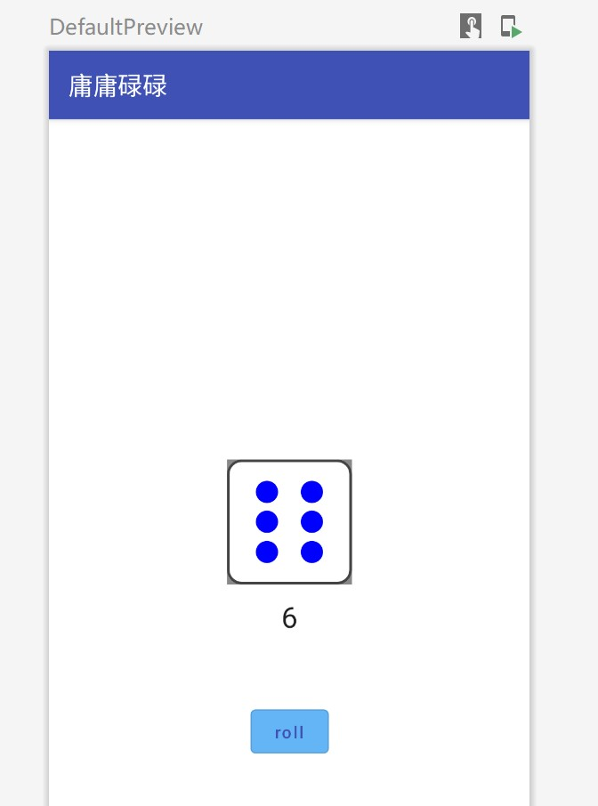
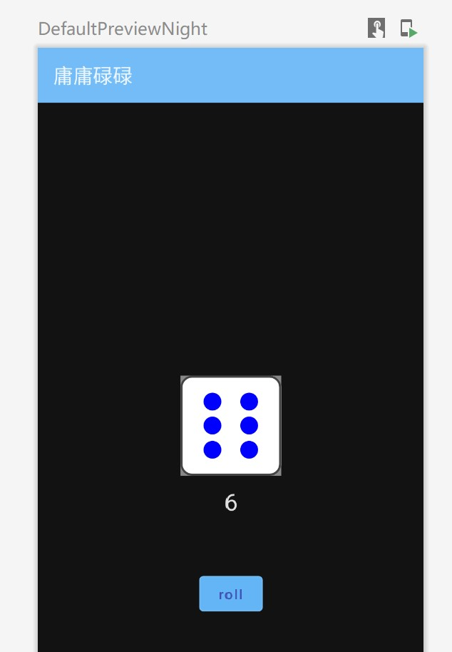

> [compose codelab](https://developer.android.google.cn/courses/pathways/compose) 
> [compose文档](https://developer.android.google.cn/jetpack/compose/layouts/basics)

## 基础使用
#### 配置
- 使用 `setContent` 来定义布局
```Kotlin
class MainActivity : AppCompatActivity() {
    override fun onCreate(savedInstanceState: Bundle?) {
        super.onCreate(savedInstanceState)
        setContent {
            BasicsCodelabTheme {
                Surface(
                  modifier = Modifier.fillMaxSize(),
                  color = MaterialTheme.colors.background
                ) {
                    Greeting("Android")
                }
            }
        }
    }
}
```
- 预览
	- 配置预览效果
		- widthDp：小屏幕手机常见宽度320dp
		- uiMode：设置深色模式
```Kotlin
@Preview(showBackground = true,
		 uiMode = UI_MODE_NIGHT_YES,
		 name = "Text preview", 
		 widthDp = 320)
@Composable
fun DefaultPreview() {
    BasicsCodelabTheme {
        Greeting(name = "Android")
    }
}
```


## 状态
#### 重组
- 概念
	- Compose通过调用可组合函数将数据转换为界面，如果您的数据发生变化（状态发生更改），Compose 会使用新数据重新执行这些函数
	- Compose还会查看各个可组合项需要哪些数据，以便只需重组数据发生了变化的组件，而避免重组未受影响的组件
- Compose需要知道要跟踪的状态，以便在收到更新时安排重组
	- Compose 采用特殊的状态跟踪系统，可以为读取特定状态的任何可组合项安排重组
	- 使用 Compose 的 `State` 和 `MutableState` 类型让 Compose 能够观察到状态
- 使用remember记住可变状态
- 不同版本的同一可组合项：每个可组合项会有自己的状态版本
```Kotlin
val expanded = remember { mutableStateOf(false) }
// 或者 val expanded by remember {mutableStateOf(false)}
OutlinedButton(
	onClick = { expanded.value = !expanded.value },
) {
	Text(if (expanded.value) "Show less" else "Show more")
}
```
#### 状态提升
- 将事件让父级Composable管理，将状态向下传递

#### 保留状态
- 当activity发生配置变更时，所有状态都会丢失
- 使用rememberSaveable保存状态

#### 使用协程
- 在Composable内部使用`LaunchedEffect()`从而安全地使用协程
	- 协程会在`LaunchedEffect()`退出后取消
	- `LaunchedEffect()`的参数为键，当键发生改变时，协程会取消并重建
```Kotlin
LaunchedEffect(playerOne, playerTwo) {  
    coroutineScope {  
        launch { playerOne.run() }  // 在新协程中执行
        launch { playerTwo.run() }
    }
    raceInProgress = false  // 等待coroutineScope执行结束才能执行
}
```


## 布局
#### 布局基础
- 将状态转为界面元素
	- 组合Composition
	- 布局Layout
	- 绘图Drawing
- 标准布局元素
	- 提供排列界面元素的方式，包括Row、Column和Box
	- 设置布局中子项的位置
```Kotlin
@Composable
fun ArtistCard(artist: Artist) {
    Row(
        verticalAlignment = Alignment.CenterVertically,
        horizontalArrangement = Arrangement.End
    ) {
	    // 以下内容居中
        Image(/*...*/)
        Column { /*...*/ }
    }
}
```
- 布局模型
	- 每个节点将尺寸约束条件向下传递给子节点从而完成对子节点的测量
	- 然后确定自己的尺寸
	- 最后，确认子节点的放置位置
- 性能
	- Compose通过只测量一次子项来实现高性能
	- 如果布局需要多次测量，则需要用到Compose的固有特性测量（Intrinsic）
- 修饰符Modifier
	- 可以进行链式操作
	- 可以设置点击事件、padding、大小方式
```Kotlin
Column(
	Modifier
		.clickable(onClick = onClick)
		.padding(padding)
		.fillMaxWidth()
) {
	// ...
}
```
- 内容槽
	- 在某个UI组件中放入composable

#### Material布局
- Scaffold
	- 提供便捷的布局
	- 应用栏
		- 包括顶部栏topBar和底部栏bottomBar
	```Kotlin
	Scaffold(
	    bottomBar = {
	        BottomAppBar { /* Bottom app bar content */ }
	    }
	) {
	    // Screen content
	}	
	```
	- FAB
		- 使用 `floatingActionButtonPosition` 参数来调整水平位置
		- 使用 `isFloatingActionButtonDocked` 参数将 FAB 与底部应用栏重叠
		- 支持使用`cutoutShape` 参数设置FAB位置风格
	- SnackBar
		- 由ScaffoldState提供
	```Kotlin
	val scaffoldState = rememberScaffoldState()
	val scope = rememberCoroutineScope()
	Scaffold(
	    scaffoldState = scaffoldState,
	    floatingActionButton = {
	        ExtendedFloatingActionButton(
	            text = { Text("Show snackbar") },
	            onClick = {
	                scope.launch {
	                    scaffoldState.snackbarHostState
	                        .showSnackbar("Snackbar")
	                }
	            }
	        )
	    }
	) {
	    // Screen content
	}
	```
	- 抽屉式导航栏drawerContent


#### 自定义布局
- layout修饰符
```Kotlin
@Preview
@Composable
fun TextWithPaddingToBaselinePreview() {
// baseline到顶部为32dp
    MyApplicationTheme {
        Text("Hi there!", Modifier.firstBaselineToTop(32.dp))
    }
}

@Preview
@Composable
fun TextWithNormalPaddingPreview() {
// 文字顶部到顶部为32dp
    MyApplicationTheme {
        Text("Hi there!", Modifier.padding(top = 32.dp))
    }
}

// 自定义的方法
fun Modifier.firstBaselineToTop(
    firstBaselineToTop: Dp
) = layout { measurable, constraints ->
    // Measure the composable
    val placeable = measurable.measure(constraints)

    // Check the composable has a first baseline
    check(placeable[FirstBaseline] != AlignmentLine.Unspecified)
    val firstBaseline = placeable[FirstBaseline]

    // Height of the composable with padding - first baseline
    val placeableY = firstBaselineToTop.roundToPx() - firstBaseline
    val height = placeable.height + placeableY
    layout(placeable.width, height) { // 指定可组合项的尺寸
        // Where the composable gets placed
        placeable.placeRelative(0, placeableY)
    }
}
```
- 创建自定义布局
	- 使用Layou Composable，`Column` 和 `Row` 等所有较高级别的布局都使用 `Layout` 可组合项构建而成。
		- `measurables` 与 `layout` 修饰符类似，是需要测量的子项的列表
		- `constraints` 是来自父项的约束条件
	```Kotlin
	@Composable
	fun MyBasicColumn(
	    modifier: Modifier = Modifier,
	    content: @Composable () -> Unit
	) {
	    Layout(
	        modifier = modifier,
	        content = content
	    ) { measurables, constraints ->
	        // Don't constrain child views further, measure them with given constraints
	        // 测量每个子部件
	        val placeables = measurables.map{measurable ->
	            measurable.measure(constraints)
	        }
	
	        layout(constraints.maxWidth, constraints.maxHeight) {
	            var yPosition = 0
	            // 放置每个子部件
	            placeables.forEach { placeable ->
	                placeable.placeRelative(0, yPosition)
	                yPosition += placeable.height
	            }
	        }
	    }
	}
	```
- 布局方向
	- 通过更改LocalLayoutDirection来更改


#### 自适应布局
- 根据分配给可组合项用于执行渲染的实际宽度从而进行自适应布局
```Kotlin
@Composable
fun Card(/* ... */) {
    BoxWithConstraints {
        if (maxWidth < 400.dp) {
            Column {
                Image(/* ... */)
                Title(/* ... */)
            }
        } else {
            Row {
                Column {
                    Title(/* ... */)
                    Description(/* ... */)
                }
                Image(/* ... */)
            }
        }
    }
}

```

#### 滚动列表
- 为Column或Row添加滚动行为
```kotlin
val scrollState = rememberScrollState()
Column(Modifier.verticalScroll(scrollState)) {
	repeat(100) {
		Text("Item #$it")
	}
}
```
- LazyColumn或LazyRow的使用
	- 作用域中通过提供items元素提供渲染逻辑
	- 使用`Arrangement.spacedBy()`方法，在每个可组合子项之间添加固定间距
	- 使用`contentPadding`添加内边距
```Kotlin
@Composable
private fun Greetings(names: List<String> = List(1000) { "$it" } ) {
    LazyColumn(
		    horizontalArrangement = Arrangement.spacedBy(8.dp),
		    contentPadding = PaddingValues(horizontal = 16.dp),
			modifier = Modifier.padding(vertical = 4.dp)
		) {
        items(items = names) { name ->
            Greeting(name = name)
        }
    }
}
```
- LazyColumn或LazyRow的注意事项
	- `LazyColumn` 不会像 `RecyclerView` 一样回收其子级。它会在您滚动它时发出新的可组合项，并保持高效运行，因为与实例化 Android `Views` 相比，发出可组合项的成本相对较低
	- 如果您改变第 1 项内容，然后滚动到第 20 项内容，再返回到第 1 项内容，会发现第 1 项内容回到原来的状态。如果需要，您可以使用 `rememberSaveable` 保存此数据
- 可变列表
	- 创建一个可由Compose观察的MutableList实例：mutableStateList
```Kotlin
Column(modifier = modifier) {
	val list = remember { getWellnessTasks().toMutableStateList()}
	WellnessTasksList(list = list, onCloseTask = { task -> 
		list.remove(task) 
	})
}
```


## 动画
#### animate\*AsState
- 使用 `animate*AsState` 创建的任何动画都是可中断的
- 为属性设置动画示例
	- 属性由animateDpAsState委托
	- 使用`animationSpec` 参数自定义动画
	- 确保值不小于0：使用`coerceAtLeast(0.dp)`
```Kotlin
var expanded by remember { mutableStateOf(false) }
val extraPadding by animateDpAsState(
	if (expanded) 48.dp else 0.dp, 
	animationSpec = spring(
		dampingRatio = Spring.DampingRatioMediumBouncy,
		stiffness = Spring.StiffnessLow
	)
)
...
Column(modifier = Modifier
	.weight(1f)
	.padding(bottom = extraPadding.coerceAtLeast(0.dp))
```

#### content动画
```Kotlin
@Composable
private fun CardContent(name: String) {
    var expanded by remember { mutableStateOf(false) }
    Row(
        modifier = Modifier
            .padding(12.dp)
            .animateContentSize(
                animationSpec = spring(
                    dampingRatio = Spring.DampingRatioMediumBouncy,
                    stiffness = Spring.StiffnessLow
                )
            )
    ) {
    ...
```


## 部件
#### Modifier属性
- [修饰符列表](https://developer.android.google.cn/jetpack/compose/modifiers-list) 
- 常见
	- heightIn：描述高度，包括最大最小值

#### Surface
- shape
	- 使得该Composable内所有元素都绘制在该形状之内

#### 文本
- Text
```Kotlin
Text(
	text = name,
	style = MaterialTheme.typography.h4.copy(
		fontWeight = FontWeight.ExtraBold
	)
)
```
- TextField

#### 图片
- 使用painterResourse得到drawable中的图片
- clip：图片容器，比如圆形
- contentScale：图片缩放程度
	- fit：能够看到整张图片
	- fillBounds：拉伸图片使得占满容器
	- Crop：放大图片使得占满容器
```Kotlin
Image(
	painter = painterResource(R.drawable.ab1_inversions),
	contentDescription = null,
	contentScale = ContentScale.Crop,
	modifier = Modifier
		.size(88.dp)
		.clip(CircleShape)
)
```

#### 其他
- Divider：分割线
- Spacer：留白


------
## 旧笔记

## 布局
##### 继续设置样式

- 设置字重和字体透明度

  - 通过传递数据给CompositionLocalProvider可以获得一些属性

  ```kotlin
  @Composable
  fun PhotographerCard() {
      Column {
          Text("Alfred Sisley", fontWeight = FontWeight.Bold)
          // LocalContentAlpha is defining opacity level of its children
          CompositionLocalProvider(LocalContentAlpha provides ContentAlpha.medium) {
              Text("3 minutes ago", style = MaterialTheme.typography.body2)
          }
      }
  }
  ```

- 展示图片框（placeholder）

  - 使用Surface并指定一个圆形
  - 在图片加载时可以看到placeholder

  ```kotlin
  Surface(
      modifier = Modifier.size(50.dp),
      shape = CircleShape,
      color = MaterialTheme.colors.onSurface.copy(alpha = 0.2f)
  ) {
      // Image goes here
  }
  ```
  
- 自定义你的composable

  - 第一个参数应该为modifier

  ```kotlin
  @Composable
  fun PhotographerCard(modifier: Modifier = Modifier) {
      Row(modifier) { ... }
  }
  ```

- 要留意modifiers串联起来（chain）的顺序

  - 先padding后clickable：此时会出现padding区域不可被点击（无响应）

    ```kotlin
    @Composable
    fun PhotographerCard(modifier: Modifier = Modifier) {
        Row(modifier
            .padding(16.dp)
            .clickable(onClick = { /* Ignoring onClick */ })
        ) {
            ...
        }
    }
    ```

##### compose组件中加入布局（Slot APIs）

- 例如：为一个button添加logo与文字

  - 旧的表达方式可读性差

    ```kotlin
    Button(
        text = "Button",
        icon: Icon? = myIcon,
        textStyle = TextStyle(...),
        spacingBetweenIconAndText = 4.dp,
        ...
    )
    ```

  - 可以添加布局

    ```kotlin
    Button {
        Row {
            MyImage()
            Spacer(4.dp)
            Text("Button")
        }
    }
    ```

##### 列表lists
- 使用LazyColumn：只渲染可见项目
  - 在preview中看起来都一样

  ```kotlin
  @Composable
  fun LazyList() {
      // We save the scrolling position with this state that can also 
      // be used to programmatically scroll the list
      val scrollState = rememberLazyListState()
  
      LazyColumn(state = scrollState) {
          items(100) {
              Text("Item #$it")
          }
      }
  }
  ```

- 远程获取并在列表中展示图片 使用第三方库Coil或Glide

  - 不使用第三方库的步骤：下载图片》译码为bitmap》在Image中将其渲染。使用第三方库可以一步到位

  - 添加依赖、联网权限

    - 使用coil出错，未知原因

    ```
    implementation "com.google.accompanist:accompanist-glide:0.10.0"
    ```

    ```xml
    <uses-permission android:name="android.permission.INTERNET" />
    ```

  - 子项目。最后在lazycolumn中调用

    ```kotlin
    @Composable
    fun ImageListItem(index: Int) {
        Row(verticalAlignment = Alignment.CenterVertically) {
    
            Image(
                painter = rememberGPainter(
                    request = "https://developer.android.com/images/brand/Android_Robot.png"
                ),
                contentDescription = "Android Logo",
                modifier = Modifier.size(50.dp)
            )
            Spacer(Modifier.width(10.dp))
            Text("Item #$index", style = MaterialTheme.typography.subtitle1)
        }
    }
    ```

- 控制划动

  - 为了防止滚动过程中会卡顿，使用了协程(Coroutine)的CoroutineScope
  - 使用scrollState.animateScrollToItem(0)控制位置

  ```kotlin
  // 替代SimpleList
  @Composable
  fun ScrollingList() {
      val listSize = 100
      // We save the scrolling position with this state
      val scrollState = rememberLazyListState()
      // We save the coroutine scope where our animated scroll will be executed
      val coroutineScope = rememberCoroutineScope()
  
      Column {
          Row {
              Button(onClick = {
                  coroutineScope.launch {
                      // 0 is the first item index
                      scrollState.animateScrollToItem(0)
                  }
              }) {
                  Text("Scroll to the top")
              }
  
              Button(onClick = {
                  coroutineScope.launch {
                      // listSize - 1 is the last index of the list
                      scrollState.animateScrollToItem(listSize - 1)
                  }
              }) {
                  Text("Scroll to the end")
              }
          }
  
          LazyColumn(state = scrollState) {
              items(listSize) {
                  ImageListItem(it)
              }
          }
      }
  }
  ```

  

##### 自定义布局

> 在View system中，自定义布局需要继承自ViewGroup，但在Compose中，只需要创建一个使用Layout Composable的函数即可

- Compose UI只允许为子元素测量一次

- 使用layout modifier》添加属性：在Modifier中添加新属性，使得padding的计算为顶部到字的baseline

  - 架构：有两个lambda参数
    - measurable 被测量和放置的子元素
    - constraints 子元素的宽、高最大值与最小值

  ```kotlin
  fun Modifier.customLayoutModifier(...) = Modifier.layout { measurable, constraints ->
    ...
  })
  ```

  - 先是测量这个部件大小，通过调用`measure`方法，这会返回一个`Placeable`，用于定位
  - 然后计算这个部件的位置，通过调用`layout(width,height)`
    - 最后通过调用`placeable.placeRelative(x,y)`以展示这个部件

  ```kotlin
  @Composable
  fun Modifier.firstBaselineToTop(
      firstBaselineToTop:Dp
  ) = this.then(
      layout { measurable, constraints ->
          val placeable = measurable.measure(constraints)
  
          check(placeable[FirstBaseline]!=AlignmentLine.Unspecified)
          val firstBaseline = placeable[FirstBaseline]
  
          val placeableY = firstBaselineToTop.roundToPx() - firstBaseline
          val height = placeable.height + placeableY
          layout(placeable.width,height){
              placeable.placeRelative(0,placeableY)
          }
      }
  )
  ```

  - 调用这个属性

  ```kotlin
  @Composable
  fun TextWithPaddingToBaselinePreview() {
    LayoutsCodelabTheme {
      Text("Hi there!", Modifier.firstBaselineToTop(32.dp))
    }
  }
  ```

- 使用Layout Coposable》

  - 可以控制测量、摆放方式
  - 架构：需要两个参数
    - modifier
    - content

  ```kotlin
  @Composable
  fun CustomLayout(
      modifier: Modifier = Modifier,
      // custom layout attributes 
      content: @Composable () -> Unit
  ) {
      Layout(
          modifier = modifier,
          content = content
      ) { measurables, constraints ->
          // measure and position children given constraints logic here
      }
  }
  ```

  - 先测量大小，再设置位置，但这次用的是列表（多个子元素）
  
  ```kotlin
  @Composable
  fun MyOwnColumn(
      modifier: Modifier = Modifier,
      content: @Composable () -> Unit
  ) {
      Layout(
          modifier = modifier,
          content = content
      ) { measurables, constraints ->
          // Don't constrain child views further, measure them with given constraints
          // List of measured children
          val placeables = measurables.map { measurable ->
              // Measure each child
              measurable.measure(constraints)
          }
  
          // Track the y co-ord we have placed children up to
          var yPosition = 0
  
          // Set the size of the layout as big as it can
          layout(constraints.maxWidth, constraints.maxHeight) {
              // Place children in the parent layout
              placeables.forEach { placeable ->
                  // Position item on the screen
                  placeable.placeRelative(x = 0, y = yPosition)
  
                  // Record the y co-ord placed up to
                  yPosition += placeable.height
              }
          }
      }
  }
  
  ```


##### 自定义布局：复杂点的

> 自定义一个StaggeredGrid，用于制作一个横向瀑布流的多按钮（checkbox）

- 从模板开始制作布局，依然先测量大小，再放置

  ```kotlin
  @Composable
  fun StaggeredGrid(
      modifier:Modifier=Modifier,
      rows:Int=3,
      content:@Composable () -> Unit
  ){
      Layout(
  //        children = children,
          modifier = modifier,
          content = content
      ){measurables,constraints ->
          val rowWidths = IntArray(rows){0}
          val rowHeights = IntArray(rows){0}
          val placeables = measurables.mapIndexed{index,measurable ->
              val placeable = measurable.measure(constraints)
              val row = index % rows
              rowWidths[row] += placeable.width
              rowHeights[row] = max(rowHeights[row],placeable.height)
              placeable
          }
  
          val width = rowWidths.maxOrNull()
              ?.coerceIn(constraints.minWidth.rangeTo(constraints.maxWidth))?:constraints.minWidth
          val height = rowHeights.sumBy{ it }
              .coerceIn(constraints.minHeight.rangeTo(constraints.maxHeight))
  
          val rowY = IntArray(rows){0}
          for(i in 1 until rows){
              rowY[i] = rowY[i-1] + rowHeights[i-1]
          }
  
          layout(width,height){
              val rowX = IntArray(rows){0}
              placeables.forEachIndexed{index,placeable ->
                  val row = index%rows
                  placeable.placeRelative(
                      x = rowX[row],
                      y = rowY[row]
                  )
                  rowX[row] += placeable.width
              }
          }
  
      }
  }
  ```

- 调用这个布局

  ```kotlin
  val topics = listOf(
      "Arts & Crafts", "Beauty", "Books", "Business", "Comics", "Culinary",
      "Design", "Fashion", "Film", "History", "Maths", "Music", "People", "Philosophy",
      "Religion", "Social sciences", "Technology", "TV", "Writing"
  )
  
  @Composable
  fun BodyContentGrid(modifier: Modifier = Modifier){
      StaggeredGrid(modifier = modifier) {
          for(topic in topics){
              // ...
          }
      }
  }
  ```

##### Layout modifiers的原理

- padding modifier的源码

  - width和height是加上padding后的值

  ```kotlin
  // How to create a modifier
  @Stable
  fun Modifier.padding(all: Dp) =
      this then PaddingModifier(start = all, top = all, end = all, bottom = all, rtlAware = true)
  
  // Implementation detail
  private class PaddingModifier(
      start: Dp = 0.dp,
      top: Dp = 0.dp,
      end: Dp = 0.dp,
      bottom: Dp = 0.dp,
      rtlAware: Boolean
  ) : LayoutModifier {
      override fun MeasureScope.measure(
          measurable: Measurable,
          constraints: Constraints
      ): MeasureScope.MeasureResult {
          val horizontal = start.roundToPx() + end.roundToPx()
          val vertical = top.roundToPx() + bottom.roundToPx()
  
          val placeable = measurable.measure(constraints.offset(-horizontal, -vertical))
  
          val width = constraints.constrainWidth(placeable.width + horizontal)
          val height = constraints.constrainHeight(placeable.height + vertical)
          return layout(width, height) {
              if (rtlAware) {
                  placeable.placeRelative(start.roundToPx(), top.roundToPx())
              } else {
                  placeable.place(start.roundToPx(), top.roundToPx())
              }
          }
      }
  }
  ```

- modifier的顺序确实影响效果

  - 会影响的内容：比如布局长宽，可以用背景和内容来验证

##### ConstraintLayout

- 在gradle中添加

  ```
  implementation "androidx.constraintlayout:constraintlayout-compose:1.0.0-alpha07"
  ```

- 初始化组件之间联系（reference）的方法：`createRefs()`

- 建立与parent联系的方法：`linkTo()`

- 指定自身为参考物的方法：`constrainAs()`

- 例》Text在Button下方

  ```kotlin
  @Composable
  fun ConstraintLayoutContent() {
      ConstraintLayout {
  
          // Create references for the composables to constrain
          val (button, text) = createRefs()
  
          Button(
              onClick = { /* Do something */ },
              // Assign reference "button" to the Button composable
              // and constrain it to the top of the ConstraintLayout
              modifier = Modifier.constrainAs(button) {
                  top.linkTo(parent.top, margin = 16.dp)
              }
          ) {
              Text("Button")
          }
  
          // Assign reference "text" to the Text composable
          // and constrain it to the bottom of the Button composable
          Text("Text", Modifier.constrainAs(text) {
              top.linkTo(button.bottom, margin = 16.dp)
          })
      }
  }
  
  @Preview
  @Composable
  fun ConstraintLayoutContentPreview() {
      LayoutsCodelabTheme {
          ConstraintLayoutContent()
      }
  }
  ```

  - 让文字居中：use the `centerHorizontallyTo` function 

    ```kotlin
    Text("Text", Modifier.constrainAs(text) {
                top.linkTo(button.bottom, margin = 16.dp)
                // Centers Text horizontally in the ConstraintLayout
                centerHorizontallyTo(parent)
            })
    ```

- 使用更多ConstraintLayout属性

  - barrier：自适应的布局无形的分割线（比如中文切换为英文时，布局也不会改变）

  ```kotlin
  @Composable
  fun LargeConstraintLayout() {
      ConstraintLayout {
          // ...
          val barrier = createEndBarrier(button1, text)
          Button(
              onClick = { /* Do something */ },
              modifier = Modifier.constrainAs(button2) {
                  top.linkTo(parent.top, margin = 16.dp)
                  start.linkTo(barrier)
              }
          ) { 
              Text("Button 2") 
          }
      }
  }
  ```

  - dimension：位置不够时自动换行。例子中修改了width

  ```kotlin
  @Composable
  fun LargeConstraintLayout() {
      ConstraintLayout {
          val text = createRef()
  
          val guideline = createGuidelineFromStart(0.5f)
          Text(
              "This is a very very very very very very very long text",
              Modifier.constrainAs(text) {
                  linkTo(guideline, parent.end)
                  width = Dimension.preferredWrapContent
              }
          )
      }
  }
  ```

- 解耦api（Decoupled API）

##### Intrinsics(固有）

- intrinsics可以让你在唯一一次测量前选择测量子项目的大小的方式

  - 下例为获取子项目高度的最小值

  ```kotlin
  Row(modifier = modifier.height(IntrinsicSize.Min)) {
  	// ...
  }
  ```


[TOC]

### 主题

##### Material主题

-   颜色含义

    -   primary：主颜色
    -   secondary：强调色
    -   on系列：对应颜色的content所使用的颜色
        -   相同颜色下的on颜色必须相同
        -   例：若primary的颜色和surface一样，则onPrimary必须和onSurface的颜色相同
    -   [material官网颜色工具](https://material.io/resources/color/) 

-   文字颜色会自动改变

    -   使用primary作为背景色，则文本颜色会自动选择onPrimary

    ```kotlin
    // before
    Surface(color = MaterialTheme.colors.background) {
        Greeting("Android")
    }
    
    // after changed
    Surface(color = MaterialTheme.colors.primary) {
        Text (text = "Hello $name!")
    }
    ```

-   文字特性

    

-   基于文字特性的修改

    ```kotlin
    Text(
        text = name,
        style = MaterialTheme.typography.h4.copy(
            fontWeight = FontWeight.ExtraBold
        )
    )
    ```

-   亮色主题下

    -   primary（军蓝色）：toolbar背景颜色，button文字颜色
    -   surface（浅蓝色）：button颜色

    

-   暗色主题下

    -   primary（军蓝色）：button文字颜色
    -   surface（浅蓝色）：toolbar背景颜色，button颜色

    
    
-   预览暗色主题

    ```kotlin
    @Preview(
        showBackground = true,
        widthDp = 320,
        uiMode = UI_MODE_NIGHT_YES,
        name = "DefaultPreviewDark"
    )
    @Preview(showBackground = true, widthDp = 320)
    @Composable
    fun DefaultPreview() {
        BasicsCodelabTheme {
            Greetings()
        }
    }
    ```

    


##### Compose的记忆memory

- localContentColor：为icon和typography设置颜色

- 复用组件也是一个recomposition的过程（如LazyColumn）

- Compose树

  - Compose会生成树：第一次运行时，Compose构造一棵树；重组时，更新树

- 副作用side-effect

  - 副作用是在 非composable运行过程中出现的视觉效果变化

    ```
    比如在第一个实验的LazyColumn中，被选中变红色背景的项目，在划动后不再为红色背景；
    又比如这个实验中，每次添加新的todo到列表时，icon的颜色都会变化
    ```

  - 如：在ViewModel中使用state、调用Random.nextInt()、或者进行数据库操作，这些都是副作用

  - 重组过程理应不出现side-effect

- 让composable拥有memory

  - remember提供了composable的memory
  
    ```kotlin
    remember(todo.id) { randomTint() }
    // 小括号内是关键参数，是给remember提供位置
    // 大括号内是lambda表达式，用于计算新的被remembered的值
    // 第一次运行时会记住该值，之后则会记住该值
    ```
  
  - 使用remember的composable 的remember值 会在移除时被遗忘（比如LazyColumn中划出了屏幕后）
  
  - 短暂的动画效果就适合在LazyColumn的子中使用remember，但其他就不适合

##### Compose的state

- 输入文字：在View系统中的EditText相当于Compose的TextField，但是TextField可以选择是有状态或者无状态的

- mutableStateOf

  - 自动为`MutableState`对象生成 getter 和 setter，是内置于 compose 中的可观察状态者，它会在更新时告诉 compose

  - 添加导入

    ```kotlin
    import androidx.compose.runtime.mutableStateOf
    import androidx.compose.runtime.getValue
    import androidx.compose.runtime.setValue
    ```

  - 声明MutableState的三种方式

    ```java
    val state = remember { mutableStateOf(default) }
    var value by remember { mutableStateOf(default) }
    val (value, setValue) = remember { mutableStateOf(default) }
    ```

- 有状态的TextField

  - 使用mutableStateOf为它保存状态，使用remember记住有这个状态
  - 虽然有状态的TextField能够重组ui，看到输入的文字，但是这个状态（输入的文字）不能被其他组件共享、获取

  ```kotlin
  @Composable
  fun SimpleFilledTextField() {
      var text by remember { mutableStateOf("Hello") }
  
      TextField(
          value = text,
          onValueChange = { text = it },
          label = { Text("Label") }
      )
  }
  ```

- 无状态的TextField

  - 使用状态提升（state hoisting）可以解决上述问题，状态提升至父Composable，使得子变成无状态的
  - 状态提升通常用到这两个参数：value、onValueChange
  - `by`是 Kotlin 中的属性委托语法
  - 状态提升带来的特性：单一来源、封装的（只有上层能够修改状态）、可共享、可接受或忽略变化、解耦（自动更新）

  ```kotlin
  @Composable
  fun TodoItemInput(onItemComplete: (TodoItem) -> Unit) {
     val (text, setText) = remember { mutableStateOf("") }
     Column {
         Row(Modifier
             .padding(horizontal = 16.dp)
             .padding(top = 16.dp)
         ) {
             TodoInputTextField(
                 text = text,
                 onTextChange = setText,
                 modifier = Modifier
                     .weight(1f)
                     .padding(end = 8.dp)
             )
             TodoEditButton(
                 onClick = { /* todo */ },
                 text = "Add",
                 modifier = Modifier.align(Alignment.CenterVertically)
             )
         }
     }
  }
  @Composable
  fun TodoInputTextField(text: String, onTextChange: (String) -> Unit, modifier: Modifier) {
     // ...
  }
  ```

- 设置button：发送event`onItemComplete()`、清空文本、文本非空时允许添加

  ```kotlin
  TodoEditButton(
     onClick = {
         onItemComplete(TodoItem(text)) // send onItemComplete event up
         setText("") // clear the internal text
     },
     text = "Add",
     modifier = Modifier.align(Alignment.CenterVertically),
     enabled = text.isNotBlank() // enable if text is not blank
  )
  ```

##### 基于state的动态数据

- 应用场景：TextField非空时展开Row，点击Row中的button以确认Todo属性

  - 新增Row是否可见的布尔型变量（而不是状态，两个状态任意造成不同步）

  - 新增状态icon用于保存当前选定的图标

    ```kotlin
       val (icon, setIcon) = remember { mutableStateOf(TodoIcon.Default)}
       val iconsVisible = text.isNotBlank()
    ```

- 重组可以根据数据变化改变树的结构

- 使用 imeAction 完成设计（输入法编辑器）

  - 键盘的submit按钮要和界面上的submit按钮发挥同一作用，可以通过复制代码完成，亦或是：使用lambda函数`submit`

    ```kotlin
    val submit = {
        // ...
    }
    onImeAction = submit
    // ...
    onClick = submit
    ```

- TextField提供对键盘输入的参数

  - `keyboardOptions` - 用于启用显示完成 IME 操作
  - `keyboardActions`- 用于指定响应触发的特定 IME 操作而触发的操作 - 在我们的例子中，一旦按下 Done，我们希望`submit`被调用并隐藏键盘
  - 控制软键盘：使用`LocalSoftwareKeyboardController.current`，这是个实验性API，还必须用`@OptIn(ExperimentalComposeUiApi::class)`

  ```kotlin
  @OptIn(ExperimentalComposeUiApi::class)
  @Composable
  fun TodoInputText(
      // ...
  ) {
      val keyboardController = LocalSoftwareKeyboardController.current
      TextField(
          // ...
          keyboardOptions = KeyboardOptions.Default.copy(imeAction = ImeAction.Done),
          keyboardActions = KeyboardActions(onDone = {
              onImeAction()
              keyboardController?.hideSoftwareKeyboard()
          }),
          modifier = modifier
      )
  }
  ```

##### 在ViewModel中使用State

> 这一小节包含了四步
>
> 状态分离》
>
> 在ViewModel中使用State（配置ViewModel）》
>
> 在ViewModel中测试State》
>
> 复用无状态组合》

- 应用场景：当点击Todo项目时可进入修改状态

- 状态分离》提取无状态的composables

  - 将有状态的Composable转换为无状态的Composable。无状态的Composable上层/入口都在有状态的Composable中

  ```kotlin
  @Composable
  fun TodoItemEntryInput(onItemComplete: (TodoItem) -> Unit) {
     val (text, setText) = remember { mutableStateOf("") }
     val (icon, setIcon) = remember { mutableStateOf(TodoIcon.Default)}
     val iconsVisible = text.isNotBlank()
     val submit = {
         onItemComplete(TodoItem(text, icon))
         setIcon(TodoIcon.Default)
         setText("")
     }
     TodoItemInput(
         text = text,
         onTextChange = setText,
         icon = icon,
         onIconChange = setIcon,
         submit = submit,
         iconsVisible = iconsVisible
     )
  }
  
  @Composable
  fun TodoItemInput(
     // ...
  ) {
     Column {
         // ...
     }
  }
  ```

- 配置ViewModel

  - ViewModel可以减轻很多作为Observer的工作量

  - 增删

    ```kotlin
    var todoItems: List<TodoItem> by mutableStateOf(listOf())
       private set
    
    // event: addItem
    fun addItem(item: TodoItem) {
        todoItems = todoItems + listOf(item)
    }
    
    // event: removeItem
    fun removeItem(item: TodoItem) {
       // toMutableList makes a mutable copy of the list we can edit, then
       // assign the new list to todoItems (which is still an immutable list)
       todoItems = todoItems.toMutableList().also {
           it.remove(item)
       }
    }
    ```

  - 在Activity中使用ViewModel

    ```kotlin
    @Composable
    private fun TodoActivityScreen(todoViewModel: TodoViewModel) {
       TodoScreen(
           items = todoViewModel.todoItems,
           onAddItem = todoViewModel::addItem,
           onRemoveItem = todoViewModel::removeItem
       )
    }
    ```

  - 定义编辑器状态

    ```kotlin
    class TodoViewModel : ViewModel() {
    
       // private state
       private var currentEditPosition by mutableStateOf(-1)
    
       // state
       var todoItems by mutableStateOf(listOf<TodoItem>())
           private set
    
       // state
       val currentEditItem: TodoItem?
           get() = todoItems.getOrNull(currentEditPosition)
    
       // ..
    ```

  - 定义编辑器事件

    ```kotlin
    class TodoViewModel : ViewModel() {
       ...
    
       // event: onEditItemSelected
       fun onEditItemSelected(item: TodoItem) {
          currentEditPosition = todoItems.indexOf(item)
       }
    
       // event: onEditDone
       fun onEditDone() {
          currentEditPosition = -1
       }
    
       // event: onEditItemChange
       fun onEditItemChange(item: TodoItem) {
          val currentItem = requireNotNull(currentEditItem)
          require(currentItem.id == item.id) {
              "You can only change an item with the same id as currentEditItem"
          }
    
          todoItems = todoItems.toMutableList().also {
              it[currentEditPosition] = item
          }
       }
    }
    ```

  - 删除项目时结束编辑

    ```kotlin
    // event: removeItem
    fun removeItem(item: TodoItem) {
       todoItems = todoItems.toMutableList().also { it.remove(item) }
       onEditDone() // don't keep the editor open when removing items
    }
    ```

- 在ViewModel中测试状态

  - 在`test/`目录中打开`TodoViewModelTest.kt`并添加删除项目的测试
    - before：创建一个新的ViewModel，然后将两个项目添加到TodoItems
    - during：测试的方法
    - after：使用断言，断言列表仅包含第二项
  - 点击运行，若无报错即断言正确
  - 如果写入`MutableState<T>`是在另一个线程上执行的，它们将不会从您的测试中立即可见

  ```kotlin
  import com.example.statecodelab.util.generateRandomTodoItem
  import com.google.common.truth.Truth.assertThat
  import org.junit.Test
  
  class TodoViewModelTest {
  
     @Test
     fun whenRemovingItem_updatesList() {
         // before
         val viewModel = TodoViewModel()
         val item1 = generateRandomTodoItem()
         val item2 = generateRandomTodoItem()
         viewModel.addItem(item1)
         viewModel.addItem(item2)
  
         // during
         viewModel.removeItem(item1)
  
         // after
         assertThat(viewModel.todoItems).isEqualTo(listOf(item2))
     }
  }
  ```

- 重用无状态组合

  - 为Composable组件传入ViewModel的三个新事件以及当前正在编辑的项目（加上？）

    ```kotlin
    @Composable
    fun TodoScreen(
        items: List<TodoItem>,
        currentlyEditing: TodoItem?,
        onAddItem: (TodoItem) -> Unit,
        onRemoveItem: (TodoItem) -> Unit,
        onStartEdit: (TodoItem) -> Unit,
        onEditItemChange: (TodoItem) -> Unit,
        onEditDone: () -> Unit
    ) {
    	// ...
    }
    ```

  - 创建一个复用Composable：直接套用无状态的TodoItemInput

    - 注意：用的是等号

    ```kotlin
    @Composable
    fun TodoItemInlineEditor(
       item: TodoItem,
       onEditItemChange: (TodoItem) -> Unit,
       onEditDone: () -> Unit,
       onRemoveItem: () -> Unit
    ) = TodoItemInput(
       text = item.task,
       onTextChange = { onEditItemChange(item.copy(task = it)) },
       icon = item.icon,
       onIconChange = { onEditItemChange(item.copy(icon = it)) },
       submit = onEditDone,
       iconsVisible = true
    )
    ```

  - 直接在LazyColumn上使用：若有修改，则显示用于修改的Composable

    - `LazyColumn`不像`RecyclerView`，它不需要做任何回收，不可见即丢弃

    ```kotlin
    // fun TodoScreen()
    // ...
    LazyColumn(
       modifier = Modifier.weight(1f),
       contentPadding = PaddingValues(top = 8.dp)
    ) { 
     items(items) { todo ->
       if (currentlyEditing?.id == todo.id) {
           TodoItemInlineEditor(
               item = currentlyEditing,
               onEditItemChange = onEditItemChange,
               onEditDone = onEditDone,
               onRemoveItem = { onRemoveItem(todo) }
           )
       } else {
           TodoRow(
               todo,
               { onStartEdit(it) },
               Modifier.fillParentMaxWidth()
           )
       }
    }
    // ...
    ```

##### 使用插槽slot来传递Composable

- Slot可以作为composable的参数，相当于把一个Composable作为参数。调用方法形如 `@Composable () -> Unit`

- 调用方：

  ```kotlin
  @Composable
  fun TodoItemInput(
     // ...
     buttonSlot: @Composable() () -> Unit,
  ) {
     Column {
         // ...
         Box(Modifier.align(Alignment.CenterVertically)) { buttonSlot() }
     }
  }
  ```

- 传入方

  - 将slot写在 { } 内，这是尾随 lambda 语法
  - 亦或者按照平时的写法，写在（ ）内

  ```kotlin
  TodoItemInput(
     // other Parameters
  ) {
    // Slot
     TodoEditButton(onClick = submit, text = "Add", enabled = text.isNotBlank())
  }
  ```


[TOC]

### 动画

##### 简单的过渡动画

- 应用场景：简单属性切换

  - 使用`animate*AsState`API，委托变化。仅适用于简单变化，*可以为size、color、value等

  ```kotlin
  // no animation
  val backgroundColor = if (tabPage == TabPage.Home) Purple100 else Green300
  
  // with animation
  val backgroundColor by animateColorAsState(if (tabPage == TabPage.Home) Purple100 else Green300)
  ```

- 应用场景：组件的可见与否

  ```kotlin
  // no animation
  if (extended) {
  		// ...
  }
  
  // with animation
  AnimatedVisibility(extended) {
    	// ...
  }
  ```

- 应用场景：组件的可见与否》配置动画 的展开、收起方向

  - enter配置进场、exit配置退场
  - animationSpec指定了动画值如何随时间改变

  ```kotlin
  AnimatedVisibility(
      visible = shown,
      enter = slideInVertically(
          // Enters by sliding down from offset -fullHeight to 0.
          initialOffsetY = { fullHeight -> -fullHeight },
          animationSpec = tween(durationMillis = 150, easing = LinearOutSlowInEasing)
      ),
      exit = slideOutVertically(
          // Exits by sliding up from offset 0 to -fullHeight.
          targetOffsetY = { fullHeight -> -fullHeight },
          animationSpec = tween(durationMillis = 250, easing = FastOutLinearInEasing)
      )
  ) {
    // ...
  }
  ```

- 应用场景：组件长宽变化时的过度动画

  - 只需在modifier里加上`.animateContentSize()`即可

  ```kotlin
  Column(
      modifier = Modifier
          .fillMaxWidth()
          .padding(16.dp)
          .animateContentSize()
  ) {
      // ... the title and the body
  }
  ```


##### 多值动画

- 同时给多个值设置同一个动画，可以使用`Transition`

  ```kotlin
  // no animation
  val indicatorLeft = tabPositions[tabPage.ordinal].left
  val indicatorRight = tabPositions[tabPage.ordinal].right
  val color = if (tabPage == TabPage.Home) Purple700 else Green800
  
  // with animation
  val transition = updateTransition(tabPage)
  val indicatorLeft by transition.animateDp { page ->
      tabPositions[page.ordinal].left
  }
  val indicatorRight by transition.animateDp { page ->
      tabPositions[page.ordinal].right
  }
  val color by transition.animateColor { page ->
      if (page == TabPage.Home) Purple700 else Green800
  }
  ```

- 自定义动画行为

  - 靠近目的地的边比另一边移动得更快来实现指标的弹性效果
  - 可以使用 `isTransitioningTo`的lambda（`transitionSpec`中的中缀函数）来确定状态变化的方向

##### 重复动画

- 应用场景：刷新某个部件后的等待动画，通过修改不透明度实现重复动画

  ```kotlin
  // no animation
  val alpha = 1f
  
  // with repeated animation
  val infiniteTransition = rememberInfiniteTransition()
  val alpha by infiniteTransition.animateFloat(
      initialValue = 0f,
      targetValue = 1f,
      animationSpec = infiniteRepeatable(
          animation = keyframes {
              durationMillis = 1000
              0.7f at 500
          },
          repeatMode = RepeatMode.Reverse
      )
  )
  ```

##### 手势动画

- 应用场景：划动删除
  - 速度不够快时不能删


### 导航

##### 使用Navigation

-   NavController：Navigation的核心组件

    -   内部有栈来记录历史导航。即使是类似同一页面下fragment之间的切换，也视为状态的增加，状态会被放入栈中。在按下返回键退出app时需要多次按下直到栈空
    -   在compose中，使用NavHostController。这是NavController的子类

    ```kotlin
    val navController = rememberNavController()
    ```

-   使用NavHost作为内容

    -   NavGraphBuilder.composable作为其状态
    -   String作为路由（如：RallyScreen.Overview.name）

    ```kotlin
    NavHost(
        navController = navController,
        startDestination = RallyScreen.Overview.name,
        modifier = Modifier.padding(innerPadding)
    ){
        composable(RallyScreen.Overview.name) {
            // ...
        }
        composable(RallyScreen.Accounts.name) {
            // ...
        }
        composable(RallyScreen.Bills.name) {
            // ...
        }
    }
    ```

-   将页面的切换告知NavController

    ```kotlin
    RallyTabRow(
        allScreens = allScreens,
        onTabSelected = { screen -> 
                 navController.navigate(screen.name) },
        currentScreen = currentScreen
    ){/**/}
    ```

-   获取栈顶（当前页面）

    ```kotlin
    val backStackEntry = navController.currentBackStackEntryAsState()
    val currentScreen = RallyScreen.fromRoute(backStackEntry.value?.destination?.route)
    ```


##### 带参的导航

-   【route是唯一的吗？（一个route必须只对应一个页面？）】

-   接收参数

    -   参数能够在route中体现，使用了大括号包住
    -   在arguments中指定参数类型
    -   通过entry得到参数

    ```kotlin
    // 参数name
    composable(
        route = "$accountsName/{name}",
        arguments = listOf(
            navArgument("name") {
                // Make argument type safe
                type = NavType.StringType
            }
        )
    ){ entry ->
        val accountName = entry.arguments?.getString("name")
        // ...
    }
    ```

-   填入参数

    ```kotlin
    navController.navigate("${RallyScreen.Accounts.name}/$name")
    ```


##### 外部可访问的链接deep link

-   在manifest中声明

    -   这里使用`rally://accounts/{name}`作为deep link URL

    ```xml
    <intent-filter>
        <action android:name="android.intent.action.VIEW" />
        <category android:name="android.intent.category.DEFAULT" />
        <category android:name="android.intent.category.BROWSABLE" />
        <data android:scheme="rally" android:host="accounts" />
    </intent-filter>
    ```

-   在composable参数中额外声明deepLinks

    ```kotlin
    composable(
        "$accountsName/{name}",
        arguments = listOf(
            navArgument("name") {
                // Make argument type safe
                type = NavType.StringType
            }
        ),
        deepLinks = listOf(navDeepLink { uriPattern = "rally://$accountsName/{name}" })
    )
    ```

-   测试deep link：使用adb

    ```sh
    adb shell am start -d "rally://accounts/Checking" -a android.intent.action.VIEW
    ```

    


[TOC]

### 迁移到Jetpack Compose

- 在`build.gradle (Module:...`配置：

  - 添加上`compose true`

  ```
  android {
      ...
      kotlinOptions {
          jvmTarget = '1.8'
          useIR = true
      }
      buildFeatures {
          ...
          compose true
      }
      composeOptions {
          kotlinCompilerExtensionVersion rootProject.composeVersion
      }
  }
  ```

  