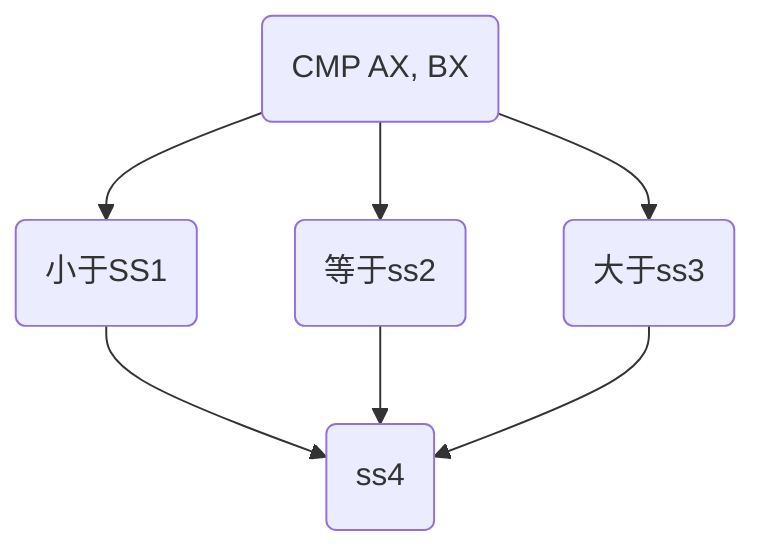

[TOC]

# 微机原理


### 计算机编码 #1

##### 基2码：基于二进制的编码

- 使用英文字母表示数制：二进制B(Binary)、八进制O/Q(Octal)、十进制D(Decimal)、十六进制H(Hexadecimal)
- 编码-数值
  - 机器数：二进制数值数据在计算机内部的编码
  - 真值：机器数所代表的实际值
- 二进制数原码编码方法
  - 最高位为符号位，`+`为0，`-`为1
  - 例子
    - [+1]<sub>原</sub>= 0000 0001
    - [+127]<sub>原</sub> = 0111 1111
    - [-0]<sub>原</sub> = 1000 0000         *对于计算机来说`+0≠-0`*
- 二进制反码编码方法
  - 当真值>0时，反码与其原码相同
  - <0时，符号位不变，其余位相反
  - 例子
    - [-127]<sub>反</sub> = 1000 0000
- 二进制补码编码方法
  - 当真值>0时，补码与其原码相同
  - <0时，其反码末位+1，符号位保持不变
  - -0的补码与+0一样，所以相比其他码，补码能表示-128
  - 例子
    - [-0]<sub>补</sub> = 0000 0000，越界位（第九位）被消除
    - [-128]<sub>补</sub> = 1000 0000
    - [-1]<sub>补</sub> = 1111 1111
  - 反数的补码也就是这个数
- 补码变真码 / 真码变主码：（若为负）取反加一
- 补码特点
  - 只有一种0
  - 易扩展。补码数扩展实际上是符号扩展（32位->64位，正数在前面补0，负数在前面补1）
  - [+x]和[-x]的补码关系是取反加一
  - 相邻数之间补码之间相差1，而[+127]与[-128]也相差1，形成一个循环
- 运算
  - 直接相加，相减时先求反再相加
    - 补码的存在减低了加减运算的复杂度，可以不管符号位直接相加
  - 溢出：与预计结果通常相差256
    - 检查方法：查看符号位是否改变
- 无符号数

##### 十进制数的编码及运算BCD

- 最常见的编码是8421码：每组有4位，每组中结果大于9时为无效编码
- 运算：
  - 直接相加，若两位相加结果大于9(9H)（有进位），则加6(6H)修正
  - 减法同理，减（6H）修正，
    - BCD码无负数，补十
- 压缩BCD码、非压缩BCD码
  - 1字节仅表示1位 **vs** 1字节表示两位BCD码
  
- 非数值数据编码
  - 字符编码 ASCII码：8位，所有ASCII码最高位为0
    - 要求记住0-9的码：30H~39H
    - A-Z：41H
    - a-z：61H(比大写大32)
      - 注意：H指的是十六进制
    - CR(回车)：0DH
    - LF(换行)：0AH
  - 汉字编码：使用两个字节来存放
    - 汉字输入编码
    - 汉字机内码

##### 微型计算机系统

- 按组装形式和系统规模分类，有PC、嵌入式计算机（单片机、单板机）
- 组成：CPU、内部存储器（内存）、输入输出接口（I/O接口，可无）、系统总线（位于主板上）
- 系统总线
  - 由三部分组成
    - 数据总线(Data Bus)：双向、三态
    - 地址总线(Address Bus)：单向、三态、用于存储地址
    - 控制总线(Control Bus)：控制信号
- 接口（与插口不同）：起数据转换、缓冲、数据预处理的作用

- 性能指标
  - 位bit
  - 字节Byte：8个bit，计算机里数据处理的基本单位
  - 字长：一次可以并行处理二进制代码的位数（取决于CPU）
  - 存储容量：16位二进制代码：字Word、32位-双字DWord
  - KB(kilo)、MB(Mega)、GB(Giga)、TB(Tera)
- 组装形式和系统规模分类


### 微处理器结构 #2

##### 功能结构

- 执行单元EU：执行指令
- 总线接口单元BIU ：管理总线
- 运算流程
  - 总线》指令队列缓冲器》EU控制电路：翻译指令》从内部存储器提取数据》在运算器运算：若加数还未来，则把数据放在通用寄存器》通用寄存器：存储计算结果》通过总线送出
- 存储器及数据概念
  - 存储器只能存储4个字节（举例），共有四个地址，可用00、01、10、11表示，使用两条地址线表示，CPU通过地址线获得存储在内存的数据
  - 8位二进制数通过8条数据线同时送进CPU
- 地址加法器和段寄存器
  - 8086有20位地址总线，可寻址存储器物理空间2^20^=1M
  - 物理地址：真正的地址，即上述寻址目的地
  - 物理地址=段地址（16位）+偏移地址（逻辑地址，16位）
    - 段地址左移4位后（补零）加上偏移地址，或者说是`物理地址=段地址*16+偏移地址`
  - 段长度：2^16^=64K
- 内部寄存器（8086CPU）
  - 数据寄存器AX、BX、CX、DX（16位数据）：存放普通数据，也可以放偏移地址；可以按照高低位分开（AH、AL…）（8位数据）
  
  - 指针与变址寄存器SP、BP、SI、DI：存放偏移地址
  
  - 指令指针与标志寄存器IP（也存放偏移地址）、FLAGS
  
  - 段寄存器CS、DS、ES、SS：存放段地址
    - Code指令代码 物理地址 = CS*16 + IP
    
    - Stack堆栈数据 物理地址 = SS*16 + SP（指向栈顶）或 BP
    - Data普通数据 物理地址 = DS*16+ SI 或 DI 或 BX
    - Extended附加数据 物理地址 = ES*16+ SI 或 DI 或 BX
    
  - 标志寄存器FLAGS：存储特殊结果
  
  - 状态标志位：
    - CF - Carry Flag：进位标志位
    - PF - Parity Flag：奇偶标志位：检查是否传输出错
    - AF - Auxiliary carry Flag：辅助进位标志位，低4位向高4位进位
    - ZF - Zero Flag：零标志位判断当前结果是否为0
    - SF - Sign Flag：符号标志位
    - OF - Overflow Flag：溢出标志位
    
  - 控制标志位
    - DF - Direction Flag：方向标志位，顺序或逆序，前者为默认
    - IF - Interrupt enable Fla：中断标志位
    - TF - Trap Flag：跟踪标志位：为调序程序使用
- I/O端口（8086）
  - I/O接口有多个端口，每个端口有对应的端口地址
  - 8086 地址总线AD~15~\~AD~0~对8位I/O端口寻址，因此可以访问的8位I/O端口最多有2^16^(64 KB)个
- 存储器（8086）：存储器组织及其寻址
- 》字节编址：存储器按字节地址号顺序排列
  - 字数据：高8位字节存放在高地址单元，低8位存放低地址单元
    - 规则字：符合以下规则》一个字数据总是位于偶地址，即偶地址（最后一位为0）即低地址，奇地址（最后一位为1）即高地址》规则字可以节省总线周期
    - 双字数据（4个字节）：高位字节位于高地址
  - 》两块芯片一起传字数据：通过$\overline{BHE}$高字节允许
    - 偶地址存取字节：A0=0且$\overline{BHE}$=1，偶地址存储器工作，由数据线AD7~AD0存取数据
    - 奇地址存取字节：A0=1且$\overline{BHE}$=0，奇地址存储器工作，由数据线AD15~AD8存取数据
    - 取的是规则字：A0=0且$\overline{BHE}$=0，奇偶地址存储器共同工作，由数据线AD15~AD0存取数据
    - 取的非规则字：需要两个总线周期才能wc2-分开工作

[TOC]

### 指令系统和寻址方式 #3

- 指令系统概述

  - 指令系统：所有CPU指令集合。每家的CPU指令系统不同，但会向上兼容

  - 指令的组成

    ```
    操作码 操作数（地址码）
    操作码 目的操作数，源操作数
    ```

    - 操作码：所完成的操作
    - 操作数：操作对象

  - 形式：机器指令（由基2码）、汇编指令

##### 8088/8086CPU寻址方式

- 指令是程序的组成元素，每条指令由两部分组成：操作码、地址码。大多数指令需要双操作数：操作码-目的操作数，源操作数
- 操作数、操作结果存放位置
  - 存储器代码段中：立即操作数》立即寻址
  - CPU寄存器中：寄存器操作数》寄存器寻址
  - 存储器的数据段、堆栈段或附加数段中：存储器操作数》存储器寻址

```c
int x = 0;
x = x + 1;
// 变量x存放在存储器中
// 加1时，x放在寄存器中执行
// 这里的1是程序的一部分
```

- 立即寻址方式

  - 立即操作数用完即弃。读取速度最快，但只能读不能写。

  ```assembly
  MOV AX,267;
  MOV AL,10010011B;
  ;相当于C语言的AX=267，AL=10010011B
  ```

- 寄存器寻址方式
  
  - 从寄存器里取数比从存储器取数的速度快得多，从而提高了指令执行速度
  - 寄存器寻址不用给出地址，节省了程序存储空间
  
  ```assembly
  MOV AX, BX
  ```
  
- 存储器寻址方式

  - 要访问存储器就要给地址。因此要读写数据段、附加段或堆栈段的数据，需要给出偏移地址（即C语言的变量指针）

  ```assembly
  MOV AX ,[1000H]
  ;直接寻址方式
  ;把代表地址位置的数据给AX。[]中内容为偏移地址
  ;地址》假设DS=3000H，则物理地址=DS*16+1000H=31000H。因为是字操作（AX），所以数据包括31000H和31001H
  ;默认的段寄存器是DS。要指定其他寄存器时可以使用段超越前缀
  
  MOV AX,[BX]
  ;寄存器间接寻址
  ;相当于C语言的AX=*BX
  
  MOV SI,5
  MOV AL,[变量名+SI]
  ;寄存器相对寻址
  ;对于访问数组会比较方便
  
  MOV AX,[BX][SI]
  ;或
  MOV AX,[BX+SI]
  ;基址变址地址
  
  MOV AX,[变量名+BX+SI]
  ;相对基址变址寻址
  ```
  - 若出现BP寄存器，则默认使用SS堆栈段
  - 都可以用超越前缀来改变要操作的段

##### 8088/8086CPU指令系统

- 五个特点

  - 目的操作数不能是立即寻址方式
  - 源操作数与目的操作数不能同时为存储器寻址方式，即两个内存单元之间不能直接传送数据（指针不能传给指针）
  - 段寄存器只能与通用寄存器或存储单元传送数据
  - 不允许给CS、IP、FLAGS三个寄存器传送数据
  - 源操作数和目的操作数必须字长相等

###### 基础操作

- 移动指令 MOV

- 数据进栈指令、出栈指令 PUSH、POP 》SP指向栈顶

  - PUSH 先修改指针，POP 后修改指针
  - 两个指令不能使用立即寻址方式（因为不知道有多少位），POP指令的操作数不能使用CS寄存器（五个特点之一）
  - 只能字操作（16位）
  - 不影响标志位
  - PUSHF、POPF标志入栈指令、标志出栈指令 ：将标志寄存器内容压入堆栈/将堆栈顶部数据取出并送入标志寄存器中

  ```assembly
  // 间接修改FLAGS》令高八位末位的TF=1
  PUSHF
  POP AX
  OR AH, 01H
  PUSH AX
  POPF
  ```

  

- XCHG 数据交换指令(exchange)：可以直接实现字互换或字节互换，无需借助额外的变量。不允许有立即操作数。

  ```assembly
  ;将数据段字节变量TABLE1和TABLE2交换的汇编代码
  MOV AL,TABLE1
  XCHG TABLE2,AL
  ```

  

- 累加器专用传送指令

  - IN输入指令：IO端口的读指令
    - 输入的数据必须放到A寄存器，即8位操作放AL，16位操作放AX
    - 一个端口对应一个地址，输入的数据必须放在A寄存器
    - 端口地址并非是固定长度。地址在8位以内时，可直接写出；超过8位时，必须先放到**DX**上
    
    ```assembly
    IN  AL, 08H
    MOV DX, 1234H
    IN  AL, DX
    ;INPUT 端口地址的端口数据到AL（或AX）
    ```
    
  - OUT：IO端口的写指令
    - 把OUTPUT AL或AX 送到端口地址的端口处
    - 指令要求与in一样
    
    ```assembly
    ;将BL的数据输出到IO地址1234H
    MOV AL,BL
    MOV DX,1234H	;IO地址超过8位，需先保存
    OUT DX,AL
    ```
    
  - XLAT换码指令（translate）

    - 为BX所指向的数组的第AL个字节换码
    - 必须使用AL和BX，用于代码转换，如各位数值转ASCII码

  - OFFSET 取偏移地址指令

- 地址传送指令 LEA（取偏移地址，等同于OFFSET）

  ```assembly
  LEA BX, TABLE
  MOV BX, OFFSET TABLE
  ;两条指令等效
  ```

  

###### 算术运算指令

- 当汇编程序无法确定指令中操作数的长度时，必须用BYTE PTR、WORD PTR、DWORD PTR伪指令来指定操作数的长度
- ADD 指令：加法。结果放前面。计算机能够直接完成16位（8086）的加法

```asm
;目的操作数 = 目的操作数 + 源操作数，像+=一样
ADD 目的操作数,源操作数
```

- ADC ：带进位的加法（A+B+CF）。所有高位（超过16位）运算皆需使用ADC

- INC 增量指令（相当于c的++）

- SUB 减法指令。目的操作数-源操作数（前减后，结果放前面）

- SBB 带借位减法指令（Substract with Borrow）。所有高位需使用

- DEC 减量指令(Decrease)

- NEG 求补指令(Negative)：补码=反码+1。

- CMP 比较指令（Compare）：目的操作数-源操作数，但相减结果不保存，用于影响(保存)标志位

- 乘法指令：两个8位数相乘，结果为16位数，两个16位数相乘，结果为32位数

  - MUL 无符号数乘法指令、IMUL 有符号数乘法指令

    ```assembly
    MUL CL
    ;AX=AL*CL，8位与8位得到16位。CL不允许是立即操作数
    ;16位与16位相乘得到32位，高16位存储在DX中，低16w
    ```

  - 四则运算中，只有乘法不会溢出

- 除法指令：要求用16位除以8位，或者32位除以16位

  - DIV、IDIV》无符号、有符号的除法

    ```assembly
    DIV CL
    ;AX÷CL，无符号商存于AL，余数存于AH
    ```

  - (AL)←(AX)/源操作数的商

  - (AH)←(AX)/源操作数的余数

  - (AX)←(DX, AX)/源操作数的商

  - (DX)←(DX, AX)/源操作数的余数

  - 被除数、商和余数必须使用A或A、D寄存器

  - 源操作数不允许立即寻址

  - 除法的溢出：OF将记录

- 符号扩展指令

  - CBW 字节转字指令 Change Byte to Word：把AL变成AX
    - 如果(AL)的最高有效位为0，则(AH)=00H
    - 如果(AL)的最高有效位为1，则(AH)=0FFH
  - CWD 字转换为双字指令 Change Word To Double word

- 十进制调整指令

  - 压缩BCD

    - DAA 加法的十进制调整指令 Decimal Adjust on Add：结果放置在AL中
  
    ```assembly
    ;完成两个压缩BCD码：1234+3099的操作，1234放在DX中，3099放在BX中，结果放在CX中
    MOV DX, 1234H
    MOV BX, 3099H
    ;一定要记得加上象征16位的H
    
    ;低位
    ADD DL, BL
    MOV AL, DL
    DAA
    MOV CL, AL
    
    ;高位：带进位相加
    ADC DH, BH
    MOV AL, DH
    DAA 
    MOV CH, AL
    ```
  
    - DAS 减法的十进制调整指令
  
  - 非压缩的BCD
  
    - AAA: ASCII ADD WITH ADJUST加法的非压缩调整指令：调整的是AL中的和
    - AAS\AAM\AAD 减、乘除

[TOC]

###### 逻辑运算指令

- AND 逻辑与指令。使用：屏蔽AL中的高4位（置0），通过逻辑乘0000 1111实现

- OR 逻辑或指令。使用：把某一位置1，通过对每一位逻辑加1

- XOR 异或指令。使用：用于清零或取反

- NOT 非指令

  ```assembly
  AND	AL,00001111B
  ;屏蔽(AL)中的高4位
  
  XOR	AL，AL
  ;指令执行后，(AL)=0，CF=0，OF=0
  
  XOR AL,10000001B
  ;使(AL)中的最高位和最低位取反，其他位保持不变
  ```

- TEST 测试指令

  - 将目的操作数与源操作数进行与运算，但是不保存结果，但影响标志位，用于条件转移中

- 移位指令

  - SHL（Shift Left）逻辑左移指令，自动补零
  - SHR 逻辑右移指令，自动补零
  - SAL（Shift Arithmatic Left）、SAR有符号数的逻辑左右移指令。右移时补符号位
  
- 移动次数大于1时应该使用CL寄存器

```assembly
MOV CL, 2
SHR AL, CL
```


  - 将无符号数AX乘以10:对2进制的数来说，相当于2\*AX+(2^3)*AX


```
 ;使用MUL
  ;乘法不能直接运算，需要先存储，才能确定有多少位
  MOV BX, 10
  MUL ;...(略)


  ;使用SHL，移位一次相当于乘以2
  SHL AX,1
  MOV BX, AX
  SHL AX,1
  SHL AX,1
  ADD AX, BX
```


  - ROL 循环左移指令ROR 循环右移指令：表示移位次数，可以实现相当于流水灯的操作


###### 控制转移指令

- JMP 无条件跳转指令

  - 段内直接转移 JMP SHORT
  - 段内直接短转移 JMP *NEAR PTR（可不写）*
  - 使用NEXT:标记跳至位置。编译器会自己知道要条多远

  - 段间直接转移 JMP FAR PTR：跳到隔壁代码段
    - 若程序长度超过64k，则需要使用新代码段，使用JMP跳转
- 条件转移指令（有条件跳转指令）

```assembly
;变量TABLE存储了一个偏移地址，当无符号数X小于、等于、大于此偏移地址时，执行下面三个不同的程序段
MOV BX, TABLE
MOV AX, X

;前者为主
CMP AX, BX
JA SS3
JZ SS2
SS1:
	...
	JMP SS4
SS2:
	...
	JMP SS4
SS3:
	...
SS4:
```

- 根据标志位零标志位ZF、符号标志位SF、溢出标志位OF、奇偶标志位PF、进位标志位CF的值决定是否跳转
- JZ(JE)（jump zero/ jump equal）为0时跳、JNZ(JNE)(jump not zero/ jump not equal)、JS...
- 可以制作出条件语句
- 比较无符号数的大小：JB(below)若低于或进位为1则转移、JNB不低于、JA(above)高于、JNA
- 比较有符号数的大小：JL小于(less)、JNL、JG大于(greater)、JNG



- 循环：`REPEAT: CMP AX,0`---`JMP Repeat`

- 子程序调用和返回指令
  - CALL 调用指令：段内、间直接调用
    - 段内`CALL NEAR PTR 子程序名`
    - 段间`CALL FAR PTR 子程序名`两端程序不在同一代码段CS中
    - 把下一条指令的偏移地址压栈，然后修改IP=跳转位置。段间还需要先将当前CS入栈。
  - RET 返回指令：子程序中返回，取出堆栈段的IP
  - LOOP 循环指令
    - 循环操作：CX不等于0时循环。每个循环期间内CX自减1
    - 配合NOP（无操作）指令延时

- INT 中断指令

  - 中断可被主动调用或者CPU收到外部引脚时被动调用

  `INT n` n为中断类型号，每个n对于一个中断指令

- HLT 挂起指令（相当于电脑的睡眠）

[TOC]

### 汇编语言程序设计 #4

##### 汇编语言

- 汇编程序分为指令和伪指令（DATA段和CODE段）
  - DATA段以DATA SEGMENT开始，以DATA ENDS结束
  - CODE段以START:开始以CODE ENDS、END START结束
  - 使用ASSUME告知计算机这是什么段（CS、DS等）
  
- 伪指令

  - 定义符号的伪指令

    1. EQU或"="》给符号名定义一个值
       - EQU不允许重复定义但"="允许
    2. PURGE》解除定义

    ```assembly
    ALPHA	  EQU	  7  
    BETA	  EQU	  ALPHA－2 
    ```

  - 定义数据的伪指令（常用）

    - DB（Define Byte）、DW、DD、DF、DQ、DT
    - 分别用来定义字节、字、双字、三字、四字、五字
    - 使用问号以表示未知结果（即仅定义）
  
    ```asm
    ; 这是一个将OP1与OP2的BCD码相加的程序，这里是数据段代码
    DATAS SEGMENT
        OP1 DB 09H
        OP2 DB 08H
        CARRY DB ?
        RESULT DB ?
    DATAS ENDS
    ```
  
  - 定义一个数组
  
    ```assembly
    AR0	DB	10,4,10H
    ;定义一个数组，元素为字节，放入这三个数据
    AR1	DB	0,?,?,0
    ;定义一个数组，元素为字节，问号为未定义
    AR2 DB 10 DUP(?)
    ;定义一个数组，有10个元素，皆未定义
    ```
  
  - 指令集选择伪指令
  
  - 定义计数器与对准伪操作
  
    - ORG》设置当前偏移地址的值
    - EVEN》使下一个变量或指令开始于偶地址
    - ALIGN》使下一个变量或指令开始于整除2、4、8、16……（2^n^）的地址

##### 汇编语言程序设计

- 子程序

  - 子程序定义

    ```
    <子程序名> PROC	<属性> 
    				  ……
              RET
    <子程序名> ENDP
    ```

    - 若无RET，则会执行子程序定义结束后的下一跳指令
    - 属性是NEAR（只能被代码段内调用）或FAR（能被其他代码段调用）
    - 现场保护：在开始子程序前保存寄存器的内容到堆栈。恢复则称为现场恢复

- BIOS中断调用

  - BIOS（Basic Input/Output System）是IBM-PC机的监控程序，固化在微型机主板的ROM中
  - BIOS中断调用：①设置分功能号（通常为AH）②设置入口参数③使用中断语句INT④分析出口参数
  - BIOS串行通信口功能：通过INT 14H能调用BIOS串行通信口中断服务程序

- DOS功能调用

  - DOS(磁盘操作系统)
  - 对于中断指令INT n，当n=5～1FH时，调用的是BIOS中的服务程序；当n=20～3FH时，调用DOS中的服务程序。其中，INT 21H是一个具有大多数常用计算机硬件操作子功能的DOS中断调用
  - DOS系统功能调用(INT 21H)：①设置功能号（AH）②设置入口参数③使用中断语句INT 21H④分析出口参数
    - 检查键盘状态：INT 21H的DOS系统功能调用的0BH号功能可以检查是否有字符键入
    - 单字符输入：INT 21H的DOS功能号1、7、8可以输入字符。其中功能7、8不回显，用于保密信息的输入
    - 字符串输入：INT 21H的0AH号功能可以接收键入的字符串并存入数据段的缓冲区（用户定义的数组）
    - 显示字符串输出：INT 21H的功能9可以输出字符串
      - 被显示的字符串必须以“＄”为结束符
      - 要输出的字符串由DX指向其首地址

  [TOC]

### 微处理器总线时序和系统总线 #5

##### 微处理器总线及配置

- 8086微处理器引脚作用
  - 8086的40条引脚信号按功能可分为四部分——20条地址总线、16条数据总线（分时复用：CPU必须先给出地址再传数据）、控制总线以及其他(时钟与电源)
  - 地址总线和数据总线
    - 数据总线16位，地址总线20位，理论上需要36个引脚，但利用CPU必须先给地址再转换数据的特点，构造出复用双重总线
  - 控制总线
    - $MN/\overline{MX}$》最小/最大方式控制线。接+5v时处于最小方式，接地时处于最大方式（已被淘汰）。本课中永远接高电平
    - $M/\overline{IO}$(memory/IO)输出，告诉外界CPU要访问存储器还是I/O端口
    - $DT/\overline{R}$(Data Transmit/Receive)输出，表示数据传输方向
    - $\overline{DEN}$(Data Enable)输出，告诉外界数据总线上的数据是否有效
    - ALE(Address Lock Enable)输出，告诉外界地址总线上的地址是否有效
    - HOLD(保持请求)输入，外部逻辑把HOLD引脚置高电平，向CPU申请总线控制权
    - HLDA(Hold Acquire保持响应)输出，用于通知外部逻辑总线控制权已经让出。外部逻辑收到HDLA信号就开始控制总线
    - $\overline{WR}$(Write)输出，表示CPU要对存储器或I/O端口进行写操作
    - $\overline{RD}$(Read)输出，表示CPU要对存储器或I/O端口进行读操作
    - INTR(Interrupt Request)输入，可屏蔽中断请求
    - $\overline{INTA}$输出，如果中断允许（IF=1），则通知中断请求设备中断请求得到响应，中断请求设备通过数据总线给出的中断类型号；若IF=0，则不响应
    - NMI(Non-Masked Interrupt不可屏蔽中断请求)输入，不能用IF屏蔽，CPU立刻输入中断类型号，立刻执行中断服务程序
    - READY(等待状态)输入，当访问的设备无法在规定时间内完成数据传送时，该设备会令READY无效，使CPU处于等待状态，直到READY有效CPU才继续运行
    - $\overline{TEST}$(等待测试)输入，在等待指令期间，CPU等待该引脚有效，以脱离等待状态
    - RESET 输入。有效时，CPU把所有寄存器以及指令队列清零
  - 其他信号：时钟信号CLK、电源VCC、地线GND
- 8086微处理器的系统配置
  - 时钟发生器8284A
    - 能统一管理系统所有芯片的时钟脉冲信号、复位信号、传递给CPU的READY信号
    - 时钟信号有两个来源：由晶振产生、由EFI引脚引入外部时钟信号。CPU时钟频率由CLK引脚提供，其他设备的时钟频率由PCLK提供
    - 复位生成电路。当$\overline{RES}$输入一个下降沿时，8284会在RESET产生高电平输出。RESET引脚可连接到CPU和其他芯片，由8284统一控制复位
  - 总线锁存器、总线收发器
    - 地址总线A19～A16、 A15～A0和$\overline{BHE}$仅在总线周期开始时出现，必须用锁存器将它们保存起来，供整个总线周期使用。常用的8位锁存器有74LS373等，共需要3片。16位数据总线D15～D0需要两片8位的总线收发器作缓冲。常用的有：74LS245等
    - 锁存器和收发器的异同：都是寄存器，但是锁存器是单方向传输，收发器是双向传输
  - 就绪控制电路分两组

##### 微处理器的基本时序

- 时序的基本概念
  - 计算机的工作是在时钟脉冲CLK的统一控制下，一个节拍一个节拍地实现的。时钟脉冲的周期称为*时钟周期* (Clock Cycle)
  - 每条指令的执行由取指令、译码和执行等操作组成，执行一条指令所需要的时间称为*指令周期* (Instruction Cycle)，不同指令的指令周期是不等长的，由一个或以上总线周期组成
  - CPU每通过总线与外部进行信息的输入、输出所需要的时间称为*总线周期* (Bus Cycle)
    - 一个总线周期至少包括4个时钟周期T1/T2/T3/T4
    - 在T1期间，由CPU输出地址，在T2/T3/T4期间传送数据
    - 若无法及时完成读写，则向CPU的READY发出等待信号，CPU在T3T4之间插入等待周期T~w~，直到READY上的信号撤销
    - 若总线上无数据传送，则执行空闲周期T~i~，也以时钟周期T为单位
- 基本时序的分析
  - 可以看出引脚什么时候有效无效
  - 总线读写操作
    - 读操作时，$\overline{DEN}$失效时间比$\overline{RD}$早
    - 写操作时，$\overline{DEN}$失效时间比$\overline{WR}$迟
  - 中断响应操作
    - 当INTR引脚上有效，且IF=1，则CPU响应中断，执行了两个中断响应周期


[TOC]

### 主存储器 #6

- 存储器芯片在标定存储器容量时，经常同时标出存储器单元的数目和每个存储单元的位数

  存储器芯片容量 = 单元数 * 位数

  - 单元数 = 2^地址线数量^，位数 = 数据线数量
  - 如：8Gb。容量 = 2^33^*8。位数=8，意味着D~7~\~D~0~，地址线数量 = 33，意味 着D~32~\~D~0~，数据线数量为8

##### 随机存储器RAM

- 静态RAM
  - 6116芯片有三条控制线：片选$\overline{CS}$、输出允许$\overline{OE}$、读写允许$\overline{WE}$
  - $\overline{OE}$和$\overline{WE}$为0时，分别表示允许读、写。当$\overline{CS}$=1时，没有读写操作

##### 只读存储器ROM

- 典型EPROM芯片
  - 2764A有13条地址线、8条数据线、2个电压输入端V~CC~和V~PP~，一个片选端$\overline{CE}$（功能同$\overline{CS}$）、$\overline{OE}$、和编程控制端$\overline{PGM}$

##### CPU与存储器连接

##### 存储器的扩展及其控制

- 主存储器容量的拓展
  - 根据存储器所要求的容量和选定的存储芯片的容量，可以计算出总的芯片量：总片数 = $\frac{总容量}{容量/片}$


[TOC]

### 定时与计数接口电路 #9

##### 定时/计数的基本概念

- 很多控制都需要定时或计数的功能，实际上定时（计数）是统一的，计数是基本，如果每次计数的时间间隔相等即为计时，如果再规定计数值即成为定时
- 三种实现方法
  - 软件定时：（循环）由CPU负责完成，完全占用了CPU的时间，且一旦CPU在计数期间做其他事情会导致定时不准确
  - 纯硬件定时：交给硬件电路来完成，不浪费CPU资源。但由于是纯硬件来完成，改变定时方法时需要改电路，会很麻烦
  - 可编程硬件定时器/计数器：硬件可通过编程来控制定时方法，使用灵活

##### 可编程定时/计数器Intel8253

- 主要性能和内部结构
  - 每个计数器有6个工作方式
  - 数据总线缓冲器：与CPU数据总线相连，CPU通过该缓存对8253进行读写操作（8位寄存器）
  - 控制字寄存器：只能写入，由COU写入来设置3个计数器的工作方式
  - 计数器0、1、2：三个独立的减法计数器（16位寄存器）
  - 2条地址线

- 外部性能：GATE门控信号、CLK计数脉冲输入、OUT脉冲输出、$\overline{CS}$、$\overline{RD}$、$\overline{WR}$、A~0~、A~1~

- 控制字的编程

  | SC1  | SC0  | RL1  | RL0  |  M2  |  M1  |  M0  | BCD  |
  | :--: | :--: | :--: | :--: | :--: | :--: | :--: | :--: |

  - SC~1、0~ 计数器选择，其中11为非法选择
  - RL~1、0~ 控制读写格式，其中00为计数器锁存命令，01、10为读写低8位、高8位，11表示都写，先低后高
  - M~2、1、0~ 选择6种工作方式
  - BCD 选择进制为二进制还是BCD，0为二进制

- 工作方式：
  
  - 方式0：计数结束后输出由低变高。计数结束后不会重新启动。GATE=0时暂停计数。计数过程可改变计数值
  - 方式1：由GATE启动计数，计数初值改变时也会触发启动。计数结束后，GATE再次启动，但要等到CLK下降沿才开始计数（同步），重新从初值开始计数
  - 方式2：频率发生器（分频器）。GATE=0时暂停计数。经过计数初值后输出一个CLK脉冲期间低电平。f~out~ = $\frac{f_{CLK}}{N}$
  - 方式3：方波发生器，与方式2一样，只是输出的是标准方波，后N/2(奇数向下取整)脉冲期间输出低电平
  - 方式4：软件触发选通，与方式0一模一样，但是OUT输出波形相反（高电平与低电平互换）
  - 方式5：硬件触发选通，与方式1一模一样，但是OUT输出波形有区别，由GATE上升沿启动并开始计数（异步）
  
- 初始化

  - 写计数值前先写控制字。计数器可以分别或一起初始化

- 应用：假设一个8253在系统中的端口地址40H—43H，如果要将计数器0设置为工作方式3，计数初值为3060H，采用二进制计数法