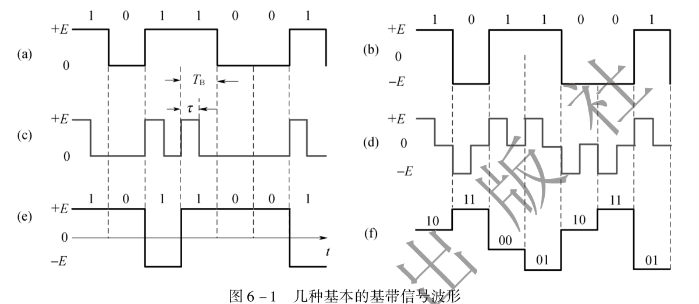
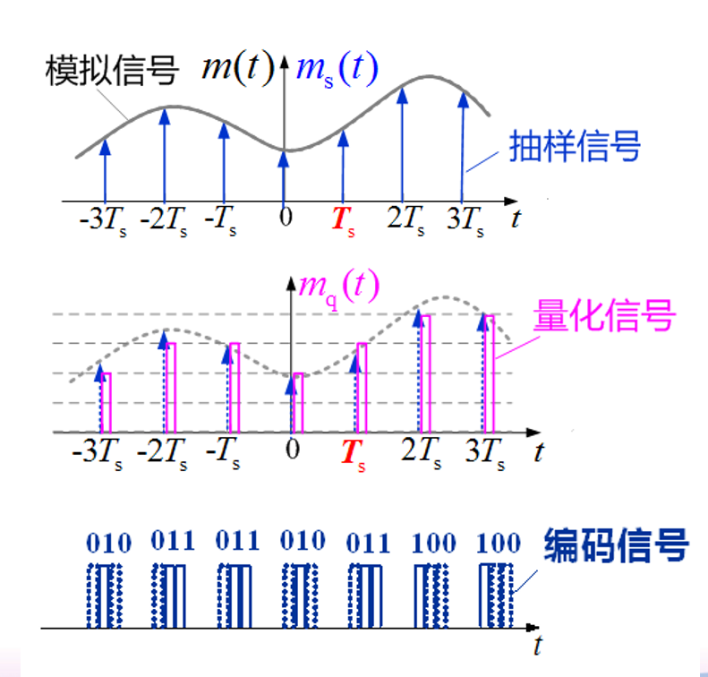

[TOC]

# 通信原理

> 8、9章不考，10、11章最重要
>
> 期末70% 平时30%


### 绪论 #1

> 通信，即利用电信号传输消息中所包含的信息

- 消息、信息、信号

  - 信号是消息传输的载体，消息是信息的载体
  - 消息是信息的物理表现，信息是消息的内涵
  - 模拟信号：取值连续
  - 数字信号：取值离散

- 通信系统模型

  - 通信系统一般模型：

    ```
    信源》发送设备》信道》接受设备》信宿
    					噪声源》
    ```

  - 模拟通信系统模型（两种重要变换）：

    - 把连续消息变换成原始电信号（基带信号）（这种变换由信源和信宿完成）
    - 把基带信号变换成合适在信道中传输的信号（这种变换通常由调制器和解调器完成）
    - 在接收端进行相反的变换
    - 经过调制后的信号称为已调信号（带通信号），具有特点①携带信息②其频谱具有带通形式

    ```
    模拟信源》调制器》信道》解调器》信宿
    					噪声源》
    ```

- 数字通信系统模型

  - 信源的编码和译码

    - 提高传输的有效性
    - 模数（a/d）转换

  - 信道的编码和译码》差错控制

  - 加密与解密

  - 数字调制与解调》把数字基带信号的频谱移到高频处，形成适合在信道中传输的带通信号

  - 同步：收发两端的信号在时间上保持步调一致

    ```
    信源》信源编码》加密》信道编码》数字调制》
    																		信道 《噪声源
    信宿《信源译码《解密《信道译码《数字解调《
    ```

- 数字通信特点

  - 抗干扰能力强、噪音不积累
  - 传输差错可控
  - 便于处理、变换、存储，可综合传输
  - 易于集成、易于加密
  - 需要较大的传输带宽
  - 对同步要求就高

- 通信系统分类方法

  - 按信道信号特征分类：模拟、信号
  - 按传输媒质分类：有线、无线
  - 按传输方式分类：基带、带通
  - 按通信业务分类：电话、图像……
  - 按工作波段分类：长波、微波……
  - 按复用方式
  - 按调制方式

- 工作波长和频率换算公式

  - λ=c/f     c=3*10^8

- 通信方式

  - 单工、双工
    - 单工通信：单行道
    - 半双工通信：一条信道，但不能同时接发
    - 全双工通信：两条信道
  - 并行、串行

##### 信息量度

> 传输信息的多少可以采用“信息量”去衡量。这小节将讨论如何度量信息中的信息量

- 事件出现概率越小，则消息中的信息量越大
  
- 信息量的计算

  ​		I = log~a~ 1/P(x) = -log~a~ P(x)  

  - I表示消息中所含信息量
  - P(x)表示消息发生概率。概率越小，信息量越大
  - a=2时，信息量单位为比特bit，简记为b。a=e时，信息量单位为奈特nat。a=10时，信息量单位为哈特莱Hartley

- 平均信息量（信息熵）H(x) 的计算：适用于非等概率

  ​		H(x) = $\sum_{i=1}^{M}$ I~i~

  ​				 =  - $\sum_{i=1}^{M}$P(x~i~)log~2~P(x~i~) (b/符号)
  
  - 等概率时，熵最大


##### 通信系统主要性能指标

- 有效性：指传输一定信息量所占用的频带宽度，即频带利用率

  - 对于模拟通信系统，传输同样的信源信号，所需的传输带宽越小，频带利用率越高，有效性越好

  - 频带利用率η

    η = $\frac{R_{B}}{B}$(Baud/Hz) 或 η~b~ = $\frac{R_{b}}{B}$(b/(s·Hz))

  - R~B~ 码元传输速率（波特率），单位为Baud
  
- R~b~信息传输速率（比特率），单位为(b/s)》
  
    R~B~ = $\frac{1}{T_B}$(Baud)

    R~B~ = $\frac{R_b}{log_2M}$

    R~b~ = R~B~ log~2~M = R~B~ H(x)

    - T~B~ 码元长度（s）
  - T~b~每个二进制码元的持续时间
    - M=n\*k      n进制码元、k个码元（等概率时）

- 可靠性：
  
  - 模拟通信系统的可靠性通常用接收端输出信号与信噪比(S /N)来度量，它反映 了信号经传输后的“保真”程度和抗噪声能力
  - 数字通信系统的可靠性可用差错概率（误信率、误码率）来衡量
  - 误码率 Pe=错误码元数Ne/传输总码元数N
  - 误信率 Pb=错误比特数/传输总比特数


[TOC]

### 确知信号 #2

##### 确知信号类型

- 确知信号：任意时刻都有确定的和可预知的信号
  - 周期信号、非周期信号
    - 每隔一定时间间隔按照相同的规律重复，且无始无终，称为周期信号
    - s(t) = s(t+T0)， -∞<t<∞
  - 能量信号、功率信号
    - 信号功率定义为电流在单位电阻上消耗的功率
    
      P=V^2^/R=V^2^=I^2^   （W）
    
      后面用S代表信号的电流或电压来计算信号功率
    
    - 能量公式》信号瞬时功率的积分
    
      E=$\int_{-\infin}^{\infin}$s^2^(t) dt​  （J）
    
    - 平均功率
    
      P=lim$_{T\to\infin}\frac{1}{T}\int_{-\infin}^{\infin}$s^2^ (t)dt​ （w）
    
    - 能量信号：若0<E<∞和p=0，则称s(t)为能量有限公式：例 单个矩阵脉冲
    
    - 功率信号：若0<p<∞和E=∞，则称s(t)为功率信号 ：例 直流信号、周期信号
    
  - 周期信号一定是个功率信号，能量信号一定是个非周期信号，结论不可逆。可通过这种方法判断是否为周期函数

##### 确知信号频域性质

> 信号最重要的性质之一，和信号的占用频带宽度以及信号的抗噪声能力有密切关系
>
> 信号的频率特性有4种，如下

- （周期性的）功率信号的频谱（傅里叶级数系数）

  ​	C~n~ = $\frac{1}{T_0}\int^{T_0/2}_{-T_0/2}$ s(t) e^-j2Πnf_0t^ dt

  - 周期性信号的傅里叶级数

    s(t) = $\sum^∞_{n=-∞}$C~n~ e^j2πnt/T_0^

  - 周期性的功率信号的频谱函数C~n~是离散的。因为n可取负值，所以在负频率上C~n~也有值。通常称C~n~为双边频谱

- 能量信号的频谱密度

  ​	 S(f) = $\int^∞_{-∞}$s(t) e^-j2πft^dt

  - 负频谱和正频谱模偶对称，相位奇对称

  - $\delta$函数的性质②
    - 可用抽样函数的极限来表示
    - 可以看作是单位阶跃函数的导数

- 能量信号的能量谱密度

  ​	G(f) = |S(f)|^2^    (J/Hz)

- 功率信号的功率谱密度

  ​	P(f) = lim~T→∞~$\frac{1}{T}$|S~T~(f)|^2^  (W/Hz)

  ​	P = $\sum^∞_{n=-∞}$|C~n~|^2^ δ(f - nf~0~) = δ(f - f~0~) + δ(f + f~0~)

  - 后者为周期性的功率信号功率密度

  - 功率信号能量无穷大，故不能计算其能量谱密度

##### 确定信号的时域性质

- 能量信号的自相关函数
  - 定义：R(τ) = $\int^∞_{-∞}$s(t) s(t + τ)dt  -∞<τ<∞
- 功率信号的自相关函数
  - 定义：R(τ) = lim~T→∞~ $\frac{1}{T}\int^{T/2}_{-T/2}$s(t) s(t + τ)dt  -∞<τ<∞
- 能量信号的互相关函数
  - 定义：R~12~(τ) = $\int^∞_{-∞}$s~1~(t) s~2~(t + τ)dt  -∞<τ<∞

- 能量信号的互相关函数
  - 定义：R~12~(τ) = lim~T→∞~ $\frac{1}{T}\int^{T/2}_{-T/2}$s~1~(t) s~2~(t + τ)dt  -∞<τ<∞


[TOC]

### 随机过程 #3

> 随机过程是重要的数学工具，因为通信系统中的信号与噪声都具有一定的随机性，需要用随机过程来描述

##### 随机过程的基本概念

- 测试结果的每一个记录都是样本函数，随机过程是所有样本函数的集合，也可以把看作是在时间进程中处于不同时刻的随机变量的集合

- 随机过程的分布函数
  - 设 ξ(t)表示一个随机过程，则其统计特性可以用分布函数或概率密度函数来描述
  - 一维、二维、n维分布函数：统计孤立时刻、两个时间点的统计特性，n越大，对随机过程统计特性描述越充分。该函数为随机过程的偏导数
  
- 随机过程的数字特征
  - 均值（数学期望）
    
    E[ζ(t)] = $\int^∞_{-∞}$ x f~1~(x ， t) dx 
    
    - 均值是时间的确定函数，常记为 a(t)
    
  - 方差
    
    D[ζ(t)] = E{ [ ζ(t) - a(t)^2^ ] } = E[x^2^] - E^2^[x]
    
    - 描述偏离程度，常记为σ^2^(t)
    
  - 均值和方差只与随机过程的一维概率密度函数有关，只能描述随机过程在各个孤立时刻的特征，不能反映随机过程内在的联系。采用相关函数或协方差函数都可以解决
  
  - 相关函数：同一个过程任意两个时刻的关联程度
  
    R(t1, t2)
  
     =  E[ ζ(t~1~) ζ(t~2~) ]
    
     = $\int^∞_{-∞}$$\int^∞_{-∞}$ x~1~x~2~f~2~(x~1~, x~2~;t~1~,t~2~)dx~1~dx~2~
    
    -  ζ(t~1~) ζ(t~2~) 是在t1和t2时刻的确定函数
    - f~2~(x~1~，x~2~;t~1~，t~2~)为 ζ(t)的二维概率密度函数 
    
  - 协方差函数 
    
    B(t~1~, t~2~)
    
     = E{[ζ(t~1~) - a(t~1~)]\[ζ(t~2~) - a(t~2~)]}
    
     = $\int^∞_{-∞}\int^∞_{-∞}$[x~1~-a(t~1~)]\[x~2~-a(t~2~)]f~2~(x~1~,x~2~;t~1~,t~2~)dx~1~dx~2~
    
    - 两者关系 : B(t~1~, t~2~) = R(t~1~, t~2~)  - a(t~1~) a(t~2~)
    - 互相关函数（仅了解）：两个过程的关联程度

##### 平稳随机过程

- 定义

  - 严平稳（狭义）随机过程：统计特性与时间起点无关的随机过程
  - 广义平稳过程
    - 均值与t无关，为常数a
    - 自相关函数仅与时间间隔（τ = t2 - t1）有关
  - 严平稳一定是广义平稳过程，反之不一定成立
  
- 各态历经性（遍历性）

  - 如果平稳过程的统计平均值等于它的任一次实现的时间平均值，则称该平稳过程具有 各态历经性
  - 判断条件① a=$\overline{a}$  ② R(τ)=$\overline{R(τ)}$
  - 时间均值$\overline{a}$和时间相关函数$\overline{R(τ)}$
    - 时间均值$\overline{a}$=$\overline{x(t)}$=lim~T→∞~$\frac{1}{T}\int^{T/2}_{-T/2}$ x(t) dt
    - 时间相关函数$\overline{R(τ)}$=$\overline{x(t)x(t+τ)}$=lim~T→∞~$\frac{1}{T}\int^{T/2}_{-T/2}$ x(t) x(t+τ)dt
  - 具有各态历经性的随机过程一定是平稳过程，反之不一定成立
  - 判断是否具有各态历经性的解题思路
    
    - 判断是否平稳（求其统计平均值）》求时间均值》比较两者是否相等

- 平稳过程的自相关函数

  R(τ) = E[ ζ(t) ζ(t+τ) ]

  - 可用于描述平稳过程的数字特征、与平稳过程的谱特性有着内在的联系

- 平稳过程的功率谱密度

  P~x~(f) = lim~T→∞~$\frac{|X_T(f)|^2}{T}$

  - 方便地求功率谱 Pξ (f)：维纳—辛钦定理

##### 高斯随机过程

- 定义：如果随机过程服从正态分布，则称它为高斯过程

- 重要性质

  - 只需要研究数字特征
  - 广义平稳的高斯过程是严平稳的
  - 如果高斯过程在不同时刻的取值是不相关的，那么他们是统计独立的
  - 若线性系统的输入过程为高斯过程，则系统输出也是高斯过程

- 高斯随机变量

  - 一维概率密度函数:star:

    ​	f(x) = $\frac{1}{\sqrt{2\pi}σ}$ exp$(-\frac{(x - a)^2}{2σ^2})$

    - σ为标准差（方差的开方），表示函数的集中程度
    - a为均值（分布中心），概率密度函数关于直线x=a对，线以下的面积为1
    - exp()：e的(-x)次方

##### 平稳随机过程通过线性系统

> 通信系统主要是由信号通过系统传输的过程。在分析通信系统时，往往需要了解随机过程通过线性过程后的情况

- 输入与输出随机过程 ξ(t) 应满足

  ζ~0~(t) = $\int^∞_{-∞}$ h(τ) ζ~i~(t-τ) dτ

- （假设输入过程是平稳的）输出过程ξ(t)的均值：

  E[ξ~0~(t)] = a $\int^∞_{-∞}$  h(τ) dτ = a H(0)

  - H(0) 为线性系统在f=0处的频率响应，即直流增益
  - 输出过程的均值是一个常数

- 输出过程ξ(t)的自相关函数

  R~o~(t1, t1+τ) = $\int^∞_{-∞}\int^∞_{-∞}$ h(α)h(β)R~i~ (τ + α - β)dα dβ=R~o~(τ)

  - 若线性系统的输入过程是平稳的，那么输出过程也是平稳的

- 输出过程ξ(t)的功率谱密度

  P~o~(f) = H^*^(f)·H(f)·P~i~(f) = | H(f) |^2^ P~i~(f)

  - 输出过程的功率谱密度是输入过程的功率谱密度乘以系统频率响应模值的平方

- 输出过程ξ(t)的概率分布》高斯过程经线性变换后仍为高斯过程

##### 窄带随机过程

> 大多数通信系统都是窄带带通型的，通过窄带系统的信号或噪声必然是窄带随机过程

- 若①随机过程ξ(t)的谱密度集中在中心频率 f~c~ 附近相对窄的频带范围Δf内，即满足Δf<<$f_c$，②f~c~远离零频率，则称该ξ(t)为窄带随机过程
- $\xi(t)$的统计特性
  - $\xi_c(t)$和$\xi_s(t)$分别为$\xi(t)$的同相分量和正交分量
  - 若$\xi(t)$平稳，则$\xi_c(t)$和$\xi_s(t)$也平稳。若是高斯过程，则两个参数也是高斯变量，且均值为0，方差相同
  - 同一时刻上得到的$\xi_c(t)$和$\xi_s(t)$是互不相关的或统计独立的
- aξ(t)和 φξ(t)的统计特性
  - aξ(t)、 φξ(t)为窄带随机过程的随机包络和随机相位
  - 一个均值为0，方差为为σ$^2_\xi$的窄带平稳高斯过程ξ(t)，其包络a~ξ~(t)的一维分布是瑞利分布，相位φ(t)的一维分布是均匀分布，并且就一维分布而言，aξ(t)、 φξ(t)是统计独立的，即$f(a_\xi，φ_\xi) = f(a_\xi)·f(φ_ξ)$

##### 正弦波加窄带高斯噪声

> 当信号经过信道传输时总会受到噪声的干扰，为了减少噪声的影响，通常在解调器前端设置一个带通滤波器，以滤除信号频带以外的噪声。这样，带通滤波器的输出是正弦波已调信号与窄带高斯噪声的混合波形

- 广义瑞利分布/莱斯分布(3.6-8)
  - 当信号很小时，退化为瑞利分布
  - 当信噪比很大时，近似高斯分布

##### 高斯白噪声和带限白噪声

> 在分析通信系统的抗噪声性能时，常用高斯白噪声作为通信信道中的噪声模型

- 带限白噪声：白噪声通过后，其结果是带限噪声。这是指其谱密度在通带范围内仍具有白色特性的噪声

- 白噪声：功率谱密度在所有频率上均为一个常数的噪声

  ​	P~n~(f) = $\frac{n_0}{2}$    (-∞< f < +∞) (W/Hz)

  - n~0~为正常数。白噪声用n(t)来表示
  - 只要噪声的功率谱均匀分布的频率范围远远大于通信系统的工作频带，就视为白噪声
  - 若白噪声取值的概率服从高斯分布，则称为高斯白噪声
- 带通白噪声
  - 如果白噪声通过理想矩形的带通(bandpass)滤波器或理想带通信道，则其输出的噪声称为带通白噪声
  - 通常，带通滤波器的B<<f~c~，因此也称窄带(narrowband)滤波器，相应地把带通白噪声称为窄带高斯白噪声


[TOC]

### 信道 #4

- 信道可以分为无线信道和有线信道。无线信道利用电磁波在空间中传播来传输信号，而有线信道利用人造的传导电或光信号的媒体来传输信号

- 信道还可以分为恒定参量信道和随机参量信道。恒定参量信道特性不随时间变化，而随机参量信道的特性随时间随机变化

- 噪声对于信号的传输有重要的不良影响，通常认为是一种有源干扰，而信道本身的传输特性不良可以看作是一种无源干扰


##### 无线信道 

- 信号的传输利用电磁波在空间的传输实现的，所有频率皆可传输，但要求天线尺寸不小于电磁波波长的1/10，所以用于通信的电磁波频率较高
- 大气层：对流层0-10km》平流层10-60km》电离层60-400km
- 根据据通信距离、频率和位置的不同，电磁波的传播主要分为：
  - 地波
    - 频率<2MHz。有绕射能力，距离为数百-数千米
    - 用于AM广播
  - 天波
    - 频率: 2~30MHz
    - 会被电离层（高空）反射，距离<4000km。存在寂静区
    - 用于远程、短波通信
  - 视线（视距）
    - 频率>30MHz
    - 直线传播、会穿透电离层
    - 用于卫星和外太空通信、超短波及微波通信
    - 增大视线的路径：提高高度、无线电中继、使用卫星中继（缺点：传输时延大、信号衰减大、成本高）、平流层通信（优点：费用低廉，延迟小，建设快，容量大，正在研究）
  - 通信距离的计算：勾股定理
    - 天波的通信距离可以按照天波路径
    - 两天线之间保持最小距离的要求：h = $\frac{D^2}{8r}$ ≈ $\frac{D^2}{50}$ (m)
- 电磁波传输过程中受到的影响
  - 在大气层内会受大气影响，大气及降水都会吸收和散射电磁波
  - 电磁波越高，衰弱越严重
  - 传播损耗
- 散射（前向散射）：电磁波通过散射方式传播
  - 电离层散射
  - 对流层散射
  - 流星余迹散射
    - 用途：低速存储，高速突发，断续传输

##### 有线信道

- 传输点信号的有线信道
  - 明线
    - 传输损耗低，但容易受天气和环境影响，对外界噪声干扰敏感，并且很难沿一条路径架设大量线路，故被电缆代替
  - 对称电缆
    - 特点：双绞线，减小导线之间干扰
    - 芯线比较细，故其损耗比明线大，但性能稳定
  - 同轴电缆
- 光纤
  - 按折射率分类：阶跃型、梯度型（曲线较大）
  - 光线的传播模式：多模光纤、单模光纤（只有一种传播模式）
    - 多模光纤中的色散：材料色散、模式色散、波导色散
    - 在 1. 31μm 和 1. 55μm 波长上出现两个损耗最小点

##### 信道的数学模型

> 对于调制（解码）信道，便于研究各种调制制度的性能
>
> 对于编码（译码）信道，便于分析通信系统的总性能，把调制和调解等过程的电路特性对信号的影响也折合到信道特性中一并考虑

- 调制信道模型

  e~o~(t) = f[e~i~(t)] + n(t)   或简化为》 e~o~(t) = k(t)e~i~(t) + n(t)

  - e~i~(t)、e~o~(t)：信道输入、输出端信号电压
  - n(t)：噪声电压。由于始终存在，故称加性噪声

  - k(t)：表示信道特性是随时间变化的（时变信道）。可以看作是对信号的一种干扰，故称为乘性干扰。有可能会导致信号产生各种失真，失真会随机变化，故k(t)只能用随机过程表述（随参信道）
  - 信道的特性不随时间变化（或变化极小），则称为恒参信道
- 编码信道模型：用转移概率描述描述编码信道的特性

##### 信道特性对信号传输的影响

- 恒参信道的主要传输特性

  - 振幅-频率特性
    - 无失真（理想）传输要求振幅特性与频率无关。若这一特性不理想，则信号的失真称为频率失真，会使信号的波形产生畸变，引起相邻码元波形之间发生部分重叠，造成码间串扰
  - 相位-频率特性
    - 无失真传输要求相位特性是一条通过原点的直线。若这一特性不理想，则信号的失真称为相位失真，对于数字信号的传输影响很大，因为也会引起码间串扰，使误码率增大
    - 上述两者皆为线性失真，可用补偿网络抵消（补偿）
  - 其他因素

- 随参信道的主要传输特性

  - 多径效应：信号经过几条路径到达接收端，而且每条路径的长度(时延)和衰减都随时间而变，即存在多径传播。多径传播对信号的影响称为多径效应

    R(t)

     = $\sum^n_{i=1}$ μ~i~(t)  cos ω~0~[t - τ~i~(t)] 

     = V(t) cos[ω~0~t + φ(t)]

    - 发射信号为Acosω~0~t，经过n条路径传播，则接收信号为R(t)
    - μ~i~(t)为第 i 条路径到达的接收信号振幅，τ~i~(t)为第 i 条路径达到的信号的时延
    - V(t)为接收信号的包络，φ(t)为相位。接收信号可以看作是包络和相位随机缓慢变化的窄带信号

  - 包络缓慢起伏（信号的强度随时间而变）的现象叫做衰落。由多径效应引起的衰落叫快衰落，而慢衰落是由传播条件引起的
    
  - 多径信道传输函数

    H(ω) = $\frac{AF(ω)e^{-jωτ_0}(1+e^{-jωτ})}{F(ω)}$ = Ae~-jωτ0~(1+e^-jωτ^)

  - 减小频率选择性衰落措施

    - 频率选择性衰落：和频率有关的衰落
    - 措施：信号的带宽小于多径信道的相关带宽(1 /τm )、降低码元传输速率

- 最终获得的信号

  - 确知信号、随相信号（码元随相位随机变化）、起伏信号（接收信号的包络、相位随机变化）

##### 信道中的噪声

- 噪声
  - 噪声：信道中存在的不需要的电信号
  - 这种加性干扰使得信号失真、发生错码、限制传输速率
  - 可分为人为噪声、自然噪声
  - 也可以分为脉冲噪声、窄带噪声、起伏噪声（包括热噪声）
  
- 热噪声（白噪声）

  - 热噪声是一种重要的自然噪声，来自一切电阻性元器件中电子的热运动。由于在一般通信系统的工作频率范围内热噪声的频谱是均匀分布的，所以热噪声由称为白噪声。因为热噪声是由大量自由电子运动产生的，故将热噪声称为高斯白噪声

  - 产生热噪声电压有效值

    V = $\sqrt{4kTRB}$   (V)

    - k=1.38*10^-23^(J/K) ：玻尔兹曼常数
    - T：热力学温度(K)，R：电阻(Ω)，B：带宽(Hz)

  - 热噪声在解调时经过了带通滤波器的过滤，从而带宽受到限制，不再是白色的了，成为了带限白噪声（窄带噪声）。由于滤波器是一种线性电路，故又称窄带高斯噪声

  - 噪声的双边功率谱密度为P~n~(f)，则此噪声功率为：

    P~n~ = $\int^∞_{-∞}$ P~n~(f) df

##### 信道容量

- 信道容量：能够无差错传输时的最大平均信息速率

- 离散信道容量
  - 两种度量单位：
    - 用每个符号能够传输的平均信息量最大值表示信道容量C
    - 用单位时间内能够传输的平均信息量最大值表示信道容量Ct
    - 两者可互换，实质一样
  
- 连续信道容量
  - 由香农信息论可证，白噪声背景下的连续信道容量为

    C~t~ = Blog~2~(1+$\frac{S}{N}$)   (b/s) 

    - S：信号平均功率(W)，B：带宽(Hz)。$\frac{S}{N}$为噪声功率比
    
      ```
      x dB 》S/N=10^(x/10)
      20 dB》S/N=100
      ```
    
    - N = n~0~B：噪声功率(W)，n~0~：噪声单边功率谱密度
    
    - 带宽、信噪比是容量的决定因素


[TOC]

### 模拟调制系统 #5

> 只讲5.1、5.2、5.5
>
> **调制**就是把信号形式转换成适合在信道中传输的一种过程
>
> **载波调制**就是用调制信号去控制载波的参数，使载波的某一个或某几个参数按照调制信号的规律变化
>
> **调制的作用和目的**：①在无线传输中，为了获得较高的辐射效率，天线的尺寸必须与发射信号的波长相比拟。②把多个基带信号分别搬移到不同的载频处，以实现信道的多路复用，提高信道利用率。③扩展信号带宽，提高系统抗干扰能力。

> 模拟消息源→调制器→信道→调解器（解调）→受信者
>
> ​					   噪声源↗

> 调制信号m(t)→调制器→已调信号s~m~(t)
>
> ​		载波c(t)↗

- 分为幅度调制和角度调制（线性调制和非线性调制）。以下只介绍幅度调制

##### 幅度调制（线性调制）原理

- 幅度调制是由调制信号去控制高频载波的幅度，使之随调制信号作线性变化的过程
- 任何调制过程都是非线性变换过程

- 调幅AM
  - (调制信号m(t)+直流偏量A~0~)*载波相乘cosω~c~t = 调幅信号s~m~(t) 当调制信号最大值小于A~0~时，使用包络检波不会发生失真
  - 要求|m(t)~max~| ≤ A~0~
  - 波形变成包络线，频谱两个两头移
  - 特点
    - 可采用包络检波、相干解调还原信号
    - AM频谱由下边带、载波分量、上波带组成
    - 优势在于接收机简单，多用于中短型广播
    - 功率利用率低
  
- 双边带调制DSB
  - 通过抑制载波以提高调制效率
  - 调制信号m(t))*载波相乘cosω~c~t = 调幅信号s(t) 
  - 特性
    - 包络不再与m(t)成正比，不能采用包络检波还原信号，而是采用相干调解
    - 频谱形式少了载波分量，其余不变
    - 调制效率100%，功率利用率高
    - 主要作用于调频立体声的差信号调制，以及为SSB、VSB提供基础等
  
- 单边带调制SSB
  - 信号的产生
    - 滤波法
      - s~DSB~*H(ω) = 调幅信号s~SSB~(t) 
      - 滤除了其中一个边带，但滤波器的实现难度大
    - 相移法：希尔伯特变换：原来的函数移动了π/2的结果。通过希尔伯特变换的加减等操作形成了单边带。但精确相移π/2实现难度大
  - 特点
    - 频带宽度减少了一半
    - 频带利用效率高、低功耗，但存在技术难点。相干调解

- 残留边带调制VSB
  - 介于SSB和DSB的折中方案，使得调制方式不像 SSB 中那样完全抑制 DSB 信号的一个边带，而是逐渐切割，使其残留—小部分，对滤波器要求不高
  - 产生：s~DSB~*H(ω) = 调幅信号s~VSB~(t) 
  - 残留边带信号特点
    - 带宽在单边带和双边带之间
    - 主要用于电视、商业广播中

- 两类解调方法：相干解调与包络检波
  - 相干解调
    - 先与载波相乘，再经由低通滤波器LPF（去掉高频）
    - 实现关键是接收端要提供一个与载波信号严格同步的相干载波
  - 包络检波：只适用于AM。隔去直流后即可得到原信号


##### 线性调制系统的抗噪声性能

> 5.1中的分析是在没有噪声的情况下进行的，本节要研究的是：信道加高斯白噪声的背景下，各种线性调制系统的抗噪声性能

- 分析模型

  > S~m~(t)           >            S~m~(t)           >            m~o~(t)
  >
  > n(t)      带通滤波器    n~i~(t)      解调器        n~o~(t)

  - 带通滤波器的作用是滤除已调信号频带以外的噪声

    - 带通滤波器带宽应和调制后带宽一致，中心频率与载波一致
    - 当带通滤波器的带宽远小于中心频率ω~o~时，可视为窄带滤波器

  - 解调器的输入噪声功率N~i~

    N~i~ = n~0~B

    - n~0~：单边功率谱密度（有时记作P~n~(f)），B：带宽
    - 若为双边功率谱密度，则N~i~需乘以2

  - 输入信噪比  $\frac{S_i}{N_i}$， S~i~ = $\frac{发射信号功率S_T}{调制信道损耗α} $

  - 输出信噪比  $\frac{S_O}{N_O}$， 通常使用G求出

  - 相干解调中》N~i~ = N~O~*4

  - G = $\frac{S_i}{N_i}$ / $\frac{S_O}{N_O}$
    - G 调制制度增益（信噪比增益），越大，抗噪声性能越好，反映了调制制度的优劣

- DSB、SSB调制系统性能
  - 带宽B：带通滤波器的频带宽度B应等于已调信号带宽。带宽可见5-5表（下方）
  - 尽管G~DSB~ = 2G~SSB~，但是在控制部分相同条件下（功率、带宽、功率谱密度），输出信噪比是相同的，即两者抗噪声性能相同
  
- AM包络检波的性能
  - AM信号相干解调系统的性能分析与前面双边带(或单边带)的相同。这里，对 AM 信号采用包络检波的性能进行讨论
  - 检波输出E（t）中大信号和噪声存在非线性关系，为使讨论简明，这里考虑两种特殊情况（利用近似公式）
    - 大信噪比情况
      - 此时，输入信号幅度远大于噪声幅度
      - 结论：AM 信号的调制制度增益 G~AM~ 随A~0~ 减小而增加，但对包络检波器来说，为了不发生过调制现象，应有A~0~ ≧ |m(t)|~max~，所以G~AM~总是小于1
      - 最大信噪比增益为：G~AM~=2/3
    - 小信噪比情况
      - 此时，输入信号幅度远小于噪声幅度
      - 结论：信号被噪声扰乱。输出信噪比不是按比例随着输入信噪比下降，而是急剧恶化，系统无法正常工作。通常把这种现象称为解调器的门限效应。开始出现门限效应的输入信噪比称为门限值。
      - 相干调解不存在门限效应

##### 各种模拟调制系统的比较

| 调制 | 带宽B      | 制度增益G | 复杂程度 |     主要应用     |
| ---- | ---------- | --------- | -------- | :--------------: |
| AM   | 2f~m~      | 2/3       | 简单     | 中短波无线电广播 |
| DSB  | 2f~m~      | 2         | 中等     |     应用较少     |
| SSB  | f~m~       | 1         | 复杂     | 短波无线电广播等 |
| VSB  | 略大于f~m~ | 近似于SSB | 复杂     |    电视广播等    |
| FM   | ...        | ...       | 中等     |       ...        |

[TOC]

### 数字基带传输系统 #6

> 与模拟通信相比，数字通信具有许多优良的特性

- 数字基带信号：未经过调制的数字信号
- 数字基带传输系统：不经载波调制而直接传输数字基带信号的系统，常用于传输距离不远的情况

##### 数字基带信号及其频谱特性

- 数字基带信号

  - 数字基带信号是表示数字信息的电波形，可用不同的电平或脉冲来表示
  - 单极性波形：1为正电平(+E)，0为0》有直流分量，只适用域计算机内部等极近距离
  - 双极性波形：1为正电平(+E)，0为负电平（-E）》抗干扰能力较强
  - 单极性归零波形（1为由正电平下降，0为0》可提供定时信息
  - 双极性归零波形：1为由正电平下降，0为由负电平上升》具备上述两种优点
  - 差分波形：0时电平保持现状，1时跳动。需要确定初始值
  - 多电平波形：一个脉冲可以携带多个比特的信息，但同时有着多个电平。每两位对应一种波形（图为2B1Q波形）

  

- 数字基带信号可表示为：

  ​	s(t) = $\sum^∞_{n=-∞}$a~n~ g(t-nT~B~) s~n~(t)
  
  - T~B~码元持续时间
  - g(t)某种脉冲波形，基带信号s(t)
  - 一般情况下可表示为：s(t) = $\sum^∞_{n=-∞}$s~n~(t)

- 基带信号的频谱特性
  - 通过频谱分析，可以确定信号需要占据的频带宽度，还可以获得信号谱中的直流分量等信息

##### 基带传输的常用码型

- 传输码的码型选择原则：不含直流，且低频分量尽量少、含有丰富的定时信息、功率谱主瓣宽度窄，以节省传输频带、不受信息源统计特性的影响、具有内在的检错能力、编译码简单

- 常用传输码型
  
  - AMI码：将1依次变为+1、-1，使其不含有直流分量。简单，但不能解决长串0（长串0时不能够提取定时信号）
  
  - HDB~3~码：由AMI改进
    - 平时按照AMI，当有连续4个0时，将第4个0改为非0脉冲，使用+V、-V代替，符号应交替
    - 当前V的符号与前者符号不同时（如+1和-V），第一个0应该变为B，符号与V相同
    - 解码简单、接收能够保证定时信息的提取
    
    ```
    消息码
     1000   0 100  0 0 1 1   000 0   000 0  1 1
    AMI码
    -1000   0+100  0 0-1+1   000 0   000 0 -1+1
    HDB3码
    -1000  -V+100  0+V-1+1  -B00-V  +B00+V -1+1
    ```
    
  - 双相码（曼切斯特编码）：出现0时用01表示，出现1时用10表示》简单
  
  - 差分双相码：1跳变，0无跳变》解决了双相码因极性反转引起的译码错误
  
  - CMI码：1用11、00轮替，0用01代替
  
  - 块编码：需要某种冗余来确保码型的同步和检错


[TOC]

### 数字调制 #7

- 数字调制：用数字基带信号控制载波某个参数的过程
- 数字带通传输系统：包括调制/解调的数字传输过程

##### 二进制数字调制原理

- 2ASK(Amplitude Shift Keying)(OOK)二进制振幅键控
  - 1时有载波，0时无
  - 产生：模拟调制法、键控法
  - 解调：
    - 包络检波法：带通滤波器》全波整流器（交流变直流，绝对值的方式）》低通滤波器（变平滑）》抽样判决器（变成脉冲）
    - 相干解调法：带通滤波器》相乘器（交流变直流，移频调幅的方式）》低通滤波器》抽样判决器
  - 2ASK信号的带宽是基带信号带宽的两倍

- 2FSK(Frequency Shift Keying)二进制频移键控
  - 1时频率慢，0时频率快。可以看成2个不同载频的2ASK叠加
  - 产生：模拟调频法、键控法
  - 解调：
    - 包络检波法：(带通滤波器》包络检波器)*2》抽样判决器
    - 相干解调法：(带通滤波器》相乘器》低通滤波器)*2》抽样判决器
    - 过零检测法
  - 连续谱形状随着两个载频之差的大小而变化

- 2PSK(Phase Shift Keying)二进制相移键控
  - 原理：载波相位
  - 产生：模拟调制法、键控法
  - 解调：相干解调
  - 2PSK信号的带宽是基带信号带宽的两倍
  - 存在问题：载波相位模糊、反相工作。可使用DPSK解决

- 2D(different)PSK二进制差分相移键控
  - 编码规则：相对码=绝对码（原来的码）⊕ 前一位相对码
  - 原理：利用前后相邻码元的载波相对相位表示信息。若当前位置减去前一位为pi，表示1，为0则表示0
  - 产生：差分编码+2PSK调制器
  - 解调：
    - 相干解调+码反变换法：比2PSK解调最后一步多了码反变换
    - 差分相干解调法
  - 功率谱密度：与2ASK相同，也是码元速率的两倍

##### 二进制相同抗噪声性能

- 性能指标：系统的误码率P~e~
- 分析方法：借用数字基带系统的方法和结论
- 分析条件：恒参信道、信道噪声是加性高斯白噪声

- 2ASK系统的抗噪声性能
  - 相干解调、包络检波总误码率
  - 判决门限与错误概率

- 2FSK、2PSK、2DPSK系统的抗噪声性能

##### 二进制数字调制系统的性能比较

- 误码率
  - r一定，相同解调方式下，抗白噪声性能优劣顺序：**2PSK**、2DPSK、2FSK、2ASK；相同调制方式下，P~e相干~<P~e非相干~，但大信噪比时（r>>1），两者性能相差不大
  - Pe一定，所需的信噪比r~2ASK~=2r~2FSK~=4r~2PSK~
- 频带带宽
  - B~2ASK~ = B~2PSK~ = B~2DPSK~ = 2*谱零点带宽（码元速率）
- 对信道特性变化的敏感性
- 设备的复杂度
  - 非相干方式比相干方式简单

[TOC]

### 信源编码 #10

- 引言
  - 信源编码的作用：压缩编码、数字化，模数转换
  - 信源无损压缩、有损压缩
  - 波形编码的三步骤：抽样、量化、编码
  - 波形编码的常用方法：PCM、DPCM、ΔM
  
  

##### 抽样

- 低通模拟信号的抽样定理
  - 定理：最高频率小于f~h~的模拟信号m(t)可由其等间隔的抽样值唯一确定，抽样间隔T~s~或抽样频率f~s~应满足：
    - T~s~ ≤ $\frac{1}{2f_H}$ 最高时为 奈奎斯特间隔
    - f~s~ ≥ 2f~H~ 最低时为奈奎斯特速率
  - 不符合上述定理时，会出现混叠失真，此时不能重建原信号
  - 抽样与恢复
- 带通模拟信号的抽样定理
  - 定理：设 带通型 模拟信号m(t)的频率范围限制在(f~L~≤f<f~H~)内，且f~L~>B，则最小抽样速率为
  
    f~s~ = 2B(1+$\frac{k}{n}$)
  
    - B = f~H~ - f~L~，n为(f~H~/B)的整数部分，k为(f~H~/B)的小数部分

##### 量化

- 量化原理：用有限个量化电平*表示*无限个抽样值
- 均匀量化：等间隔划分输入信号的取值域
  - 信号量噪比：量化器的性能指标之一
    - 量化噪声N~q~：（抽样值 - 量化值）的均方值
    - 信号量噪比S/N~q~：信号功率与量化噪声 功率之比
  - 缺点：信号小时，S/N~q~也小，往往达不到要求；电话传输中需要的编码位数多，导致编码信号的带宽增大且编码设备复杂
- 非均匀量化
  - 量化间隔不相等的量化方法。ΔV随信号样值变化
  - 实现方法：先压缩，再进行均匀量化，等效于非均匀量化
  - 压缩：提高小信号的信噪比。在接收端需要采用一个与压缩特性相反的扩张器来恢复信号
    - 压缩特性：y = 1 + $\frac{1}{k}$ ln x
    - （压缩后）信号小，量化间隔小；信号大，量化间隔大
  - 两种压缩律
    - A律、μ律：13、15折现近似法
    - A律分有利于数字化，大信号下量化性能更优
  - 对语音信号采用非均匀量化的原因：小信号出现概率大，大信号出现概率小

##### 编码：PCM:star:

> 脉冲编码调制 Pulse Code Modulation

- 数字化过程

  - 量化电平数M=8：量化值只能取8种

  - 常用二进制码

    - 量化级序号》0-7为负极性部分，8-15为正极性部分
    - 自然二进制码：平时用的二进制码

  - 折叠二进制码：A律13折现PCM编码中，共2^8^个量化级，故需编成8位二进制码

    - C~1~极性码：表示样值的极性
    - C~2~-C~4~段落码：表示样值的幅度所处的段落
    - C~5~-C~8~段内码：代表各段内的16个量化级
    - 折叠二进制码特点：具有镜像特性、简化了编码过程、误码对小电压的影响小

    - 编码的计算：需要记住表值。Δ表示一个最小量化单位，不可漏
    - 转换为均匀量化n位码：I~C~转换为二进制后，在前面补0直到够n位

    ```
    段内码 = (Is - 起始值)/量化间隔  》取整，只舍不入
    编码电平Ic = 码组表示结果
    ```

  | 段落序号 | 段落码 |   段落范围    | 段内量化间隔 |
  | :------: | :----: | :-----------: | :----------: |
  |    8     |  111   |   1024-2048   |      64      |
  |    i     |  i-1   | 2^i+2^-2^i+3^ |    2^i-2^    |
  |    3     |  010   |     32-64     |      2       |
  |    2     |  001   |     16-32     |      1       |
  |    1     |  000   |     0-16      |      1       |

- 电话信号的编译码器》编码的实现

- 译码：把PCM信号还原为相应的原样值信号（D/A变换）

  - 译码电平I~D~ = 编码电平I~C~ + 段内量化间隔/2
  
- PCM系统中噪声的影响

  - PCM系统输出 = 信号成分 + 量化噪声 + 加性噪声
  - 性能指标：抗加性噪声性能、抗量化噪声性能（前两者皆为功率比）、总输出信噪比（噪声的功率相加后与信号功率比）

##### 差分脉冲编码调制DPCM

- PCM信号的比特率和带宽
  - 降低编码信号的比特率、压缩信号的传输频带是语音编码技术追求的目标（PCM的比特率高、占用带宽大）
  - 解决思路是：利用相邻抽样值之间的相关性，减少信息冗余、获得压缩效果
- 预测编码
  - 将前面几个抽样值进行计算得到预测值，将预测值与当前样值得到预测误差。将预测误差进行传输，这样所需的编码位数减少，降低了比特率
  - 线性预测：利用前面几个抽样值的线性组合来预测当前时刻的样值。若仅用前面一个抽样值预测当前的样值，即为DPCM
- DPCM原理与性能
  - 量化误差与信号量噪比
- 自适应差分脉码调制ADPCM：改善了DPCM性能
  - 用自适应量化、预测取代固定量化、预测
  - 大大提高输出信噪比和编码动态范围

##### 增量调制：ΔM、DM

- 拥有编译码简单、 低比特率时的量化信噪比高、抗误码特性好等优点
- 量化电平数取2，即对预测误差进行1位编码。每个编码比特表示相邻抽样值的极性（正负）
- 增量调制系统中的量化噪声
  - 译码器最大跟踪斜率：k = $\frac{σ}{Δt}$ = σ * f~s~。要求避免过载，即最大斜率小于k，方法：
    - σ选大：采用自适应ΔM，使量化台阶随信号变化而变化
    - f~s~选大：对减小过载噪声和一般噪声都有利
  - 编码范围A~min~\~A~max~、起始编码电平A~min~ = σ/2、 最大编码电平A~max~ = $\frac{σ·f_s}{ω_k}$ = $\frac{σ·f_s}{2\pi f_k}$

[TOC]

### 差错控制编码 #11

- 各种干扰使传送的数据流中产生误码
  - 针对乘性干扰：采用均衡等措施
  - 针对加性干扰：合理选择调制/解调方法，增大发射功率、采用差错控制等措施
- 差错控制编码（纠错编码）
  - 目的：降低误码率
  - 方法：增加一些多余码元（监督码元），接收时利用这种关系来发现或纠正传输过程中产生的错码

##### 自动要求重发系统 ARQ

- 3种 ARQ
  - 停止等待ARQ系统：在发送下一个码组之前，要等待来自接收机的ACK（半双工、效率低下）
  - 拉后ARQ系统：连续发送，当发送段收到某组的NAK答复后，退回并从该组开始重发。效率更高，但要求系统需要双工信道
  - 选择重发ARQ系统：仅重发出错的码组，进一步提高了效率
- ARQ的特点（与前向纠错FEC相比）
  - 码率较高，用较少的监督码元就能使误码率降到很低、检错的复杂度低、能适应不同特性的信道
  - 需双向信道来重发、重发使得ARQ系统传输的效率低、信道干扰严重时，将发生因反复重发而造成事实上的通信中断、不适用于要求实时通信的场合

##### 纠错编码的基本原理

- 冗余
  - 引入冗余，使得接收端能够发现错误。冗余越多，纠错检错能力越强
  - 多余度：监督码元r/n
  - 码率（编码效率）：R~c~ = $\frac{信息码元数k}{编码后码字位数n}$
  - 冗余度：r/k
- 分组码：将信息码每k个分为一组，按一定规则为每组信息码附加r个监督码的编码称为分组码编码后的每组长度为n = k+r
  - 分组码的符号(n，k)
- 码重和码距
  - 码长n：码组种的码元个数
  - 码重w：码组中“1”的个数
  - 码距d：两个码组对应位上数字不同的位数称为码组的距离
  - 最小码距d~0~：各个码组之间距离的最小值。
  - 最小码距和检纠错能力的关系:star:
    - 检e个错码，要求d~0~ ≥ e+1
    - 纠t个错码，要求d~0~ ≥ 2t+1
    - 纠t个错码，同时检e个错码，要求d~0~ ≥ e+t+1(e>t)

- （性能）系统宽带和信噪比的矛盾：降低误码率、节省信噪比，但带宽增大

##### 简单的实用编码

- 奇偶监督码
  - 所有数模2加（异或运算）得到监督元。只有一位监督元
  - 只能检测奇数个错码，也不具备纠错能力
  - 适用于检测随机出现的零星差错，码率很高
- 二维奇偶监督码
  - 按行、按列一起进行奇偶监督
  - 有一定的纠错能力，适于检测长度不大于行数或列数的突发错误
- 恒比码
  - 每个码组1和0的数目之比恒定。计算接受组中1的数目，就可知是否有错
- 正反码
  - 每个码组的监督位数目等于信息位数目，督元与信元相同或相反，则由信息码中1的个数而定（奇数个1时，相同；偶数个1时，反码）
  - 译码方法：先将接收码组中的信息位和监督位按模2加，得到一个合成码组，并由此生成一个校验码组（根据1的个数，若偶数个1时，校验码组是合成码组的反码）
  - 观察校验码组中1的个数，然后判决纠正。全为0时无错码
  - 具有纠正1位错码的能力

##### 线性分组码:star:

- 汉明码：一种能够纠正1位错码 且编码效率较高的线性分组码

  - 构造原理

    - 校正子S：所有数模2加得到监督元，若s=0，认为无错，若s=1，认为有错
    - 对于线性分组码(n，k)，满足2^r^ - 1 = n 时称为汉明码
   ```
   例：分组码(n,k)中k=4，取r=3时满足汉明码要求。
   用a6~a0表示这7个码元，S1~S3表示3个监督关系式中的校正子。校正子和错码位置有如下关系
   ------
   S1 S2 S3 错码位置
    0  0  1   a0
    0  1  0   a1
    1  0  0   a2
    0  1  1   a3
    1  0  1   a4
    1  1  0   a5
    1  1  1   a6
    0  0  0   无错码
   ------
   得到偶数监督关系式：(把为1的地方写进式中)
   	S1 = a6 ⊕ a5 ⊕ a4 ⊕ a2
   	S2 = a6 ⊕ a5 ⊕ a3 ⊕ a1
   	S3 = a6 ⊕ a4 ⊕ a3 ⊕ a0
   移项，得到监督位a2a1a0
   	a2 = a6 ⊕ a5 ⊕ a4
   	a1 = a6 ⊕ a5 ⊕ a3
   	a0 = a6 ⊕ a4 ⊕ a3
   ```

- 线性分组码的一般原理。例：（7，4）汉明码

  - 监督矩阵H

    - H的行数等于r，且各行是线性无关的。可以由H确定督元和信元之间的关系

    - 将上述S~1~S~2~S~3~关系式改写为H（出现则为1，未出现为0，从左往右分别是a~6~-a~0~，也就是督元在右）

      ​	| 1110  100 |

      ​	| 1101  010 |     =  [P I~r~]  = H

      ​	| 1011  001 |

      ​	码组A = [a~6~ a~5~ a~4~ a~3~ a~2~ a~1~ a~0~]

      ​	则 A · H^T^ = 0
      
    - 误码在哪里：码组 · H^T^ = 校正子组，通过错码位置关系找出错码

  - 生成矩阵G

    - 将上述a~2~a~1~a~0~关系式改写成矩阵P，然后转置，得到矩阵Q（同样地，出现为1，最左为a~6~）

    - 可见，给定信息位a6-a3后，用信息位的行距阵乘以矩阵Q即可产生监督位

      ​					 |111|

      ​					 |110|

      [a~6~ a~5~ a~4~ a~3~]|101|    =    [a~6~ a~5~ a~4~ a~3~]Q = [a~2~ a~1~ a~0~]

      ​					 |011|

    - 在Q的左侧加上k*k阶单位矩阵，得到G

      ​					|1000  111|

      G = [I~k~Q] =  |0100  110|

      ​					|0010  101|

      ​					|0001  011|

    - 码组A = [a~6~ a~5~ a~4~ a~3~] · G

    - 性质：各行线性无关、G的各行本身就是一个码组

  - 矩阵乘法，其中加法为模二加

    

  - G和H的关系

    - 由典型H、G获得的码称为系统码。系统码的特点是编码后，信元位置不变，督元附在其后
  
  - 错误矩阵：接收矩阵 - 发送矩阵
  
  - 线性分组码的性质
  
    - 封闭性：一种线性码的任意两个许用码组之和仍为该码中的一个许用码组
    - 最小距离：d0就是码的最小重量


[TOC]

##### 循环码

- 循环码是（n，k）线性分组码的一个重要子类

  - 编译码设备简单，检纠错能力较强，应用广泛
  - 具有线性分组码的性质，还具有循环性：循环码中任一许用码经过循环移位后，所得到的码组仍然是许用码组

- 码多项式的运算

  - 码多项式：码字的多项式表示。

    - 例：表示为A(x) = a~6~x^6^ + a~5~x^5^ + ... + a~1~x + a~0~

  - 按模运算

    - 模n运算：四则运算的结果除以n求得的余数

      若$\frac{F(x)}{N(x)}$ = Q(x) + $\frac{R(x)}{N(x)}$ ，则对于 模N(x)运算来说，

      F(x) ≡ R(x)

    - 其中，除法中的减法为模二加

  - 循环码的码多项式

    > x^i^ · A(x) ≡ A'(x)    模(x^n^+1)
    >
    > A'(x) 是该码组的一个许用码组，是A(x)代表的码组向左循环i次的结果

    - 例：循环码组A(x) = x^6^ +x^5^+x^2^+1，其码长n=7，现给定i=3，则

      > x^3^ · A(x) = x^3^ ( x^6^ +x^5^+x^2^+1) = x^5^+ x^3^ + x^2^+ x
      >
      > 模(x^7^+1)

    - i为左移i位

  - 循环码的生成矩阵G

    - 循环码的生成多项式g(x)：在循环码的2~k~个码组中挑出前面(k-1)位都是0的码组，用g(x)表示

    - 用k个线性无关的循环码码组可构成G

      G(x) =  |x^k-1^g(x)|

      ​			|x^k-2^g(x)|

      ​			|	...	 |

      ​			| x g(x)  |
    
      ​			|    g(x)  |
    
    - g(x)是循环码的核心， 对于给定的k位信息码，由g(x)构造出G(x)，从而产生(n， k)循环码
    
  - 循环码多项式A

    - A(x) = [a6 a5 a4 a3] G(x)
    - 循环码的g(x)是(x^n^+1)的(n-k)次因子

- 循环码的编解码方法

- 一种非分组码、是小分组、延时小

  - 非分组码：监督码元不仅监督当组码元

- 卷积码的生成矩阵和监督矩阵

- 卷积码的表述方式：解析/代数表示、码树图、状态图、网格图

  