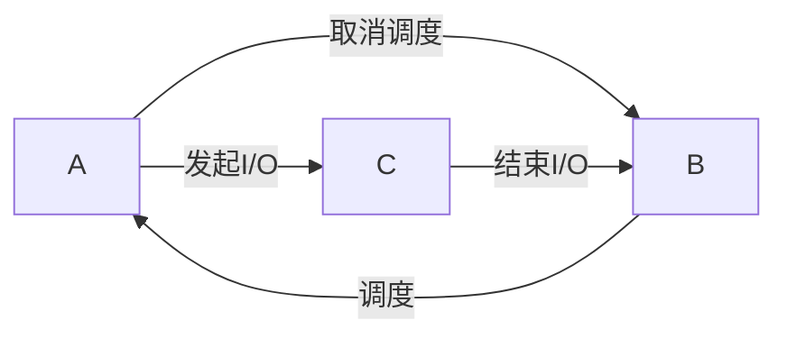

#### #2 操作系统介绍
- 虚拟化（virtualization）
	- 将物理资源转换为虚拟形式
	- 因实现虚拟化，操作系统也被称为虚拟机
	- 虚拟化CPU
		- 将单个CPU转换为看似无限数量的CPU，使得多个程序能同时进行
	- 虚拟化内存
		- 好像每个程序都拥有自己的私有内存，而不是与其他程序共享相同的物理内存
- 并发
- 持久性
	- 需要硬件和软件来持久地存储数据
	- 硬件以某种I/O设备出现，通常为硬盘，软件用于管理硬盘，称为文件系统
	- 操作系统提供了通过系统调用访问设备的标准和简单方法，因此操作系统也被称为标准库
- 操作系统设计目标
	- 建立抽象
	- 提供高性能
	- 应用程序之间以及程序和操作系统之间提供保护、隔离
	- 提高可靠性

#### #4 进程

------
- 进程
	- 操作系统为正在运行的程序提供的抽象，就是所谓的进程
	- CPU的时分共享
		- 每个进程只允许一个时间片，然后切换到其他进程
		- 造成性能损失
	- 进程的机器状态
		- 内存：存储指令和数据
		- 寄存器：许多指令明确地读取或更新寄存器。特殊的寄存器包括了程序计数器和指针等
	- 进程的运行过程
		1. 将代码和静态数据从磁盘中加载到内存上
		2. 操作系统为程序的运行时栈、堆分配内存
		3. 启动程序，执行main()
	- 进程状态
		- 运行：正在执行指令
		- 就绪：操作系统此时没有选择该进程
		- 阻塞：进程执行了诸如I/O请求的操作
	- 跟踪被阻塞的进程：当I/O事件完成时，确保唤醒进程，让它准备好

#### #5 进程API
- `fork()`：克隆当前进程，以创建新进程
- `wait()`：等待子进程运行
- `exec()`：在当前进程运行其他程序（如果成功，则原来的程序不再被运行）

#### #6 受限直接执行
- 受限直接执行LDE（limited direct execution）
- 目的：在时分共享的CPU中，既需要不增加系统开销从而实现高性能，又需要保留操作系统对CPU的控制权
- 直接运行协议
	- 操作系统
		- 在进程列表上创建条目
		- 为程序分配内存
		- 将程序加载到内存中
		- 根据argc/argv设置程序栈
		- 清除寄存器
		- 执行call main()方法
	- 程序
		- 执行main()
		- 从main()中执行return
	- 操作系统
		- 释放进程的内存
		- 将进程从进程列表中移除
- 受限
	- 使用陷阱表限制操作
	- 使用非协作方式使得操作系统可以随时重新获得控制权
- 用户模式与内核模式
	- 硬件提供不同的执行模式来协助操作系统（处理器模式）
	- 用户模式：此模式下运行的代码会受到限制。进程不能发出I/O请求
	- 内核模式：操作系统以这种模式运行
- 系统调用
	- 提供用户执行特权操作的能力
	- 实现原理：内核向用户暴露某些关键功能
	- 陷阱指令
		- 要执行系统调用，必须执行特殊的陷阱指令
		- 执行该指令时，跳入内核并将特权级别提升到内核模式
		- 最后，操作系统会调用“从陷阱返回”指令（return from trap）回到用户模式
		- 为了保证能够正确返回，需要有足够的寄存器。在x86上，处理器会在跳入陷阱前将寄存器保存到内核栈中
	- 陷阱表
		- 陷阱表：硬件中断时需要执行的操作
		- 在操作系统启动的第一件事，就是告诉硬件在发生中断时要执行哪些代码，以及陷阱处理程序的位置
		- 硬件会记住这些处理程序的位置，直到下一次启动机器
- 两种思想
	- 协作方式
		- 此方式下，操作系统相信系统进程会合理运行，运行时间过长的进程会自动放弃CPU
		- 将控制权交给操作系统的方式
			- 进行系统调用的时候
			- 应用程序执行了某些非法操作，比如除以0，或者访问无法访问的内存
		- 缺点
			- 假如某个进程陷入无限循环，而又不进行系统调用，就会出现操作系统无法获取控制权的方式，只能通过重启电脑解决问题
	- 非协作方式
		- 通过设置时钟的中断处理程序可以实现重获CPU控制权
		- 发生中断时，需要将各种寄存器保存到内核栈中，从而能够轻易恢复
- 上下文切换(context switch)
	- 上下文切换包括了保存当前进程中寄存器的值，以及恢复即将执行的寄存器的值

#### #7 进程调度介绍
- 工作负载：操作系统中运行的进程
- 调度指标
	- 性能指标
		- 周转时间 = 任务完成时间 - 到达（系统收到任务）时间
		- 响应时间 = 首次执行时间 - 到达时间
	- 公平指标
- 调度类型
	- 非抢占式(non-preemptive)
		- 系统会将每项工作完成后再处理新工作
		- FIFO、SJF调度都是非抢占式的
	- 抢占式(preemptive)
		- 现代化调度
		- 可以进行上下文切换
- FIFO调度（FCFS先到先服务）
	- 在上一个任务结束后，按任务的先后顺序来决定下一个任务
- SJF调度（Shortest Job First）
	- 在上一个任务结束后，按任务的时长顺序来决定下一个任务
- STCF调度（Shortest Time-to-Completion First）
	- 抢占式的SJF
	- 在任务到来时临时停止当前进程，按任务的时长顺序来决定下一个任务
- 轮转调度（RR, Round-Robin）
	- 在一个时间片内运行一个工作，然后切换到队列中的下一个任务
	- 上下文切换有成本，应当减少切换次数
- 重叠(overlap)：当前进程在发起I/O操作时，将CPU交由其他进程

#### #8 MLFQ
- 多级反馈队列（Multi-level Feedback Queue）
- 特点
	- 优化周转时间
	- 降低响应时间
	- 对进程时长一无所知，通过预测分配任务
- 模型
	- 队列
		- 有许多独立的队列，其中不同的队列表示不同的优先级
		- 每一个工作只能存在于一个队列之中
	- 优先级
		- 如果一个进程不断放弃CPU去等待键盘输入，这是交互型进程的可能行为，MLFQ会让它保持高优先级
		- 如果一个进程长时间地占用CPU，MLFQ会降低其优先级
		- 操作系统默认只从最高优先级队列中执行工作
		- 所有的工作在开始时都是最高优先级
		- 低优先级的工作应该周期地提高优先级，已得到运作（防止饥饿问题，即地优先级工作永远无法执行）
- 规则
	- 如果工作A的优先级高于工作B，运行A
	- 如果工作A的优先级等于工作B，轮转运行工作A、B
	- 工作进入系统时，放在最高优先级
	- 工作用完某一层中时间的配额后，降低其优先级 
	- 经过一段时间，将系统中所有工作重新加入最高优先级队列中

#### #9 比例份额
- 比例份额的思想(proportial-share)
	- 调度程序的最终目标，是确保每个工作获得一定比例额度CPU时间，而不是优化周转时间和响应时间
	- 暂时没有分配彩票的策略
- 彩票调度(lottery scheduling)
	- 彩票数代表进程占有某个资源的份额，本章中指的是进程占有CPU的份额
	- 彩票机制十分适合表示所有权比例
	- 操作系统通过随机方式获得中奖的进程
	- 机制
		- 彩票货币
			- 操作系统中存在多个用户
			- 每个用户内部的工作同样使用彩票方式表示占有份额，但这种彩票需要兑换成全局彩票货币
		- 彩票转让
			- 进程可以临时将自己的彩票交给另一个进程
		- 彩票通胀
			- 进程可以临时提升或降低自己拥有的彩票数量
	- 特点
		- 利用了随机性，轻量快速，也可以避免边角情况
		- 当工作执行时间很短时，平均不公平度非常糟糕（比如，只有硬币次数抛得足够多，才能体现出正反面出现几率是1:1）。称为不确定性
- 步长调度
	- 步长值与票数成反比
	- 每个工作都有一个行程值，操作系统每次选择行程值最低的工作运行，每次运行时工作的行程值加等于步长值
	- 特点
		- 确定性的公平分配算法
		- 需要记录工作的全局状态（行程值）

#### #10 多处理器调度
#### #13 地址空间
- 内存就是一个字节数组
- 操作系统提供内存的发展
	- 早期
		- 操作系统从物理地址0开始占据
		- 之后的地址交由当前程序
	- 分时系统
		- 让一个进程单独占用全部内存一小段时间，然后停止它，并将它所有状态信息保存在磁盘上，加载其他进程的状态信息，再运行
		- 改进
			- 进程切换时，仍将进程信息放在内存中
- 地址空间
	- 操作系统提供给运行程序的抽象
		- 实际上的程序会被加载在任意的物理地址
	- 一个进程的地址空间包含运行的程序的所有内存状态
		- 程序代码(code)
		- 堆(heap)
			- 管理动态分配的、用户管理的内存
		- 栈(stack)
			- 保存当前的函数调用信息，分配内存给局部变量，传递参数和函数返回值
		- 约定
			- 堆的地址在代码之后向下增长，栈的地址在内存空间的底部向上增长
			- 堆和栈中间是未被分配的内存，两者通过增长蚕食这部分空间
- 虚拟化内存的目标
	- 透明
		- 程序感知不到内存被虚拟化的事实
		- C语言中指针地址都是虚拟内存
	- 效率
		- 时间上和空间上实现高效
		- 依靠硬件支持，包括TLB这样的硬件功能
	- 保护
		- 确保进程受到保护，无法被其他进程访问（隔离）

#### #14 内存操作API
- malloc
	- 传入要申请的堆空间大小，成功就返回一个指向新申请空间的指针，失败就返回NULL
- free
	- 释放内存
- 常见错误
	- 忘记分配内存
		- 可能会导致段错误（segmentation fault）
	- 没有分配足够内存
		- 溢出可能会带来不会报错的危害
	- 忘记初始化分配的内存
		- 导致随机读取了未知的数据
	- 忘记释放内存
		- 导致内存泄露
	- 在用完之前释放内存
		- 也称：悬挂指针
	- 反复释放内存
		- 可能会崩溃
	- free了不是malloc产生的指针
- 底层操作系统的支持
	- malloc和free是库调用，建立在系统调用之上
	- 系统调用brk
		- 用于改变程序分断（break）的位置，即堆结束的位置
	- 系统调用mmap
		- 从操作系统中获取内存，这个区域与交换空间相关联

#### #15 地址转换
- 地址转换介绍
	- 通过硬件实现虚拟化内存中的地址转换
	- 硬件介入到每次内存访问中，将进程提供的虚拟地址转换为数据实际存储的物理地址（重定位）
- 动态重定位
	- 使用基址加界限机制
	- 每个CPU需要两个硬件寄存器
		- 基址（base）寄存器
			- 记录程序在物理内存中的实际加载地址
			- 物理地址=虚拟地址+基址
		- 界限（bound）寄存器
			- 提供了访问保护。当进程访问的地址超过了这个界限，CPU将触发异常
		- 将CPU负责地址转换的部分统称为内存管理单元MMU
		- 硬件提供特殊的指令用于修改基址寄存器和界限寄存器，但是这些指令是特权指令
	- 地址转换完全由硬件处理，没有操作系统的介入
- 操作系统着手处理虚拟化地址
	- 在进程创建时，操作系统
		- 为进程的地址空间找到内存空间
		- 使用空闲列表的数据结构来找到可用的内存空间
		- 将起始地址记录在基址寄存器中
	- 在进程终止时，操作系统
		- 回收其所有内存，并将这些内存放回空闲列表
	- 在上下文切换时
		- 保存和恢复基址寄存器和界限寄存器，保存位置通常为进程在内存中的结构，如进程结构、进程控制块
	- 操作系统提供异常处理程序，用于在进程试图越界访问时采取行动，通常是终止错误进程

#### #16 分段
- 段
	- 地址空间里连续定长的区域
	- 典型地址空间里有3个逻辑段，即代码、栈和堆
	- 只有操作系统知道代码分段，进程依然将地址空间视为连续的
- 段错误
	- 通常指在支持分段的机器上发生了非法的内存访问
- 原因
	- 地址空间中，栈和堆之间的空间即使没有被进程使用，也会占用实际的物理内存，造成浪费
	- 分段使得操作系统能将不同的段放到不同的物理区域
- 支持共享
	- 共享内存段也可以节省内存
	- 尽管操作系统存在共享内存，但是每个进程会将共享内存视为自己独占了这块内存
- 实现
	- 在MMU中为每个逻辑段引入一对基址和界限寄存器
	- 硬件在地址转换时对段的判断方式
		- 使用虚拟地址，其中前2位用于标识段，后12位是段内偏移
		- 通过地址方式来确认段
	- 硬件同时需要记录段的增长方向
	- 为每个段增加几位用于标识程序是否能够读写该段，这几位称为保护位
- 细粒度和粗粒度的分段
	- 分段数量的多少表示其粗粒度和细粒度，上述例子中只有3段，称为粗粒度
	- 支持许多段需要进一步的硬件支持，并在内存中保存某种段表
- 操作系统为段分配空间的方式
	- 内存中可能存在过多的外部碎片，导致难以分配需要大内存的段
	- 紧凑物理内存
		- 操作系统先终止运行的进程，将它们的数据复制到连续的内存区域中，改变它们的段寄存器中的值，指向新的物理地址，从而获得足够大的连续空间
		- 成本高，且耗费大量的处理器时间
	- 空闲列表管理算法
		- 试图保存大的内存块用于分配
		- 相关的算法有很多种，目标皆为尽量减少碎片的产生

#### #17 空闲空间管理
- 需求
	- 如果要管理的空间由大小不同的单元构成，管理就会变得困难
	- 让碎片最小化
		- 内部碎片
			- 分配给程序的内存块超出请求的大小时，未使用的内存称为内部碎片
		- 外部碎片
			- 内存区域中未被分配的内存
		- 本章讨论的碎片指外部碎片
- 在C语言中，使用malloc()将内存分配后通常不会被移动，而更高级的语言中可能可以通过紧凑技术来减少碎片
- 空闲列表
	- 使用单链表的方式，将每块空闲区域作为一个节点连接
	- 每个节点记录可用空间的开始地址和大小
- 机制
	- 分割
		- 需要分配内存时如果找到了比需求空间更大的区域时，分割该区域，并修改空闲列表节点数据
	- 合并
		- 释放内存时，如果该内存前后都为空闲区域，那么合并为一个较大的空闲块（由空闲列表节点体现）
	- 追踪已分配空间的大小
		- 使用“头块”的数据结构记录额外的信息，这可能包括分配空间的大小、提供完整性检查的幻数
		- 头块会位于malloc所返回指针指向内存区域之上，可以通过简单的指针运算得到头块的位置
		- 因此当用户请求内存时，库会寻找该内存大小加头块大小的空闲块
	- 嵌入空闲列表
- 基本策略
	- 最优匹配
		- 遍历整个空闲列表，找到和请求大小一样或更大的空间块，然后返回这组候选者中最小的一块
		- 特点
			- 避免空间浪费
			- 性能代价大
			- 可能剩下很多难以利用的小块
	- 最差匹配
		- 遍历整个空闲列表，找到最大的空闲块，分割并满足用户需求后，将剩余的块加入空闲列表
		- 特点
			- 避免了最优匹配导致出现许多小块
			- 性能代价大
			- 导致过量的碎片
	- 首次匹配
		- 找到第一个足够大的块然后返回给用户
		- 特点
			- 速度优势
			- 让空闲列表的开头部分存在很多小块
	- 下次匹配
		- 基于首次匹配，但是算法会从上次分配给用户的空闲空间开始遍历
		- 特点
			- 速度优势
			- 避免了让空闲列表的开头部分存在很多小块
	- 分离空闲匹配
		- 如果某个应用程序经常申请几种大小的内存空间，那就用一个独立的列表，只管理这样大小的对象
		- 厚块分配程序（slab allocator）
	- 伙伴系统
		- 将空闲空间看作大小为2^N的空间，当有一个内存分配请求时，将空闲空间递归地一分为二，找到一个恰能满足该请求的空间
	- 更先进的分配程序采用更复杂的数据结构来优化开销，牺牲简单性来换取性能，比如平衡二叉树、伸展树、偏序树

#### #18 分页
- 概念
	- 将一个进程的地址空间分割成固定大小的单元，每个单元称为一页
	- 把物理内存看成是定长槽块的阵列，叫做页帧
- 地址转换
	- 操作系统为每个进程保存一个数据结构，称为页表。页表用于为地址空间的每个虚拟页保存地址转换
	- 使用虚拟地址，由虚拟页面号VPN和页内偏移量组成
	- 虚拟地址转换为物理地址时，只需要将虚拟页面号替换为物理帧号PFN即可
- 