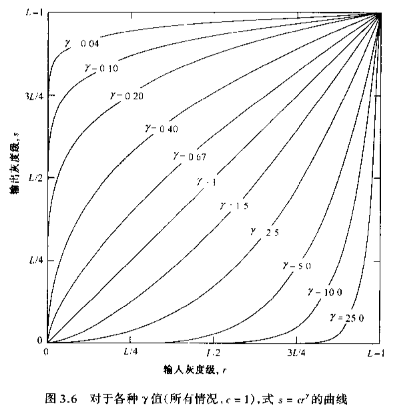
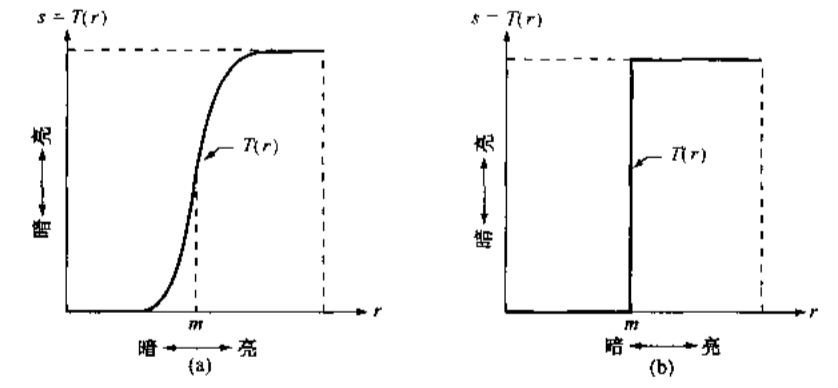
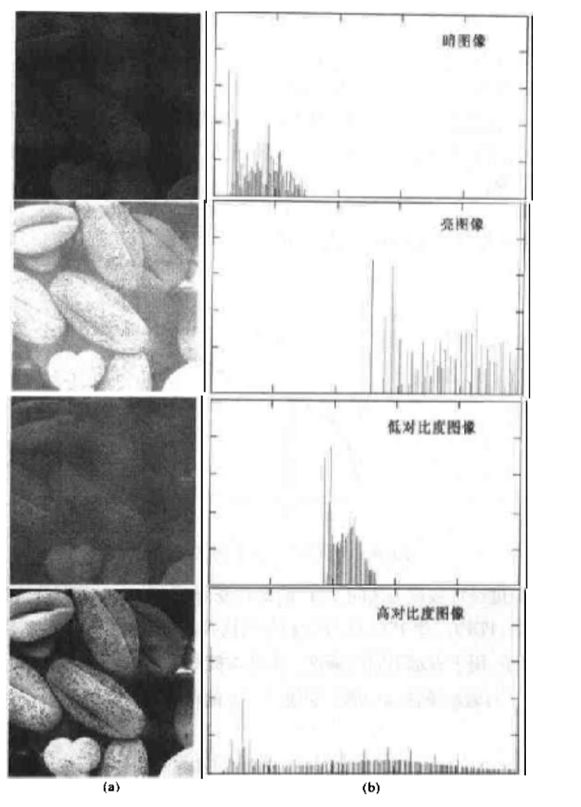

# 数字图像处理

[TOC]

### 1# 基本原理

##### 数字图像

-   数字图像处理概念
    -   数字图像：由有限的像素组成的图像，每一个像素都有一个特定的位置和幅值
    -   灰度值：一幅图像可以定义为二维函数f(x,y)，任意坐标的幅值为该点的灰度
    -   数字图像处理：用计算机处理数字图像
-   图像取样和量化
    -   取样：空间离散化，即对坐标值的数字化
    -   量化：像素值的离散化，即对幅度值的数字化

##### 大小和灰度

-   动态范围：图像中的灰度值范围
-   对比度：图像中最大亮度和最小亮度之比
-   分辨率
    -   空间分辨率
        -   最小可分辨的图像细节
        -   单位长度内，能分辨的线对数/图像的像素数量
    -   灰度级L：$L=2^k$，对应的图像常称为k位图像或k比特图像
    -   数字图像存储空间位数需求：`b = M×N×k` 
    -   灰度级分辨率
        -   最小可分辨的灰度级变化
        -   通常为2的幂级数，该值越高，黑白关系越明显
        -   如，8位图像的灰度级分辨率为256
-   图像的放大和缩小
    -   放大可看作采样
    -   缩小可看作欠采样
        -   图像缩小前最好对图像进行平滑（降低高频分量），以减少亚取样导致的混淆现象
-   放大的两个步骤
    -   叠加网格：放大后的像素网格b叠加在原来的网格a上
    -   灰度赋值：给b的每个像素点赋值。有如下方式
-   三种放大方式（越下，效果越好，算法量越大）
    -   最近邻内插：b的像素值为最近的a的像素值。棋盘效应明显
    -   双线性内插：使用邻近4个点的像素值，按照距离赋予权重
    -   立方内插：基于三次方程内插

##### 像素间关系

-   相邻像素
    -   4邻域
        -   上下左右(x+1,y), (x-1,y), (x,y+1), (x,y-1) 
        -   这个像素集称为p的4邻域，写作N~4~(p)
    -   对角邻域
        -   东北、西北、东南、西南(x+1,y+1), (x-1,y+1), (x-1,y+1), (x-1,y-1) 
        -   这个像素集用N~D~(p)表示
    -   8邻域：周围一圈（4邻域+对角邻域）N~8~(p)
-   邻接性：灰度值相同的区域
-   连通性
-   区域和边界
-   距离变量
    -   欧氏距离
    -   城市街区距离D~4~ 
    -   棋盘距离D~8~ 
-   图像类型
    -   灰度图像：每个像素表示一个亮度值
    -   彩色图像：每个像素有三个亮度值

##### 使用Matlab

-   读取图像
    -   `imread('test.jpg')`：读取图片
    -   `size()`：查看图片矩阵大小
    -   `whos()`：查看图片信息
    -   `imfinfo('test.jpg')`：查看图片详细信息
-   显示图像
    -   `imshow(img)`：显示图像、指定灰度范围
    -   `imshow(img, [100,200])`：显示图像的指定灰度范围
    -   `imshow(img, [])`：显示图像的整个动态范围（在矩阵的最大值不是255时，使用该函数）
-   类型转换
    -   `im2uint8` 
    -   `im2double` 
-   图像处理
    -   `im2bw(img, 0.5)`：转二值图像，参数2为阈值
    -   `imresize(img, 2, 'nearest')` ：图像收缩。参数2为放大倍数，参数3为插值方式

-   例：任意区域的剪切

    ```matlab
    I = imread('lena.bmp');
    % 由c、r组成的点坐标围城一个多边形
    c = [122 172 200 170 121 94];
    r = [21 21 75 121 121 75];
    % BW是一个二维矩阵，只有0和1
    BW = roipoly(I, c, r);
    % 交互式选择roi，即图像界面
    % BW = roipoly(I);
    
    figure; imshow(BW);
    figure; imshow(I.*uint8(BW));
    ```


[TOC]

### 2# 亮度变换与空间滤波

##### 基本灰度变换

-   灰度级变换s=T(r)
      
    - 例：对比度增强的灰度级变换
	    - 在极限情况下，产生二值图像，在m左侧的图像变暗，m右侧的图像变亮

       


-   常用灰度级变换

    -   图像反转
    -   对数变换
    -   幂次变换（伽马变换）
    -   灰度切割：增强某一亮度特征

-   位平面bit-plane

    -   位图切割：设每个像素由n比特表示，则高比特位最清晰

        ```matlab
        % 位图切割：显示8个位平面图像
        A = imread('lena.bmp');
        subplot(3,3,1);
        imshow(A);title('原始图像');
        for i=8:-1:1
           A_bitplane = logical(bitget(A,i));
           subplot(3, 3, 9-i+1);
           imshow(A_bitplane);
           title(['位平面 ' num2str(i)]);
        end
        ```

    -   位图移位

        ```matlab
        % 减少位深
        B=bitshift(A,-2);
        B=bitshift(B,2);
        figure;
        subplot(1,2,1);imshow(A);
        title('原图像');
        subplot(1,2,2);imshow(B);
        title('位深6bit');
        ```

##### 直方图处理

-   直方图h(r~k~) = n~k~

    -   r~k~是第k级的灰度
    -   n~k~是图像中灰度级为r~k~的像素个数

-   归一化的直方图h(r~k~) = 1：表示灰度概率

-   查看图像直方图

    ```matlab
    target = imread('images/rice.tif');
    
    subplot(2,2,1);imshow(target);title('原图')
    subplot(2,2,2);imhist(target);title('原图')
    ```

-   图像直方图的对比

    

-   直方图均衡化

    -   能够自动确定变换函数，旨在生成有均匀直方图的输出图像
    -   将图像灰度范围拉伸至近乎均衡的结果

-   直方图匹配（规定化）

    -   使图像具有规定的直方图分布


##### 空间滤波

-   边界填充
    -   replicate：复制外边界。外围值等于其最近的边界值
    -   symmetric：对称扩展。将边界作为对称中心
    -   circular：循环扩展。让当前图像看起来处于循环中，上下左右都是这一张图像，头接尾尾接头


-   为避免图像数据溢出，在imread读入图像后，应该使用im2double()进行数据类型转换

-   均值滤波器

    ```
    1 1 1
    1 1 1
    1 1 1	*1/9
    ```

-   锐化滤波器

    -   高通滤波器-拉普拉斯算子

        ```
        0  1  0
        1 -4  1
        0  1  0
        ```

    -   高增益滤波器

        -   拉普拉斯算子的基础上，当前像素值+1
        -   中心系数若为负，取反

        ```
         0 -1  0
        -1  5 -1
         0 -1  0
        ```

-   统计排序滤波器：非线性
    -   基于图像滤波器包围的图像区域中像素的排序，然后由统计排序结果决定的值代替中心像素的值
    -   中值滤波器
        -   使用邻域内灰度的中值代替该像素的值
        -   降噪能力强，适合去除椒盐噪声，且模糊的副作用会更小

-   均值处理与积分相似，所以锐化处理可以使用微分来完成
-   基于二阶微分的图像增强：拉普拉斯算子


### 4# 频域处理

##### 傅里叶变换和频率域的介绍

-   图像中的傅里叶变换
    
    -   “数学的棱镜”：傅里叶变换将函数基于频率分成不同的成分
    -   低频对应着图像的慢变化分量，如平滑的墙壁
    -   高频则对应着图像中变化越来越快的灰度级
    -   较高频率是物体的边缘和灰度级的突发改变（如：噪声）标志的图像成分
    
-   二维DFT
    
    -   在傅里叶变换之前用$(-1)^{x+y}$乘以输入的图像函数使得傅里叶变换的原点设置在u=M/2, v=N/2上，该点为二维DFT对应的M×N区域的中心
    
        $F[f(x,y)(-1)^{x+y}] = F(u-M/2, v-N/2)$ 
    
    -   matlab实现
    
        ```matlab
        % DFT
        Fc = fftshift(fft2(src));
        
        % 幅度谱的显示，注意设置动态范围
        S = log(1+abs(Fc));
        imshow(S, []);
        
        % IDFT
        f = real(ifft2(ifftshift(Fc)))
        ```
    
-   在频域中滤波
    -   步骤
        -   计算图像的DFT：`F(u,v)` 
        -   用滤波器函数`H(u,v)`乘以`F(u,v)`后
        -   计算其IDFT并获得结果中的实部
    -   `H(u,v)`滤波器传递函数

-   空域滤波器和频域滤波器

    -   对应关系：空域卷积，频域相乘

    -   使用空域滤波器进行频域滤波

        -   优势：当算子越大，卷积处理每个像素的时间复杂度越高

        ```matlab
        f = im2double(imread('lena.bmp'));
        [M,N] = size(f);
        h = fspecial('gaussian',7,3);
        % freq2能够实现去中心化
        H = ifftshift(freqz2(h,N,M));
        F = fft2(f);
        G = F.*H;
        g = real(ifft2(G));
        imshow(g);
        ```

    -   查看空域滤波器的三维显示

        ```matlab
        h=fspecial('gaussian', 7, 3);
        H=freqz2(h,256,256);
        figure;
        mesh(h);
        figure;
        mesh(H)
        figure
        imshow(H,[]);
        ```


##### 频域滤波器

-   理想低频滤波器ILPF

    ```matlab
    % ...
    [M,N] = size(f)
    [U,V] = dftuv(M,N);
    D = hypot(U,V);		% 周期上与原点(0,0)的距离
    D0 = 30;
    % 大于D0则为0,小于则为1
    H = (D0<=30);
    F = fft2(f);
    % ...
    ```

    -   有振铃现象

-   巴特沃思滤波器BLPF

    -   与ILPF相比
        -   BLPF变换函数在通带与被滤除的频率之间没有明显的截断
        -   低阶的BLPF处理后没有如ILPF出现明显的振铃现象（一阶无振铃，低阶很微小）

-   高斯低通滤波器GLPF

    -   无振铃现象，但过渡带会随着阈值增长

-   理想高通滤波器IHPF

    -   同样有振铃现象

-   BHPF、GHPF

-   高频加强滤波器

-   带通/带陷滤波器：某一部分频率通过/不通过


### 5# 图像复原

##### 图像退化/复原过程

-   图像退化：图像在形成、记录、传输过程中，由于系统和技术不完善导致的图像质量下降（如拍照）
    -   可记为：`g(x,y) = h(x,y)*f(x,y)（卷积） + η(x+y)`
        -   `h(x+y)`为退化函数
        -   `η(x+y)`为噪声
-   图像复原：利用退化过程的先验知识，通过退化的逆过程，使已退化的图像恢复本来的面目
    -   使用频域描述以减低计算复杂度，则退化图像记为`G(u,v) =  H(u,v)F(u,v) + N(u,v)`
    -   求得原图像F(u,v)则需要使用逆滤波器$\frac{1}{H(u,v)}$ 
    -   噪声的处理十分棘手，可以通过为逆滤波器增加一个低通滤波器优化

##### 噪声

-   噪声模型：噪声的概率密度函数（PDF）

    -   白噪声：在整个频域都会出现的噪声
    -   瑞利噪声：相比高斯噪声，均值某一侧较垂直
    -   伽马噪声
    -   指数分布噪声
    -   均匀分布噪声：等概率出现
    -   脉冲噪声（椒盐噪声）

-   添加噪声

    ```matlab
    % 参数3、4：均值，方差
    g = imnoise(f, 'gaussian', 0, 0.1)
    ```

-   噪声抑制（图像只受噪声影响下）

-   噪声模型的估计

    -   选择图像灰度基本恒定的区域（降低难度啊）
    -   通过计算推导噪声的PDF

    ```matlab
    % 获取噪声的直方图并进行估计
    
    f = imread('lena.bmp');
    % 添加噪声
    % fn = imnoise(f, 'gaussian', 0, 0.1) 
    [B,c,r] = roipoly(fn);
    figure; imshow(B);	% B的区域只有0和1，roi区为1
    N = fn.*uint8(B);
    figure; imshow(N)
    H = imhist(fn(B))	%只求值为1区域的直方图
    figure; bar(H)		%得到直方图
    ```

-   仅有噪声下的复原方法

    -   几何/算术均值滤波器
        -   几何均值滤波器的平滑效果与算术均值滤波器相当，但倾向于损失较少的图像细节
        -   算术和几何适合处理高斯或均匀等随机噪声
    
    -   调和均值滤波器
        -   对盐噪声较有效，对椒噪声效果差
    
    -   反调和均值滤波器：Q为该滤波器的阶数
        -   Q=0时等同于算术均值滤波器
        -   Q=-1时等同于调和均值滤波器
        -   Q<0时适合消除盐噪声
        -   Q>0时适合消除椒噪声
        -   调和与反调和更适于处理脉冲噪声,但必须知道是暗噪声还是亮噪声,以便选择Q值符号
    -   统计排序滤波器
        -   中值滤波器：处理椒盐噪声的最佳方案。多次处理效果更好，但图像也会更加模糊
        -   最大值滤波器：取最大值。可以去除椒噪声，但是也会从黑色物体边缘移走一些黑色像素
        -   最小值滤波器：取最小值。可以去除盐噪声，但是也会从亮色物体边缘移走一些白色像素
        -   中点滤波器：适合处理高斯和均匀随机分布这类噪声
        -   修正的α均值滤波器：除了处理椒盐噪声，对均匀噪声效果也好

    ```matlab
    % 使用工具箱DIPUM消除噪声
    f = imread()
    g = imnoise(f, 'gaussian', 0, 0.001)
    f_denoise = spfilt(g, 'gmean', 3, 3)
    ```
    
    -   自适应滤波器：利用由m*n矩形窗口定义的区域内图像的统计特征进行处理
    
    ```matlab
    f_denoise = adpmedian(g, 7);
    ```
    
    -   带阻滤波器：用于去除周期噪声


### 6# 彩色图像处理

##### 三维坐标系的色彩模型

-   RGB模型
    -   （全）真彩色：以24位表示的RGB彩色图像，即`#ffffff`为白色
    
    -   获取RGB彩色空间的切面
    
    -   获取色彩单独通道
    
        ```matlab
        I=imread('tommy.bmp');
        Ir=I(:,:,1);
        Ig=I(:,:,2);
        Ib=I(:,:,3);
        ```
    
-   HSV模型：色调、饱和度、数值
    
    -   RGB转HSV
    
        ```c
        // 伪代码
        max=max(R,G,B)；
        min=min(R,G,B)；
        V=max(R,G,B)；
        S=(max-min)/max；
        if (R = max) H =(G-B)/(max-min)* 60；
        if (G = max) H = 120+(B-R)/(max-min)* 60
        if (B = max) H = 240 +(R-G)/(max-min)* 60；
        if (H < 0) H = H + 360； 
        ```
    


[TOC]

### 7# 图像压缩

##### 压缩基础

-   图像压缩的必要性
    -   图像大
    -   图像存在冗余：像素间邻域存在冗余
-   压缩的分类：按照保真度、按照图像类型
-   保真度准则：均方根误差、均方信噪比
    -   无损lossless
-   压缩效率指标：
    -   图像信息熵：随机序列的不确定性
        -   `entrophy()`：求得图像的熵
    -   编码冗余度与编码效率

##### 图像压缩模型

-   编码器与解码器

##### 信息论要素

##### 统计编码

-   变长编码/霍夫曼编码：编码效率最高，计算量较大
    -   缺点
        -   没有错误保护功能
        -   可变长编码很难查找压缩文件中的任意内容
-   位平面编码/行程编码
-   预测编码
    -   目的：降熵，降低不确定性
    -   利用像素间冗余降熵

##### Jpeg压缩原理


### 8# 形态学图像处理

##### 基础处理

-   形态学针对的是二值图像

-   平移：A平移点x记作A~x~ 

    ```
    A(3,0)
    x(1,-1)
    Ax(4,-1)
    ```

-   反射：中心对称$\overline{A}$ 

    ```
    A(3,1)
    A`(-3,-1)
    ```

-   膨胀：$A\oplus B$ ，可看作A平移B的所有元素的或运算

    ```
    A[(3,0),(4,1),(5,2)]
    B[(1,0),(-1,0)]
    A⊕B [(4,0),(2,0),(5,1),(3,1),(6,2),(4,2)]
    ```

    ```matlab
    A=[0 0 0
       0 0 0
       0 0 1]
    B=[1 1 1
       1 1 1
       1 1 1]
       
    A⊕B=[0 0 0
    	 0 1 1
    	 0 1 1]
    ```

    -   matlab：`imdilate(A,B)` 
    -   能够把间断的像素连接起来，但也会使得目标像素线条变粗

-   腐蚀：$A\ominus B$ ，可看作是A平移B后所有元素的与运算

-   开运算：先腐蚀后膨胀$A\circ B=(A\ominus B)\oplus B$ 
    -   作用
        -   消除小物体
        -   断开细小连接
        -   平滑较大物体的边界
    -   特性
        -   运算结果一定是原来集合的子集（只减不增）
        -   无论进行几次开运算，结果都不会改变
-   闭运算：先膨胀后腐蚀$A\cdot B=(A\oplus B)\ominus B$ 
    -   作用
        -   填充物体内细小空洞
        -   连接邻近3物体
        -   平滑边界
    -   特性
        -   原来的集合是闭运算结果集合的子集
        -   无论进行几次闭运算，结果都不会改变


### 9# 图像分割

-   图像识别和理解的前提

##### 点和线的边缘检测

-   点检测模板

    -   门限化：若R>=threshold，则认为是孤立点

    ```
    -1	-1	-1
    -1	 8	-1
    -1	-1	-1
    ```

-   线检测模板

    ```
    // 横向的、单像素的线
    -1	-1	-1
     2	 2	 2
    -1	-1	-1
    ```


##### 边缘检测

-   理想边缘模型

-   斜坡边缘模型
    -   使用一阶或二阶微分算子检测边缘
    -   噪声对边缘检测有影响，且二阶导数比一阶导数更敏感。应该先考虑平滑处理操作
    
-   算子
    -   梯度算子：对噪声比较敏感
    -   Roberts算子：对噪声敏感，但是比梯度算子好
    -   Prewitt和Sobel算子：对图像进行平滑抗噪，但平滑所用权值略有不同；检测出的边缘容易出现多像素宽度
    -   Kirsch算子：可以得到边缘的方向
    -   拉普拉斯算子
        -   二阶微分算子
        -   各向同性，因此不能检测出边的方向
    -   高斯型拉普拉斯算子LoG
    -   Canny边缘检测算法
    
-   梯度算子编程

    ```matlab
    f=double(imread('cameraman.bmp'));
    wdx=[-1;1];
    wdy=wdx';
    Gx=imfilter(f,wdx);
    Gy=imfilter(f,wdy);
    df=abs(Gx)+abs(Gy);
    figure;
    imshow(df,[]);
    ```

-   过零点检测：适用于二阶微分算子

-   Canny边缘检测算法

    -   最优边缘准则
        -   最优检测
        -   最优定位检测
        -   检测点与边缘点一一对应
    -   步骤
        -   使用高斯滤波来平滑图像
        -   使用soblel算子寻找图像的强度梯度
        -   使用非最大抑制技术来消除误检
        -   应用双阈值的方法来定位可能的边界
        -   利用滞后技术来跟踪边界

##### 霍夫变换

-   使用点表示一条直线
    -   两个参数表示一条直线，而平面的xy坐标就是这两个参数
    -   使用极坐标的参数：避免直角坐标系带来无穷大的问题

##### 图像分割-阈值处理

-   手动选取阈值
-   自动选取阈值
    -   好的阈值策略
        -   每一次迭代，新产生的阈值优于上一次
        -   能够快速收敛：随着次数的增加，MSE下降得快


[TOC]

### #期末

##### #1 绪论

-   数字图像的概念、空间和灰度值
-   数字图像处理的概念

##### #2 数字图像处理基础知识

-   空间分辨率和灰度分辨率的区别，与图像质量、图像数据量的关系
-   图像放大缩小的三种方法及其特点
-   3种像素邻域
-   图像的对比度和动态范围

##### #3 灰度变换与空间滤波

-   灰度变换与空间滤波的区别
-   空间滤波的图像输出
-   灰度变换的类型、函数
-   空间滤波的分类：数学形态上、处理效果上
-   灰度直方图的概念及其物理意义
-   直方图的灰度变换方法
-   位平面，LSB，MSB

##### #4 频域处理

-   图像的傅里叶变换
-   频域滤波、由空域滤波器得到的频域滤波器、频域滤波器的理论基础

##### #5 图像复原

-   与图像增强对比
-   统计排序滤波器
-   周期噪声的消除

##### #6 彩色图像处理

-   彩色空间

##### #7 图像压缩

-   图像冗余的来源
-   霍夫曼编码的方法
-   jpeg压缩

##### #8 图像分割

-   线的检测及检测模板
-   边缘检测及算子，一阶导数和二阶导数的特点，检测模板

##### #9 形态学处理

-   膨胀和腐蚀及其作用
-   开运算和闭运算及其作用
