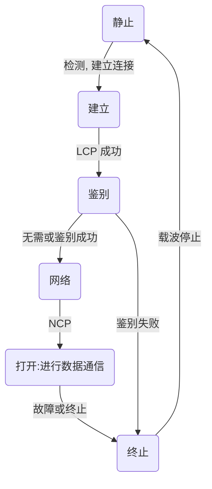

## #1 网络基础知识
#### 协议
- 必要性：设备之间只要遵循系统的协议就能够实现通信
- 分组交换协议：将数据分割为包（packet，较小单位）进行传输
- 协议的标准化
	- OSI协议由ISO制定
	- TCP/IP协议由IETF制定
- 协议的分层
	- 使用下一层所提供的服务
	- 接口：上下层之间交互时所遵循的约定
	- 协议：同一层之间的交互所遵循的约定
- OSI参考模型
	- 协议不等于参考模型。OSI协议以OSI参考模型为基础定了标准
	- 分层
		- 应用层：针对特定应用的协议，如email
		- 表示层：设备固有数据格式和网络标准数据格式的转换，如SPDY
		- 会话层：通信管理，负责建立和打开通信连接，以及数据的分割等传输相关管理，如SSL
		- 传输层：管理节点之间的数据传输
		- 网络层：地址管理与路由选择
		- 数据链路层：互连设备之间的冲动和识别数据帧
		- 物理层：电压表示0/1、连接器与网线规格
	- 数据包
		- 单位
			- 帧是数据链路层中包单位
			- 数据报是IP和UDP等网络层以上的分层中包的单位
			- 段是TCP数据流中的信息
			- 消息是应用协议中数据的单位
		- 信息
			- 每个包首部都会包含两个信息：发送端和接收端地址、上层协议

#### 网络
- 互联网
	- 多个网络连接使其构成一个更大的网络
	- 结构：骨干网和末端网组成

#### 其他概念
- 传输方式的分类
	- 连接方面
		- 面向有连接型：通信前先建立连接
		- 面向无连接型：无需确认对端是否存在
	- 交换方面
		- 电路交换
			- 主要用于过去的电话网
			- 需要先建立连接，指在电路上找到通路，并在连接期间一直占用该电路
		- 分组交换：常见有TCP/IP
	- 接收端数量方面
		- 单播
		- 广播
		- 多播（相比广播，限制了接收端）
		- 任播
- 网络设备
	- 通信媒介：以太网（包括双绞线、光纤）、无线等
	- 网卡
	- 中继器：物理层面上延长网络的设备。对衰弱的信号进行还原
	- 网桥：例如交换集线器。数据链路层面上连接两个网络的设备
	- 路由器（3层交换器）：网络层面上连接两个网络，并对分组报文进行转发的设备
	- 4-7层交换机：例如负载均衡器
	- 网关：从传输层到应用层的数据进行转换和转发的设备。例如代理服务器、防火墙
- 网络指标
	- 传输速率/带宽/吞吐量
		- 设备间数据流动的物理速度
		- 单位为bps（Bits Per Second）


## #2 物理层
#### 物理层基础

#### 编码


## #3 数据链路层
#### 数据链路层基础
- 网络拓扑
	- 指网络的连接和构成形态
	- 包括总线型、环型、星形、网状型、混合型
- MAC地址
	- 用于识别数据链路中互连的节点。理论上唯一
	- 长度为6byte，3-24位字节表示厂商识别码，后25-48位字节表示厂商内识别码
- 依照通信介质分类
	- 数据链路中常把节点称作站
	- 共享介质型网络
		- 由多个设备共享一个通信介质的一种网络
		- 设备之间使用同一个载波信道进行发送和接收。因此基本上采用半双工通信
		- 介质访问控制方式
			- 争用方式
				- 意指争夺获取数据传输的权力，也叫CSMA（载波监听多路访问）
				- 网络中的每个节点采用先到先得的方式占用信道发送数据。如果多个站同时发送帧，就会产生冲突现象，导致网络拥堵与性能下降
			- 改良的CSMA：CSMA/CD
				- 冲突检查
					- 如果载波信道上没有数据流动，则任何站都可以发送数据
					- 检查是否发生冲突（通过检测电压）。一旦发生冲突，放弃发送数据，同时立即释放载波信道
					- 放弃发送以后，随机延时一段时间，再重新争用介质，重新发送帧
			- 令牌传递方式
				- 只有取得令牌的站才能发送数据
				- 特点
					- 不会存在冲突
					- 每个站都有通过平等循环获得令牌的机会，即使网络拥堵也不会导致性能下降
					- 但是在网络不太拥堵的情况下数据链路的利用率不能达到100%。为此衍生了多种令牌传递技术以提高性能
	- 非共享介质型网络
		- 网络中每个站直连交换机，由交换机负责转发数据帧
		- 不会发生冲突，可以采用全双工通信，因此不需要CSMA/CD也可以实现高效通信
		- 致命缺点：交换机发生故障
- 根据MAC地址转发
	- 交换集线器（以太网交换机）
		- 将交换机用于以太网中的技术
		- 是持有多个端口的网桥，依据转发表，根据数据链路层中的每个帧的目标MAC地址决定从哪个网络接口发送数据
		- 转发表Forwarding Table
			- 自动生成，依据是接收到包时，将源MAC地址及其接口作为对应关系记录
			- 将目的MAC地址没有对应关系的包发送到所有端口，有对应关系则仅发送到对应端口
- 环路检测技术
	- 环路现象
		- 数据帧在环路中被一而再再而三地持续转发导致异常的数据帧遍布网络，最终导致瘫痪
	- 解决方法
		- 生成树
			- 每个网桥必须在每1~10秒内相互转换BPDU包（Bridge Protocol Data Unit）从而判断应该优先使用哪些端口
		- 源路由
			- 解决令牌环网络的问题
- VLAN
	- 将物理上的一个网段分为逻辑上的多个网段
- 数据链路层可以再细分为两层
	- 介质访问控制层MAC
		- 包括了MAC地址和CSMA/CD
	- 逻辑链路控制层LLC

#### 以太网
- 以太网简介
	- 以太Ether
		- 介质。量子力学提出之前，人们认为宇宙空间充满了以太
	- 以太网特点
		- 规范简单、易于网卡实现，因此价格也低廉
	- 连接形式
		- 初期：总线型
		- 后期：采用交换机
	- 分类
		- 10BASE、100BASE、10GBASE等分别指10Mbps、100Mbps、10Gbps的传输速度
		- 以太网尾部的字符或数字则表示了不同的传输介质，包括了同轴电缆（数字）、双绞线（-T）等
- 以太网帧格式（不包括IEEE802.3以太网、VLAN）
	- 前导码
		- 表示一个以太网帧的开始，8byte
		- 用于对端网卡能够确保与其同步的标志，不是以太网帧的一部分
	- 帧首部
		- 目标MAC地址，6byte
		- 源MAC地址，6byte
		- 上层协议类型，2byte
	- 数据
	- FCS（Frame Check Sequence）
		- 位于帧尾部，用于检查帧是否有损坏

#### 无线通信
- 无线通信的种类
| 分类       | 标准化组织      | 相关技术 |
| ---------- | --------------- | -------- |
| 短距离无线 | 个别组织        | RF-ID    |
| 无线PAN    | IEEE802.15      | 蓝牙     |
| 无线LAN    | IEEE802.11      | WIFI     |
| 无线WAN    | GSM、CDMA2000等 | 3G、4G等 |
- IEEE802.11
	- WIFI：为普及IEEE802.11的各种标准而打造的一个品牌名称
	- MAC层中
		- 同样使用MAC地址
		- 在介质访问控制上使用CSMA/CA
	- 物理层中
		- 使用电磁线或红外线
- IEEE802.11n
	- 也称WIFI4
	- 采用同步多条天线的MIMO（Multiple-Input-Multiple-Output）技术实现高速无线通信的一种标准
	- 物理层使用2.4GHz或5GHz频段

#### PPP
- 与以太网和FDDI的区别
	- 以太网和FDDI不仅与数据链路层有关，还与物理层有关，决定了其中的0、1该被解释为何种电子信号
	- PPP是纯粹的数据链路层
- PPP主要功能包括两个协议
	- LCP（Link Control Protocol）
		- 负责建立和断开连接、设置最大接收单元MRU、设置验证协议（PAP或CHAP）以及设置是否进行通信质量的监控
	- NCP（Net Control Protocol）
		- 如果上层为IP，则称为IPCP
	- IPCP
		- 负责IP地址设置以及是否进行TCP/IP首部压缩等设备
- PPP的帧格式
	- 在每帧前加上1byte的标志码"01111110"来区分帧
	- 标志码位于帧的头部和尾部
	- 因此在发送数据帧时不允许连续出现6个"1"，必须每出现5个"1"就插入1个"0"
- PPPoE
	- 在以太网上提供PPP功能
	- 特点
		- 单纯的以太网没有验证功能，也没有建立和断开处理
		- 采用PPPoE可以方便地利用PPP功能进行终端用户管理
- 其他数据链路
	- ATM、POS、FDDI、HDMI


## #4 IP协议
#### 网络层
- 主机与节点
	- 主机：配有IP地址的设备，但是不进行路由控制的设备
	- 路由器/网关/3层交换机：配有IP地址的设备且进行路由控制的设备
	- 节点：主机和路由器的统称
- 网络层的主要作用
	- 实现终端节点之间的通信（点对点通信）
	- 跨越多种数据链路
		- 同时对数据链路进行抽象
- IP基础知识
	- IP地址
		- 网络层的地址。网络层以下的设备不需要持有IP地址
	- 路由控制
		- 将分组数据发送到最终目标地址的功能
			- 路由器未必知道前往目标地址最佳的路径，但是会给出推荐的下一跳
		- 跳Hop
			- 指网络中的一个区间
			- IP包在一个个跳下被转发，因此IP路由被称为多条路由
	- IP面向无连接的原因
		- 简化。尽最大努力服务（Best Effort）
		- 提速。建立连接可以委托上层处理
- 数据链路的抽象化工作
	- 分片处理（IP Fragmentation）
		- 不同数据链路的MTU（Max Transmission Unit）不同，因此IP可能需要适当进行分片处理
		- 组合后再交给上一层
		- 分片可由任意节点实现，但组合只能在目标主机中进行
		- 缺点
			- 路由器的处理符合加重
			- 一旦某个分片丢失，则整个IP数据报作废
	- 路径MTU发现（Path MTU Discovery）
		- 先发现所有数据链路中最小的MTU，然后分片后再发送。避免了中途的路由器进行分片处理
		- UDP发现的原理
			- 先发送禁止分片的IP数据报
			- 途中的路由器收到应该分片但是禁止分片的IP数据报就会将其丢弃。随后通过ICMP的不可达消息将数据链路上MTU的值发送给主机
			- 源主机设置对应MTU。如此反复知道不再收到ICMP报文
		- TCP发现的原理
			- 如果TCP中采用路径MTU发现，则交由TCP分片。IP层不再进行分片处理
			- 根据MTU计算出MSS（最大段长度）
	- ARP（下一章）

#### IP地址
- 32位的IPv4地址，但是不够全球使用
	- 采用十进制点表示法
	- 由网络和主机两部分标识组成（既能体现网络、又能识别主机）
- IP地址的分类
	- 注意事项
		- 主机号不能为全0或全1
			- 全0表示网络地址或者IP地址不可获知
			- 全1表示广播地址
	- A类
		- 开头标识：0
		- 网络标识（含开头）：1byte
	- B类
		- 开头标识：10
		- 网络标识（含开头）：2byte
	- C类
		- 开头标识：110
		- 网络标识（含开头）：3byte
	- D类
		- 开头标识：1110
		- 网络标识（含开头）：4byte
		- 没有主机标识，故多用于多播
	- 计算题
		- 网段内的主机上限
			- $2^{主机位数}-2$ 
		- 网路数量
			- $2^{网络可变位数}-2$ 
- 广播与多播
	- 广播用于将包发送给所有主机
		- 本地广播：只在本地网络发送
		- 直接广播：在不同网络之间广播，存在安全问题，不一定被路由器支持
	- 多播用于将包发送给特定组内的所有主机
		- 可以穿透路由
		- 使用D类地址，除开头的28为为多播的组编号
		- 需要IGMP等协议的支持
- 子网
	- 将分类地址的主机地址部分用作子网地址，用于细分比分类地址更小粒度的网络
	- 使用子网掩码表示
		- 4byte，只由1和0组成
		- 1表示网络标识部分
	- 使用后缀法表示
		- IP地址后面使用`/26`表示网络地址的位数
		- 使用此表示法时，可以省略网络地址的0，如`127.20 /16`等于`127.20.0.0 /16`
- CIDR（超网）
	- 采用任意长度分割IP地址的网络标识和主机标识
		- 能分配出符合需求网段内最大主机数量的网络
		- 内部采用固定长度的子网掩码机制
	- CIDR体现（推出原因）的是合并而不是再分配，网络标识比对应分类的位数可能更少（企业需求的B类地址稀缺）
- VLSM（可变长度的子网掩码）
	- 域内所有的子网掩码不必是系统长度的
	- 构造了高效的IP地址分配方式
- 私有地址
	- 缓解IP地址不足的问题
	- 可以让每个独立的网络随意地设置IP地址
	- 私有地址可用的网络地址
		- A类：10/8（10.0.0.0~10.255.255.255）
		- B类：172.16/12（172.16.0.0~172.31.255.255）
		- C类：192.168/16（192.168）
		- 该范围内的IP地址都属于私有IP
	- 私有IP通过NAT与互联网实现通信
- 全局地址由谁决定
	- 用户向ISP申请接入互联网时，ISP代替用户申请了一个全局IP地址
	- 对于FTTH和ADSL服务，ISP会直接给用户分配全局IP地址，并且用户每次重连，该IP地址都可能会发生变化
- IPv6
	- 特点
		- IP地址扩大与路由控制表聚合
		- 性能提升
		- 支持即插即用功能
		- 采用认证与加密功能
		- 多播、Mobile IP称为扩展功能
	- 地址表示
		- 16byte
		- 表示
			- 2byte一组，每组用`:`隔开，采用16进制表示
		- 使用`::`省略中间的0
			- 一个IP地址只能出现一次
		```Text
		1080:0:0:0:8:800:200C:417A
		1080::8:800:200C:417A
		```
	- 地址结构
		- 全局单播地址
			- 前8byte网络标识，后8byte为主机标识
		- 链路本地单播地址
			- 以`1111 1110 10`作为前缀
			- 前8byte除前缀外为全0，后8byte为主机标识
			- 仅在链路中通信（相当于私有地址）
		- 唯一本地地址
			- 以`1111 110`作为前缀
			- 前8byte网络标识，后8byte为主机标识
			- 尽量在链路中通信，但仍有访问网络的需求
	- 分段处理：使用路径MTU发现

#### 路由控制
- 路由控制表
	- 路由器、主机都会持有自己的控制表
	- 记录着网络地址与对应下一步应该发送至路由器的地址
	- 生成
		- 静态路由控制：手动设置控制表
		- 动态路由控制：路由器之间相互交换信息从而自动生成控制表
	- 发送IP包时
		- 先确定IP包首部中的目标地址，再转发
		- 如果没有对应目标地址，则选择最长匹配的网络地址进行转发（最多相同的位数）
	- 默认路由
		- 表示默认的下一跳
		- 一般标记为0.0.0.0/0或default
	- 主机路由
		- 标记为”IP地址/32“
	- 环回地址
		- 是在同一台计算机上的程序之间进行网络通信时所使用的一个默认地址
		- 标记为127.0.0.1或localhost
- 路由控制表的聚合
	- 聚合可以有效地减少路由表条目
		- 路由表小，可减少内存和CPU资源、查找时间
	- 按照下一跳分组，提取所有相同的网络位

#### IP首部
- IPv4数据报
	- 版本
		- 4位
		- 标识IP首部的版本号
	- 首部长度
		- 4位
		- 表示IP首部的大小，单位为4byte
		- 最小值为5（20byte）
	- 区分服务TOS（Type Of Service）
		- 8位
		- 表明服务质量，包括了优先度、最低延迟等。因为导致复杂所以没有被投入使用
		- 有提出将TOS字段划分为DSCP和ECN字段，用于表明优先级、拥堵情况
	- 总长度
		- 16位
		- 单位为byte，能表示的IP包最大长度为$2^{16}$byte
	- 标识
		- 16位
		- 用于分片重组
	- 标志
		- 3位
		- 表示包被分片的相关信息，如是否进行分片、是否为分片的最后一个包
	- 片偏移
		- 13位
		- 标识分片的每一个分段相对于原始数据的位置
		- 单位为8byte，最大可表示$8*2^{13}$byte
	- TTL（Time To Live生存时间）
		- 8位
		- 表示能经过的路由器。每经过一个路由器，值就减一
		- 值为0时则丢弃该包，避免了IP包在网络内无线传递的问题
	- 协议
		- 8位
		- 表示IP首部的下一个首部隶属于哪个协议
	- 首部校验和
		- 16位
		- 只用于检验数据报的首部，不校验数据部分
	- 源地址、目标地址
		- 32位+32位
	- 可选字段
	- 填充
		- 填充0，令首部长度是4byte的整数倍
	- 数据
- IPv6数据报
	- 为了减轻路由器的负担，省略了首部校验和字段
	- IPv6首部长度固定，因此通过拓展首部的方式加入可选项
	- 版本
		- 4位
	- 通信量类
		- 8位
		- 对标IPv4的TOS字段，用于对今后的研究
	- 流标号
		- 20位
		- 准备用于服务质量QoS
	- 有效载荷长度
		- 16位
		- 指可选项以及数据部分的长度
	- 下一个首部
		- 8位
		- 对标IPv4的协议字段
		- 下一个首部可能是IPv6的拓展首部，也可能是上一层协议
	- 跳数限制
		- 8位
		- 对标IPv4的TTL
	- 源地址、目标地址
		- 128位+128位

## #4 IP协议相关技术
#### DNS
- IP地址不方便记忆
	- 主机识别码
		- 为每台计算机赋以唯一主机名，在进行网络通信时可以直接使用
		- 通过hosts数据库文件实现，该数据库记录了主机名和对应的IP地址
		- 互联网信息中心记录着所有的hosts文件，每当其中的信息发生变更，文件就会更新。随着网络规模扩大，变得难以管理
	- 使用DNS（Domain Name System）
		- 自动维护主机名和IP地址之间对应关系的数据库
		- 不论网络规模变得多么庞大，都能在一个较小的范围内通过DNS进行管理
- 域名的构成
	- 树形结构
		- 从顶级域名开始向下延申
		- 每个域名之下可以包含多个域名
- 域名服务器
	- 管理域名的主机和相应的软件，可以管理所在分层的域的相关信息
	- 根域名服务器对DNS的检索数据功能起着至关重要的作用
		- 如果域名服务器宕机，那么针对该域的DNS查询也就无法正常工作
		- 为了提高容灾能力，每个域都会设置至少两个域名服务器
	- 层级关系
		- 各个域的分层上都设有各自的域名服务器
		- 各层的域名服务器都了解该层以下分层中所有域名服务器的IP地址
		- 所有域名服务器都了解根域名服务器的IP地址
		- 如果往下不再有分层（叶子节点），则可以自由指定主机名称或子网名称
	- DNS还要管理众多消息
		- A记录：通过域名得到IP地址
		- PTR记录：通过IP地址获得域名
		- NS记录：得到上下层域名服务器IP地址
		- MX记录：注册了邮件地址与邮件接收服务器的主机名
- 解析器
	- 进行DNS查询的主机和软件
	- 每个解析器都至少要注册一个以上的域名服务器的IP地址
- DNS查询
	- 流程
		- 解析器向DNS服务器查询IP地址
		- 被指定的DNS服务器如果没有存储对应域名，则向根域名服务器请求进行查询
		- 根域名服务器返回IP地址对应的域名服务器地址
		- 被指定的服务器向该域名服务器查询IP地址，并将查询到的IP返回给客户端
	- 解析器和域名服务器都会设置缓存以提高性能

#### ARP
- APR概述（Address Resolution Protocol）
	- 以目标IP地址为线索，定位下一个应该接收数据分包的网络设备对应的MAC地址
	- 在Unix或Windows中可以通过`arp-a`得到ARP表信息
	- 仅适用于IPv4。IPv6需要通过ICMPv6完成对应功能
- 工作机制
	- 广播发送ARP请求包，并置入自己的MAC地址
	- 收到广播、且请求的IP地址与本机一致，则发送携带自身MAC地址的ARP响应包
	- 得到对方对应IP地址和MAC地址后，主机会将这些信息缓存进ARP表
- 两种地址皆存在的必要性
	- MAC地址主打网络内部操作，能够依靠交换机直接转发，但受限于交换机性能
	- IP地址主打跨网络运输，同时包含了设备位置的信息
- RARP（Reverses ARP）
	- 根据MAC地址定位IP地址的协议
	- RARP服务器
		- 向没有IP地址的设备提供IP地址
		- 由没有IP地址的设备发出PARP请求包询问自身IP地址，RARP服务器返回RARP响应包告知地址
- 代理ARP
	- 通常ARP包会被路由器隔离，但通过采用代理ARP的路由器可将ARP请求转发给邻近的网段

#### ICMP
- 负责辅助IP，便于诊断调试
	- 场景
		- 目标不可达
			- 路由器发现无法通过ARP找到目标主机，所以向源主机发送ICMP的包
		- 重定向（慎用：可能引发问题）
			- 路由器发现发送端使用了次优的路径发送数据，则发送数据后，返回ICMP的包
		- 超时
			- 路由器发现TTL为0的IP包，丢弃并发送ICMP包
		- 回送消息
			- 用于确认所发送的数据包是否到达对端
				- 可以向对端主机发送ICMP回送请求消息
				- 或者接收对端主机发送回来的回送应答消息
		- 原点抑制（少用：引起不公平通信）
			- 在网络拥堵的情况下，路由器发送ICMP报文告知主机降低IP包传输间隔从而缓和拥塞情况
		- 路由器探索消息
			- 用于发现与自己相连网络中的路由器
		- 地址掩码消息
			- 获取子网掩码
	- ICMP基于IP，且不保证服务质量，不宜过分依赖
- traceroute
	- 基于ICMP超时功能，将所有路由器的IP地址逐一呈现
	- 在UNIX中使用`traceroute`命令，而在Windows中使用`tracert`命令
- ping
	- 基于ICMP回送消息功能
- ICMPv6
	- 与IPv4的协议相比
		- ICMPv6能力得到扩大，使用该协议才能令IPv6正常通信
		- 仅服务于IPv4的ARP协议被ICMPv6的邻居探索消息替代
		- 实现了即插即用：自动获取IP地址
	- 邻居探索
		- 基于IPv6的多播地址，这样可以避免不支持该协议的节点也收到包

#### DHCP
- DHCP能力（Dynamic Host Configuration Protocol）
	- 自动设置IP地址、子网掩码、默认路由、DNS服务器等TCP/IP通信必须的设置
	- 统一管理IP地址分配
- 分配IP地址的方法
	- 在特定的IP地址中自动选出一个进行分配
	- 针对MAC地址分配一个固定的IP地址
- 工作机制：需要架设DHCP服务器（通常在路由器上）
	- 当新的设备接入到网络时，广播发送DHCP发现包
	- DHCP服务器向新设备发送DHCP提供包，通知可以使用的网络设置
	- 新设备广播发送DHCP请求包，表示使用上述网络设置
	- DHCP服务器发送DHCP提供包表示允许
	- 不需要IP地址时，可以发送DHCP解除包
- 检查IP地址是否已被分配的方法
	- 发送ICMP回送请求包
	- 发送ARP请求包
- DHCP中继代理
	- 在大规模网络环境中，一般有多个以太网网段，将DHCP服务器分设到各个路由器上会难以进行管理和运维
	- 使用DHCP中继代理进行统一管理和运维
		- 在唯一的DHCP服务器中统一管理每个子网的IP地址分配等信息
		- 中继代理由路由器承担，负责将内部网络中接入的新设备与DHCP服务器作为代理进行交流

#### NAT
- NAT技术的作用（Network Address Translator）
	- 为本地网络中的私有地址在连接互联网时，提供全局IP地址
	- 既是为了解决IPv4地址面临枯竭而开发的技术，也能够提高网络安全
	- NAPT
		- 将TCP/UDP的端口号也进行转换。已被看作NAT一部分
- 工作机制
	- 在NAT路由器内部，存在一张自动生成的用来转换地址的表
	- 在TCP中
		- 发送SYN包建立连接时生成表信息
		- 发出FIN包确认时删除表信息
	- 在UDP中无说明
- NAT-PT（NAT Protocol Translation）
	- 将IPv6的首部转换为IPv4的首部
- NAT潜在问题：依赖转换表
	- 管理转换表存在开销
	- 一旦NAT遇到异常需要重新启动时，所有TCP连接都被重置
	- 外部难以连接内部
		- 使用NAT穿越可解决

#### IP隧道
- 功能：服务于传输不顺的IPv6（转发多播消息也适用）
	- 在IPv6设备之间的跨网络传输中，往往出现传输途中存在仅支持使用IPv4的网络
	- 使用IP隧道将IPv6的包追加IPv4首部后再转发以解决问题

#### 其他相关IP技术
- IP多播相关
	- 多播中需要确认接收端是否存在
		- 通过MLD（多播监听发现）实现
- IP任播
	- 发起通信时，响应的目标可以有多个（响应的目标设置了相同的IP地址）
- 通信质量控制
	- QoS
- 显式拥塞通知
	- ECN机制
- Mobile IP
	- 对于移动设备，IP地址可能会发生变更
	- 适用Mobile IP使得当主机所连接的子网IP发生变化时，主机IP地址仍保持不变
	- 术语
		- 移动主机MH
			- 指移动了位置，但IP地址不变的设备
		- 归属网络/地址
			- 设备移动前的网络/地址
		- 归属代理HA
			- 处于归属网络下，可监控移动设备的位置，并转发数据包给移动主机
		- 外部代理FA
			- 适用于支持移动主机的移动设备
	- 工作机制
		- 设备移动后（但仍处于连接时），归属代理将从服务器收到的消息采用IP隧道转发给移动主机，由外部代理接收
		- 外部代理使用隧道将IP头删除还原后交给移动主机
		- 移动主机可直接向服务器发送消息，不需经过隧道


## #6 传输层
#### 传输层概念
- UNIX中，服务端程序的守护进程
	- HTTP的服务端程序是httpd（HTTP守护进程）
	- SSH的服务端程序是sshd（SSH守护进程）
	- UNIX不需要逐个启动守护进程，而是启动一个代表接收请求的inetd（互联网守护进程）。它是一种超级守护进程，收到请求后会使用fork创建新的进程并转换为对应的守护进程
- 操作系统的Socket API
- 端口号
	- 传输层的地址，用于标识计算机中进行通信的不同的应用程序
	- 运输层的协议通过IP地址、端口号、协议号来判断是否为同一个通信
- 端口号的确立
	- 既定的端口号
		- 知名端口号
			- 0~1023
			- 包括了HTTP、TELNET等所使用的端口号
	- 动态的端口号
		- 49152~65535（$2^{16}-1$）
		- 交由操作系统进行分配

#### UDP
- UDP特点（User Datagram Protocol）
	- 简单高效的面向无连接协议
	- 进行校验和检查，如果出错则将收到的包丢弃
- 数据报
	- 首部8byte
		- 源端口号
			- 2byte
			- 该字段是可选项，不需要返回的通信中可以为空（全0）
		- 目标端口号
			- 2byte
		- 包长度
			- 2byte
			- 保存了UDP首部的长度跟数据的长度之和，单位为byte
		- 校验和（Checksum）
			- 2byte
			- 发送主机通过伪首部计算校验和
			- 接受主机在收到UDP数据报后，根据IP首部信息构造伪首部，再进行校验和计算
			- 该字段为可选项
	- 数据
- TCP和UDP中使用检验和的目的
	- 在数据链路层中，FCS可以检查因为噪声干扰导致的位错误
	- 在传输层中进行校验则是为了避免发送途中某一路由器发生故障导致经此路由器的包等被破坏
		- 故障可能是指软件设计问题

#### TCP
- TCP特点（Transmission Control Protocol）
	- 提供复杂的控制功能，包括重发控制、顺序控制等
	- 面向连接
		- 连接
			- 设备间为了相互传递消息而专有的通信线路，也叫虚拟电路
			- TCP负责控制连接的建立、断开、保持等管理工作
	- 实现可靠传输
- 确认应答
	- 接收方得到发送方的数据后，应该返回一个确认应答ACK
		- 超时重传（迟迟收不到ACK）
		- 如果仅是确认应答在发送途中产生丢包，那么接收方再次收到相同数据时会将其放弃
	- 使用编号识别数据
		- 每byte对应一个编号
		- 序列号
			- 本次发送数据的第一个编号
		- 确认应答号
			- 期望下次发送数据的第一个编号
		- 计算TCP数据长度
			- IP首部中的数据包长度 - IP首部长度 - TCP首部长度
	- 超时的确定
		- 计算RTT及其偏差
			- Route Trip Time往返时间
			- RTT偏差也叫抖动
		- 重发后若还是收不到应答，则再次发送，等待时间会延长
		- 重发次数过多后，则判断为网络或对端主机发生异常，强制关闭连接
- 连接管理
	- 三次握手
	- 四次摆手
- TCP以段为单位发送数据
	- TCP可以确定发送数据包的单位，并称其为MSS（最大消息长度）
		- 在建立连接的时候，两端主机会在TCP首部中写入MSS选项，告知对方自己的接口能适应的MSS的大小
		- 最终会在两者的MSS中选择一个较小的值投入使用
		- 最大值为536byte
- 窗口控制
	- 确认应答的通信方式效率不高，于是TCP利用窗口控制来提高通信效率
	- 工作机制
		- 在发送了一段数据后不必等待确认应答，而是继续发送
		- 发送端在等待确认应答之前，必须在缓存区中保留这段数据
		- 收到应答后，窗口向前滑动
	- 重发控制（高速重发控制）
		- 丢失确认应答不影响窗口控制的运作
			- 理论上只需窗口最后一段数据得到应答，则整个滑动窗口的数据都表示成功送达
		- 收到3次重复的确认应答时（重复同一个确认应答号），进行对应段数据的重发
- 流控制
	- 发送端根据接收端的实际接受能力控制发送的数据量
	- 工作机制
		- 接收端主机向发送端主机通知自己可以接受数据的大小（窗口的大小）
			- 该值越大，网络的吞吐量越高
		- 接收端的缓冲区一旦面临数据溢出时，发送端的主机会根据接收端主机的提示，对发送数据的量进行控制
		- 当值为0时，发送端会等待重发超时的时间
			- 如果期间收到窗口更新通知，则继续发送
			- 否则等待后，发送一个窗口探测包进行询问。窗口探测包是为了避免窗口更新通知在传输过程中丢失
- 拥塞控制
	- 慢启动
		- 在通信开始时，通过慢启动算法得到合适的发送数据量（窗口大小）
		- 慢启动避免了通信开始时连续发包导致的网络拥堵
		- 拥塞窗口会持续增长
- 提高网络利用率的规范
	- Nagle算法
		- 数据应当尽量占满MSS
			- 数据不多的情况下，应该延迟发送
	- 延迟确认应答
		- 使得发送的报文中，缓冲区不会太小
	- 捎带应答
		- 在应用层协议中，往往符合“请求响应模式”
		- TCP将确认应和响应数据通过一个包发送，从而减少数据量
- TCP报文
	- 首部20byte+
		- 源端口号、目标端口号
			- 各2byte
		- 序列号
			- 4byte
			- 发送SYN包和FIN包尽管不携带数据，但是也会作为一个字节增加对应的序列号
		- 确认应答号
			- 4byte
		- 数据偏移
			- 4位
			- 告知TCP所传输的数据部分从TCP包的哪位开始，单位为4byte
		- 保留
			- 4位
			- 供扩展使用
		- 控制位
			- 1byte
			- 共8个控制位
				- CWR、ECE
					- 用于IP首部的ECN字段
				- URG
					- 表示包中有需要紧急处理的数据
				- ACK
					- 确认应答标志位
				- PSH
					- 表示需要将收到的数据立刻传给上层应用协议
					- 反之，先进行缓存
				- RST
					- 表示TCP连接中出现异常，必须强制断开连接
				- SYN
					- 表示用于建立连接
				- FIN
					- 表示希望断开连接
		- 窗口大小
			- 2byte
		- 校验和
			- 2byte
			- 校验方式与UDP相似，区别在于TCP的校验和无法关闭
		- 紧急指针
			- 2byte
			- 只有在URG标志位为1时有效
			- 紧急数据指从数据部分的首位开始到紧急指针所指的位置
		- 选项（长度可变）+填充
			- 最大长度为40byte
			- SACK（选择确认应答）
				- 在网络不通畅、时不时丢失数据的情况下，可能出现接受方接受到不连续的数据，如果依然等待应答会导致网络性能下降
				- 使用该选项后，可以允许最多4次接受数据不连续的情况，提高了网络吞吐量
	- 数据部分（TCP载荷）
- 窗口大小与吞吐量
	- TCP通信的最大吞吐量由窗口大小和往返时间决定
	- 假定最大吞吐量T，窗口大小为W，往返时间为RTT，那么有
		- $T = \frac{W}{RTT}$  
	- 在Web浏览器中，一般采用同时建立多个（6个）TCP连接来提高吞吐量
		- 使用了HTTP/2之后，基于其多路复用机制，浏览器就只需进行一个TCP连接

#### 其他传输层协议
- UDP-Lite
	- 进行校验和检查的范围可由应用自行决定
		- 提高了对UDP包的接受程度
- SCTP（Stream Control Transmission Protocol）
	- 特点
		- 以消息为单位转发
		- 支持多重宿主
			- 在有多个NIC的主机中，即使所使用的NIC发生变化，也能继续通信
			- 例如电脑既可以连接WIFI，又可以使用以太网
		- 支持多数据流通信
		- 可以定义消息的生存期限
- DCCP（Datagram Congestion Control Protocol）
	- 特点
		- 与UDP一样不提供可靠通信
		- 面向连接
		- 能够根据网络拥堵情况进行拥塞控制
- QUIC
	- 解决了TCP的队头阻塞
		- TCP的一条连接中，当存在一个数据丢失，那么该数据之后的数据都需要等待
		- 在基于HTTP/2的浏览器中，由于使用多路复用，因此当遇到队头阻塞的情况下，性能比使用多个TCP连接、基于HTTP/1的浏览器更差
		- QUIC通过对数据流独立处理，从而避免阻塞
			- 在单个数据流内，数据任是按序交付的
	- 减少延迟
		- 与TCP的三次握手相比，QUIC只需要0-RTT或1-RTT的握手
	- 基于UDP
		- 大部分设备在运输层中只支持TCP和UDP，因此建立新的协议会带来麻烦
		- 同时提供错误处理、可靠性、流控制和内置安全性（集成了TLS1.3）


## #7 路由协议
#### 路由控制
- 概念
	- 路由器对途经的数据报进行正确地转发，使得数据报到达目的主机
	- 控制表（Routing Table）是其转发规则
- 路由控制的分类
	- 静态路由
		- 事先设置好路由信息
		- 管理员需手动设置、维护，在网络较多的情况下十分麻烦
		- 当路由器发生故障时，可能造成网络瘫痪
	- 动态路由
		- 让路由协议在运行过程中自动地设置路由控制信息
		- 路由协议的实现皆基于路由器之间交换路由信息
- 路由控制的范围
	- 自治系统AS（Autonomous System）/路由选择域
		- 能够制定自己的路由策略，并以此为准在一个或多个网络群体中采用的小型单位。通常发生在企业内部的网络
		- 每个自治系统都分配了一个2byte的编号
	- 自治系统内部采用域内路由协议IGP（Interior Gateway Protocol）
		- 可以使用RIP、RIP2、OSPF等众多协议
	- 自治系统之间采用域间路由协议EGP（Exterior Gateway Protocol）
		- 可以使用EGP、BGP协议
- 路由算法
	- 距离向量算法
		- 根据距离和方向信息决定主机/网络的位置
		- 特点
			- 算法简单
			- 每个路由器掌握的信息都不相同
			- 但在网络构造变得复杂时，获得稳定的路由消息之前需要消耗一定的时间
				- 路由消息变得稳定的过程称为路由收敛
			- 极易发生路由循环问题
	- 链路状态算法
		- 根据网络整体连接状态的基础上生成路由控制表
		- 特点
			- 每个路由器持有相同的信息，路由器之间应该尽快与对方保持同步
				- 同步指保持同样的值
			- 算法复杂，尤其在复杂的网络结构中
			- 计算路由表过程相对消耗路由器的CPU与内存
	- 路径向量算法
		- 对所经过的路径信息访问列表进行路由控制
		- 能够避免环路、同时支持策略路由（选择要通过的自治系统）
- 主要路由协议
| 路由协议名 | 下一层协议 | 方式     | 使用范围 | 循环检测 |
| ---------- | ---------- | -------- | -------- | -------- |
| RIP        | UDP        | 距离向量 | 域内     | 不可以       |
| RIP2       | UDP        | 距离向量 | 域内     | 不可以       |
| OSPF       | IP         | 链路状态 | 域内     | 可以      |
| EGP        | IP         | 距离向量 | 对外     | 不可以     |
| BGP        | TCP        | 路径向量 | 对外     | 可以         |

#### RIP
- RIP特点（Routing Information Protocol）
	- RIP将路由信息定期向全网广播，如果没有收到路由控制信息，连接就会被断开，一次为30秒。因为有可能是丢包导致收不到信息，因此RIP规定等6次之后，才真正关闭连接
		- 随着网络个数的增加，所要交换的路由控制信息越多
	- 使用距离向量算法，其中将跳数看作距离
	- 支持使用子网掩码
		- 但不交换子网掩码信息
		- 0子网和1子网皆无法在RIP中使用
- RIP应对路由变更下存在的问题
	- 场景：过分相信相邻路由器带来了无限计数
		- 网络A与路由A相连，而路由A与路由B相连。此时路由A到达网络A的跳数为1，路由B则为2
		- 突发故障，路由A无法连接网络A。但路由B持有到达网络A的跳数信息以为仍能到达，通过广播告知了路由A
		- 广播A相信了路由B，将到达网络A的跳数设为3
		- 路由AB之间进入了无限计数，幸好RIP中最长距离为16，随后意识到了网络A不可达
	- 解决无限计数
		- 设置最长距离
		- 水平分割
			- 规定路由器不将收到的路由消息返还给发送端
			- 该方法无法在带有环路的网络体现效果
	- 缓解“坏消息传得慢”
		- 毒性逆转
			- 当链路被断开时，将该消息传播，即发送一个距离为16的消息
		- 触发更新
			- 路由信息发生变化时，不等待30秒，而是立刻进行广播
- RIP2特点
	- 使用多播减少流量
	- 支持子网掩码
		- 交换信息中加入了子网掩码信息
	- 路由选择域
	- 外部路由标志
	- 身份验证密钥

#### OSPF
- OSPF特点（Open Shortest Path First）
	- 基于链路状态算法
		- 路由器之间交换网络拓扑信息，然后再根据该信息生成路由控制表
		- 在一个相对复杂的网络中，通常使用指定路由器（Designed Router）作为中心，与所有的路由器交换信息
		- 拥有5种类型的包，运用可以减少网络流量、达到快速更新路由信息的目的
		- 采用Dijkstra算法生成相应的路由控制表
	- 支持子网掩码
	- 使用区域的概念减少网络流量
		- 区域（Area）是将自治网络划分为若干个更小的范围
		- 具有多个区域的自治系统必须要有一个主干区域（Backbone Area）
			- 所有区域都必须和主干区域相连
		- 路由器也因此得到了区分
			- 内部路由器
				- 区域内部的路由器
				- 只持有区域内的拓扑
			- 区域边界路由器
				- 连接区域与主干区域的路由器
				- 不会将区域内的链路状态信息全部原样发送，只会发送自己到达这些路由器的距离信息
				- 如果对应区域只有一个区域边界路由器，则称该区域为末端区域
			- 主干路由器
				- 只与主干区域内连接的路由器
			- 边界路由器
				- 与外部连接的路由器
		- 维护人员需要合理地设计区域，才能发挥OSPF的优势
	- 每条链路都赋予了权重（代价）
		- 代价可由管理员配置
- OSPF工作原理
	- LAN中每10秒发送一个HELLO包，从而判断连接是否断开
		- 允许等4次后仍无反馈则确认断开
	- 链路状态发生变化时，发送Link State Update包通知网络状态的变化

#### BGP（边界网关协议）
- BGP基于路径向量协议
	- BGP扬声器
		- 根据BGP进行交换路由控制信息的路由器
		- 建立BGP连接从而交换BGP信息
	- 自治系统路径信息访问列表（AS Path List）
		- BGP中的数据报送达目标网络时，生成中途经过所有自治系统的编号列表
		- 如果针对同一个目标出现多条路径时，BGP会从路径信息中选择较短的路由
	- 路由选择的度量
		- RIP使用路由器的个数、OSPF使用子网的成本
		- 而BGP使用自治系统进行度量标准

#### MPLS
- MPLS特点（Multi Protocol Label Switching）
	- 与路由技术区分的标记交换技术
		- 两者都用于转发IP数据报
		- 路由技术基于IP地址中最长匹配原则进行转发
		- 标记交换则对每个IP包都设定一个标记，然后根据标记进行转发
	- 参与角色
		- 标记交换路由器LSR（Switching）
			- 负责根据标记转发
		- 标记边缘路由器LER（Edge）
			- 对数据包进行追加标记和删除标记的操作
	- 优点
		- 转发速度快
		- 基于虚拟路径，提供了通信质量控制、带宽保证和VPN等功能


## #8 应用协议
#### 远程登录
- 目的
	- 实现分时系统（Time Sharing System）环境，将主机和终端的关系应用到计算机网络上的结果
	- 通过远程登录主机后，不仅可以使用主机应用，还可以进行参数设置（就好像坐在远程主机前控制一样）
	- 主要使用TELNET和SSH两种协议
- TELNET
	- 利用TCP的一条连接，通过这一条连接向主机Shell发送文字命令并在主机上执行
	- 常用于登录路由器或高性能交换机等网络设备进行相应的设置
	- 选项
		- 处理用户所输入文字的功能
		- 选项的交互和协商功能
	- 模式
		- 行模式
			- 每从键盘输入一行，就将该行的数据发送
		- 透明模式
			- 每输入一个字符都要发送
	- TELNET客户端
		- 与目标主机的23号端口建立连接，与telnetd程序进行交互
		- Windows的Telnet功能默认关闭，需要安装才能使用
		- TELNET客户端可以与其他的TCP端口号连接，实现连接到不同的应用
	```
	// 以下命令可视为相同（ftp使用端口21）
	telnet 主机名 21
	ftp 主机名
	
	// 使用http
	telnet 主机名 80
	```
- SSH
	- 功能
		- 加密的远程登录，比TELNET更安全
		- 更强的认证机制
		- 转发文件
		- 使用端口转发功能
			- 指将特点端口收到的消息转发到特定的IP地址和端口号

#### 文件传输
- FTP
	- 两个相连的计算机之间进行文件传输时所使用的协议
	- 允许设置为登录访问或者匿名访问
- FTP工作机制：使用两条TCP连接
	- 一条用来控制
		- 使用端口21
		- 用于登陆用户名和密码的验证、发送文件的名称等
	- 一条用于数据传输
		- 使用端口20。也可能处于安全考虑，使用随机数分配的端口号
		- 按照控制连接的相反方向建立，因此在NAT连接外部FTP服务器时，无法直接建立传输数据时使用的TCP连接。此时需使用PASV命令修改建立连接的方向

#### 电子邮件
- 邮件地址
	- 格式
		- `名称 @ 通信地址`
	- 现在，电子邮件的发送地址由DNS进行管理
		- DNS中注册有邮件地址及其作为发送地址时对应的邮件服务器域名
		- 映射信息被称为MX记录（Mail Exchange）
- MIME（Multipurpose Internet Mail Extensions）
	- 曾经只能处理文本格式的邮件，如今电子邮件数据所能发送的数据类型已被控制到MIME
	- 鉴于MIME规定了应用消息的格式，因此可被看作表示层
	- 由首部和正文两部分组成。格式可以是混合格式，通过设置分隔符分开
- SMTP（Simple Mail Transfer Protocol）
	- 直接建立TCP连接进行传输
	- 缺点
		- 只有在双方电脑都开机时才能够发送（对于向有时差的地区发送邮件变得十分困难）
		- 没有验证发送者的功能，导致无法避免广告邮件和垃圾邮件
			- 可以使用SMTP认证或者POP解决
- POP
	- 引进了一种一直会连接电源的邮件服务器，可以看作是网关
	- 发送和接受端通过邮件服务器进行收发邮件
- IMAP（Internet Message Access Protocol）
	- 在POP中邮件由客户端进行管理，而在IMAP中邮件由服务器进行管理

#### WWW
- WWW万维网（World Wide Web/Web）
	- 将互联网中的信息以超文本形式展现的系统
	- 定义了3个重要的概念
		- URI
		- HTML：记述Web页的一种语言
		- HTTP：见下两章
- URI（Uniform Resource Idntifier）
	- 用于标识资源
	- URL（Uniform Resource Locator）常被用于标识互联网中文件的具体位置，但是URI不局限于标识互联网资源，可以作为所有资源的标识码
	- URI所表示的组合叫方案（Scheme）

#### 网络管理
- SNMP
	- 管理端叫管理器（网络监控终端）
	- 被管理端叫做代理（路由器、交换机等）
	- 应用：MRTG，定期收集网络中路由器的网络流量信息的工具
- MIB（Management Information Base）
	- SNMB中的交互信息是MIB
	- MIB是在树形结构的数据库中为每个项目附加编号的一种数据结构
	- MIB由监控网络中某个设备接口的众多参数构成
- RMON（Remote Monitoring MIB）
	- RMON由监控网络上线路的众多参数构成

#### 其他应用层协议
- 多媒体通信实现技术
	- H.323
		- 在IP网上参数音视频的协议
		- 定义了4个主要组件：用户终端、网关、网匣、多点控制单元
	- SIP
		- 比H.323简单
	- RTP（Real Time Protocol）
		- 实现顺序控制
	- RTCP（RTP Control Protocol）
		- 辅助RTP的协议，通过丢包率等线路质量管理进行控制
	- 数字压缩技术
		- 有效减少音视频数据的大小
- P2P（Peer To Peer）
	- 常规情况下，一台服务器对应多个客户端通信，称为C/S模式，即1对N的通信形态
	- 在网络上不经服务器直接1对1通信称为P2P
- LDAP（Lightweight Directory Access Protocol）
	- 访问目录服务的协议


## #9 网络安全
#### 网络安全构成要素
- 防火墙
	- 组织机构为了避免域内网络受到非法访问的威胁而设置防火墙
		- 使用NAT的情况下，由于限定了可以从外部访问的地址，也能起到防火墙的作用
	- 设计思路
		- 暴露给危险的主机和路由器的个数要有限
		- 防火墙针对这些主机和路由器实施安全防护
	- 防火墙无法判断当前访问是否为非法访问
- IDS入侵检测系统
	- 检查侵入内部网络进行非法访问的情况，并及时通知给网络管理员的系统
- DMZ（非军事化区DeMilitiarized Zone）
	- 设置一个服务器，并在这台服务器上建立一个允许从互联网直接进行通信的专用子网
	- 将外网和内网隔开
- 反病毒/个人防火墙
	- 监控计算机中进出的所有包、数据和文件，同时防止对计算机的异常操作和病毒入侵
- PKI（公钥基础结构Public Key Infrastructure）
	- 通过可信赖的第三方（认证机构CA）检查通信对方是否真实而进行验证的机制
	- 认证机构通过颁布数字证书验证通信对方的真实性
	- 证书包含了
		- 用户身份信息
		- 用户公钥信息
		- 证书签发机构对该证书的数字签名信息

#### 加密技术与安全协议
- 加密技术
	- 加密电子邮件下，可以使用S/MIME、PGP技术
	- 加密Web数据下，可以使用SSL/TLS技术
	- IPsec是网络层的加密技术
- 加密机制
	- 共享密钥加密
		- 使用对称密钥
			- 加密和解密通用一个密钥
		- 加密方式包括AES、DES等
	- 公开密钥加密
		- 私钥用于解密，需要严格管理
		- 公钥用于加密，应该公开发布
		- 该方式的加密和解密需要花费的时间较长
		- 加密方式包括RSA、DH、椭圆曲线等
- IPsec与VPN
	- 曾经为了防止信息泄漏，对机密数据的传输一般使用由专线连接的私有网络，然而此举成本较高。因此提出了使用虚拟的私有网络VPN（Virtual Private Network）
	- 在构建VPN时，常用到IPsec
		- 在IP首部的后面追加ESP和认证首部
		- 两种加密方式
			- 加密TCP首部和数据部分
			- 包括IP首部在内，对整个IP包进行加密，并追加IP首部
- TLS/SSL与HTTPS
- IEEE802.1X
	- 对用户进行认证的技术，只有被认可的设备才能访问网络
	- 由客户端终端、无线基站AP或2层交换机以及认证服务器组成
	- 工作机制
		- 当设备未获取认证而连接AP时，AP通过提供临时IP地址只允许设备连接认证服务器。用户被要求输入用户名和密码
		- 收到信息后，认证服务器将用户所能访问的网络信息通知给AP和终端
		- 随后AP会进行VLAN号码的切换，使得客户端IP地址重置，最终得以连接网络


## #10 HTTP
#### 基础
- HTTP协议基础
	- 用于客户端和服务器端之间的通信
	- 通过请求和响应的交换达成通信
	- 特点
		- 无连接
		- 无状态
			- 无状态指HTTP协议不具备保存之前发送过或响应的功能
			- 引入Cookie技术保持状态
	- 使用URI定位互联网上的资源
- HTTP的持久连接
	- 常规情况下，每进行一次HTTP通信就要断开一次TCP连接
		- 早年通信量较小，影响不大
		- 如今数据量增大，增加开销显著
	- 在HTTP/1.1中，所有的连接默认是持久连接
		- 管线化
			- 类似TCP滑动窗口，可以并发地发送多个HTTP请求，而不必等待响应
			- 依赖于HTTP的持久连接
- 使用Cookie管理状态
	- 服务器端
		- 通过向客户端发送、得到Cookie从而记住客户端信息
	- 交互过程
		- Cookie会根据服务器端发送的响应报文内Set-Cookie的字段信息通知客户端保存Cookie
		- 客户端往服务器端发送请求时，客户端会自动在请求报文中加入Cookie的值后发送出去
- Web应用
	- CGI（Common Gateway Interface通用网关接口）
		- Web服务器在接收到客户端发送的请求后，发送相应的指令，程序会因此作出相应的动作，如动态创建HTML
		- 通常使用Perl、PHP、Ruby、C编写
	- Servlet
		- 在服务器上动态创建内容的程序，JavaEE的一部分
		- Servlet的运行环境称为Web容器或Servlet容器
- 数据发布的格式及语言
	- XML
		- 比起HTML更容易读取数据
	```XML
	<研讨会 编号="TR01" 主题="Web应用程序脆弱性诊断讲座">
		<类别>安全</类别>
		<概要>在当下社会...</概要>
	</研讨会>
	<研讨会 编号="TR02" 主题="网络系统脆弱性诊断讲座">
		<类别>安全</类别>
		<概要>网络已经成为了...</概要>
	</研讨会>
	```
	- RSS和Atom
		- 两者都用到了XML
	- JSON
	```Json
	{"name":"Web应用程序脆弱性诊断讲座", "num":"TR01"}
	```

#### HTTP报文
- 报文结构
	- 报文结构：报文首部+空行+报文主体（可空）
	- 请求报文首部
		- 请求行`GET / HTTP/1.1`
		- 请求首部字段
		- 通用首部字段
		- 其他
	- 响应报文首部
		- 状态行`HTTP/1.1 200 OK`
		- 响应首部字段
		- 通用首部字段
		- 其他
- 首部分类
	- 端到端首部（End-toend Header）
		- 这些首部的信息应该被缓存
	- 逐条首部（Hop-by-hop Header）
		- 这些首部的信息只对单次转发有效
- 通用首部字段
	- Cache-Control
		- 操作缓存的工作机制，包括是否允许缓存、对缓存存放时间的接受程度等
	- Connection
		- 控制不再转发给代理的首部字段/管理持久连接(1.1)
	- Date
		- 表明创建HTTP报文的日期和时间
	- Trailer
		- 表示报文主体后记录的首部字段
	- Transfer-Encoding
		- 规定了传输报文主体时采用的编码方式
	- Upgrade
		- 用于检测是否能够使用更高版本的协议进行通信
	- Via
		- 追踪客户端与服务器之间的请求和响应报文传输路径
	- Warning
		- 告知缓存相关问题的警告
- 请求首部字段
	- Accept/Accept-Charset/Accept-Encoding/Accept-Language/TE
		- 阐述客户端能够接受的媒体/字符集/内容编码/语言类型/传输编码方式及优先级
	- Authorization/Proxy-Authorization
		- 客户端与服务器之间/客户端与代理之间。告知服务器用户的认证信息
	- Expect
		- 告知客户端期望的行为
		- 因服务器无法理解客户端的期望而发生错误时，返回状态码417
	- From
		- 告知服务器客户的电子邮件地址
	- Host
		- 告知服务器请求的资源所处的互联网主机名和端口号
		- 用于解决虚拟主机下仅凭靠IP无法知道目标主机
	- If-Match/If-None-Match
		- 服务器端只有在符合/不符合条件的情况下才执行请求
	- If-Modified-Since/If-Range/If-Unmodified-Since
		- 客户端想要指定时间之后/期间/之前得到修改的资源
		- 如果资源没有在指定时间后被修改，则返回304 Not Modified
	- Max-Forwards
		- 限定了可经过服务器的最大数目
	- Range
		- 获取部分资源的请求范围
	- Referer
		- 告知服务器请求的原始资源URI（从哪个Web页面发起的请求）
	- User-Agent
		- 告知服务器浏览器的类型（手机还是电脑）
- 响应首部字段
	- Accept-Ranges
		- 告知客户端服务器能否处理范围请求
		- 可以则值为byte，否则为null
	- Age
		- 告知客户端服务器在多久前创建了响应。通常是缓存服务器告知上次请求时间
	- ETag
		- 资源的唯一标识
	- Location
		- 可以将响应接收方引导至某个与请求URI位置不同的资源(临时重定向的资源)
	- Proxy-Authenticate
		- 发送代理服务器所要求的认证信息给客户端
	- Retry-After
		- 告知客户端应在多久之后再次发送请求
	- Server
		- 服务器应用程序的信息
	- Vary
		- 可对缓存进行控制
	- WWW-Authenticate
		- 用于HTTP访问认证
- 实体首部字段
	- Allow
		- 通知客户端能够支持对资源操作的所有HTTP方法
	- Content-Encoding/Content-Length/Content-Locaiton/Content-MD5/Content-Range/Content-Type
		- 告知客户端实体主体使用的内容编码/自然语言/大小/返回资源对应URI/MD5指/范围/格式类型
	- Expires
		- 指定了缓存的有效期
	- Last-Modified
		- 上次修改时间
- 为Cookie服务的首部字段
	- Set-Cookie
		- 设置Cookie
	- Cookie
		- 服务器要接受的Cookie信息
- HTTP报文细节
	- 提升传输效率
		- 内容编码：先压缩再传输
		- 分块传输编码：将大数据切割多块后发送
	- 多部份对象集合（Multipart）
		- MIME机制（Multipurpose Internet Mail Extensions）依靠Multipart允许邮件处理文本、图片、视频等多个不同类型的数据
		- HTTP协议也采纳了多部份对象集合
	- 范围请求
		- 提供恢复机制：如下载过程中网络出现中断后，从中断处恢复下载
		- 请求报文可以请求服务器端文件某个范围内的数据
	- 内容协商
		- 如网站根据设备参数提供不同语言的网站

#### HTTP方法与状态码
- 状态码类别
	- 1xx表示接收的请求正在处理
	- 2xx请求正常处理完毕
		- 200 OK
			- 请求处理成功
		- 204 No Content
			- 请求处理成功，但没有资源需要返回
		- 206 Partial Content
			- 表示客户端进行了范围请求，且处理成功
	- 3xx需要进行附加操作以完成请求
		- 301 Moved Permanently
			- 永久性重定向，表示请求的资源被分配了新的URI
		- 302 Found
			- 临时性重定向，表示请求的资源暂时被分配了新的URI
		- 303 See Other
			- 请求的资源存在着另一个URI，应该使用GET方法定向获取请求的资源
		- 304 Not Modified
			- 表示客户端发送附带条件的请求时，服务端允许请求访问资源但未满足条件的情况
		- 307 Temporary Redirect
			- 与302类似
	- 4xx服务器无法处理请求
		- 400 Bad Request
			- 请求报文中存在语法错误
		- 401 Unauthorized
			- 首次接收到401响应表示进入认证的对话窗口
			- 再次收到401响应则表示用户认证失败
		- 403 Forbidden
			- 请求的资源访问被服务器拒绝了
		- 404 Not Found
			- 服务器上找不到请求的资源
	- 5xx服务器处理请求出错
		- 500 Internal Server Error
			- 表示服务器端在执行请求时发送了错误
		- 503 Service Unavailable
			- 表示服务器超负载或者正在进行停机维护，现在无法处理请求
- HTTP方法
	- GET
		- 获取资源
	```Text
	请求
	GET /index.html HTTP/1.1
	
	响应
	返回index.html的资源
	```
	- POST：传输实体主体
	```Text
	请求
	POST /submit.cgi HTTP/1.1
	Host: www.hackr.jp
	Content-Length: 1560 (1560字节的数据)
	
	响应
	返回submit.cgi接收数据的处理结果
	```
	- PUT：传输方法
	```Text
	请求
	PUT /example.html HTTP/1.1
	Host: www.hackr.jp
	Content-Type: text/html
	Content-Length: 1560
	
	响应
	响应返回状态码204 No Content，表示请求执行成功但无数据返回
	```
	- HEAD：与GET相似，不返回主体部分
	```Text
	请求
	HEAD /index.html HTTP/1.1
	Host: www.hackr.jp
	
	响应
	返回index.html有关的响应首部
	```
	- DELETE：删除文件
	```Text
	请求
	DELETE /index.html HTTP/1.1
	Host: www.hackr.jp
	
	响应
	响应返回状态码204 No Content
	```
	- OPTIONS：询问支持的方法
	```Text
	请求
	OPTIONS * HTTP/1.1
	
	响应
	HTTP/1.1 200 OK
	Allow: GET, POST, HEAD, OPTIONS
	```
	- CONNECT：要求用隧道协议连接代理（加密）
	```Text
	请求
	CONNECT proxy.hackr.jp:8080 HTTP/1.1
	Host: proxy.hackr.jp
	
	响应
	HTTP/1.1 200 OK
	```
	- TRACE：追踪路径（不常用）

#### Web服务器
- 虚拟主机
	- 在一台HTTP服务器搭建多个Web站点
	- 尽管虚拟主机可以寄存多个不同的主机名和域名的Web网站，但是拥有者相同的IP地址
		- 因此在发送HTTP请求时，必须在Host首部内完整指定主机名或域名的URI
- HTTP通信中除了客户端和服务器外的其他角色
	- 代理
		- 不会改变请求URI，但通过代理服务器时会在报文中追加写入Via首部信息表
		- 使用理由
			- 利用缓存技术减少网络带宽的流量
				- 转发响应时，也将资源的副本（缓存）保存到代理服务器上
				- 当代理再次接收到相同资源的请求时，直接将之前缓存的资源作为响应返回
			- 组织内部针对特定网站的访问控制
			- 获取访问日志
	- 网关
		- 转发其他服务器通信数据的服务器
		- 接收从客户端发送来的请求时，就像自己拥有资源的服务器一样对请求进行处理
		- 使用理由
			- 允许通信线路上的服务器提供非HTTP协议服务
			- 提高安全性
	- 隧道
		- 客户端与服务器之间进行中转，并保持双方通信连接的应用程序
		- 使用理由
			- 确保安全通信
- 保存资源的缓存
	- 缓存
		- 指代理服务器或者客户端本地磁盘内保存的资源副本，有时也被称为临时网络文件
		- 利用缓存可减少对源服务器的访问，节省了通信流量和时间
	- 缓存的有效期限
		- 确保缓存资源不过时

#### HTTP安全
- HTTP不安全
	- 通信使用明文，易监听
	- 不验证通信方的身份，易伪装
	- 无法证明报文的完整性，报文内容易篡改
- 使用HTTPS
	- HTTP+加密+认证+完整性保护=HTTPS
	- HTTPS不是应用层的新协议，而是再HTTP通信接口部分使用了SSL代替（SSL位于HTTP和TCP之间，应该说属于会话层），其他应用层协议也可以配合SSL使用
	- SSL协议：Security Sockets Layer
		- TLS是其版本迭代，但是由于SSL的名字在人们心中根深蒂固，因此该协议也被称为SSL或者SSL/TLS
	- HTTPS速度慢
		- 通信慢：加入了SSL通信，通信量增加
		- 消耗CPU、内存资源：执行加密解密的运算
- 加密机制
	- 共享密钥加密（对称密钥）
		- 加密和解密使用同一密钥（利用的是二进制或运算可逆的特点）
		- 先将密钥发送，再将报文发送
		- 缺点：密钥可能被监听
	- 公开密钥加密（非对称加密）
		- 加密使用公钥，解密使用私钥
		- 对方持有公钥与私钥。通信开始时，对方发送公钥
		- 将报文加密后发送
		- 缺点：处理较慢
		- 可靠性问题
			- 难以避免中间人攻击（中间人拦截传输过程，并将公钥替换，从而能够窃听发送者的报文）
			- 通过数字证书可以解决该问题
	- HTTPS采用混合加密机制
		- 将密钥通过公开密钥加密的方式发送给接收方
		- 然后通过共享密钥加密的方式直接与对方通信
- 数字签名
	- 使用公开密钥加密，但是公钥用于解密，私钥用于加密
	- 发送方将数字签名加密后发送给接收端
	- 接收端解密后即可验证
	- 实现了认证和检测篡改的功能，同时预防了事后否认（发送端谎称消息不是自身发送的）的发生
- 数字证书
	- 由数字认证机构CA(Certificate Authority)和其他相关机关颁发
	- 服务器的运营人员向数字认证机构提出公开密钥的付费申请。数字认证机构会对其服务器信息生成数字签名
	- 流程
		- 接收方收到发送方的数字证书，证书包含了发送方的公钥
		- 接收方获取认证中心的公钥，并对数字证书进行验证。验证通过后得到了发送方的公钥
		- 多数浏览器开发商发布版本时，会事先在内部植入常用的认证机关的公开密钥
- HTTPS通信步骤
	- 客户端：发送Clinet Hello报文开始SSL通信。报文包含客户端支持的SSL指定版本、加密组件列表
	- 服务器：回复Server Hello报文进行应答。报文包括SSL版本及加密组件
	- 服务器：发送Certificate证书。报文包括公钥
	- 服务器：发送Server Hello Done报文表示SSL握手协商部分结束
	- 客户端：发送Client Key Exchange报文。报文包括了使用公钥加密的钥匙
	- 客户端：发送Change Cipher Spec报文，提示服务器采用该钥匙进行加密
	- 客户端：发送Finished报文。报文包括了至今全部报文的整体校验值
	- 服务器：发送Change Cipher Spec报文
	- 服务器：发送Finished报文。SSL连接建立完成，从此处开始应用层协议的通信
	- 客户端：发送HTTP请求
	- 服务器：发送HTTP响应
	- 客户端：发送close_notify报文，表示断开连接
- HTTP认证
	- 验证通信对方是否具有权限
	- BASIC认证
		- 流程
			- 客户端发送认证资源的请求
			- 服务器返回状态码401，告知客户端需要进行认证
			- 客户端输入ID和密码后，（两者中间使用“:”连接为字符串）以Base64方式编码后发送
			- 服务器认证成功则返回状态码200，否则返回401
		- 缺点
			- Base64编码方式不是加密处理，可以直接解码
			- BASIC认证难以实现认证注销操作
	- DIGEST认证
		- 流程
			- 客户端发送认证资源的请求
			- 服务器返回状态码401，同时发送临时的质询码
			- 客户端依据Request-Digest的计算规则得到响应码并发送
			- 服务器认证成功则返回状态码200，否则返回401
		- 特点
			- 比BASIC安全，但比不上HTTPS
			- DIGEST认证防止了密码被窃听的可能，但不能防止用户伪装
	- SSL客户端认证
		- 证书认证流程
			- 客户端发送认证资源的请求
			- 服务器发送Certificate Request报文，要求客户端提供证书
			- 客户端将客户端证书以Client Certificate报文发送
			- 服务器验证客户端证书。验证通过后才能领取客户端的公钥，然后开始HTTPS加密通信
		- 客户端证书需要付费使用
		- SSL客户端一般采用证书认证和表单认证来使用
			- 双因素认证
				- 通过SSL客户端证书认证客户端计算机
				- 通过密码认证是否用户本人
	- 表单认证
		- 主流的认证方式
			- HTTP协议提供的BASIC认证和DIGEST认证存在便利性和安全性问题
			- SSL客户端认证安全但涉及维护费用问题未能普及
			- 因此由Web应用程序各自实现基于表单的认证方式
		- Session管理及Cookie应用
			- HTTP是无状态协议，因此需要使用Cookie来管理Session，从而保存认证结果
			- 流程
				- 客户端发送登录信息
				- 服务器发送包含识别用户的Session ID的Cookie
				- 客户端发送Session ID自证身份
- 针对Web的攻击简介
	- HTTP不具备必要的安全功能
	- 在请求报文中加载攻击代码
	- 主动攻击
		- 指攻击者通过直接访问Web应用，把攻击代码传入的攻击模式
		- 包括了
			- SQL注入
			- OS命令注入
	- 被动攻击
		- 指利用圈套策略执行攻击代码的攻击模式
		- 包括了
			- 攻击者诱使用户触发已设置好的陷阱（如钓鱼邮件），而中招的用户浏览器会将含有攻击代码的HTTP请求发送给作为攻击目标的Web应用。导致了用户个人信息被窃取/攻击企业内网
- Web的安全漏洞
	- 输出值被转义的漏洞
		- XSS（跨站脚本攻击）
		- SQL注入攻击
		- OS命令注入攻击
		- HTTP首部注入攻击
		- 邮件首部攻击
	- 设置或设计缺陷的漏洞
	- 因会话管理疏忽的安全漏洞
	- 密码破解
		- 穷举法（难以破解）
		- 字典攻击（遍历日期组合。将密码设为生日就很容易被破解）
	- 点击劫持
		- 用其他网站覆盖目标网站，但是按钮位置不变。诱使用户按下按钮
	- Dos攻击
		- 让运行中的服务呈现停止状态
		- 两种攻击方式
			- 集中利用访问请求造成资源过载
			- 通过攻击安全漏洞使服务停止
		- DDos：多台计算机发起的Dos攻击

#### HTTP的功能拓展与完善
- HTTP协议广受欢迎，使得人们会尽量地基于HTTP拓展和完善功能
- HTTP/1.1
	- 默认使用`Connection:keep-alive`持久连接，避免了连接建立和释放的开销
		- 通信双方只要未提出断开连接，则保存TCP的连接状态
		- 持久连接使得管线化方式成为可能，可以并行地发送多个请求
	- 缺陷
		- 高延迟，带来页面的加载速度降低
			- 网络延迟问题是由于队头阻塞，导致宽带无法被充分利用
			- 队头阻塞：TCP一旦丢包，就要等待重传，从而阻塞TCP连接中的所有请求
		- 无状态特性，导致了巨大的HTTP头部
		- 明文传输，不安全
		- 不支持服务器推送消息
- WebDAV（Web-based Distributed Authoring and Versioning）
	- 可对Web服务器上的内容直接进行文件复制、编辑等操作的分布式文件系统（远程文件管理）
- 使用SPDY解决实时推送的问题
	- HTTP的问题
		- 重复发送相同冗长的首部、请求只能从客户端开始、一条连接上只能有一条请求等，HTTP的标准成为了瓶颈
	- Ajax的问题
		- 异步操作有效地利用了JavaScript，但是仍无法解决HTTP协议本身存在的问题
	- Comet的问题
		- 服务器端收到请求后，会将响应置于挂起状态，当服务器端有内容更新时，再返回该响应
		- 内容上做到了实时更新，但是为了保留响应，一次连接的持续时间变长了
		- 仍无法解决HTTP协议本身存在的问题
	- SPDY的设计
		- 属于会话层协议，控制对数据的流动
		- 功能
			- 多路复用流：多个HTTP请求复用一条TCP连接
			- 赋予请求优先级
			- 压缩HTTP首部
			- 推送功能：改变了传统的“请求响应”模式，服务器不再需要被动等待请求响应
			- 服务器提示功能
- WebSocket
	- 在2011年实现标准化
	- 特点
		- 推送功能：服务器可直接发送数据
		- 减少通信量：保持了连接状态、WebSocket首部信息少
	- 实现WebSocket通信
		- 在HTTP连接建立之后需要完成一次握手请求
			- 握手的请求
				- 使用Http的Upgrade字段，用以告知服务器通信协议发生改变
			- 握手的响应
				- 返回状态码101Switching Protocols的响应
			- 握手后，通信时不再使用HTTP的数据帧，而是WebSocket的独立数据帧
- HTTP/2.0
	- 在2014年实现标准化，基于SPDY
	- 特性
		- 二进制传输
			- 将请求和响应分割为更小的帧，并且采用二进制编码方式。服务器接收后拼接帧
			- 多个帧之间可以乱序发送
		- 基于SPDY的优点
		- 基于HTTP/1.1的优点
	- 缺陷
		- 握手带来延迟
		- 没有彻底解决TCP的队头阻塞
		- 支持服务器推送但是不能被代码使用，需要配合SSE（而WebSocket可以直接支持）
- HTTP/3.0
	- 在2022年实现标准化
	- 特性
		- 传输层使用了基于UDP的“QUIC”协议
			- 解决了队头阻塞的问题
			- 同时依然实现了类似TCP的流量控制、传输可靠性
			- 实现了快速握手
			- 集成了TLS1.3，无需等待TLS握手完成就开始发送数据
		- 基于HTTP/2.0的优点

# ------
旧笔记
### 计算机网络概述 #1
##### 因特网
- 网络、互连网、因特网
  - 网络：由若干结点（Node）和连接这些结点的链路组成（Link）
  - 互连网(internet)：多个网络互联起来
  - 互联网、因特网(Internet)：世界上最大的互连网络
  - 主机：每台连接网络的设备
- 因特网发展3个阶段
  - 从单个ARPANET向互联网发展
  - 逐步建成三级结构的因特网
  - 逐步形成了多层次ISP结构的因特网
- ISP：因特网服务提供者（电信、移动、联通等）
- 基于ISP的三层结构的因特网
  - 第一层：因特网主干网。覆盖国际性区域范围，拥有高速链路和交换设备-ISP之间直接参与互联
  - 第二层：第一层ISP的客户，有大公司或者ISP。具有区域性或国家性覆盖规模
  - 第三层：本地ISP。第二层ISP的用户。校园网、小区等是这层的用户
- 因特网的标准化工作：因特网协会ISOC
- 因特网组成

- 计算机网络定义：一些互相连接的、**自治的计算机**的集合

##### 计算机网络分类

- 按照拓扑结构分类
  - 总线型
    - 结构简单、增减结点方便、节省线路，节点故障不殃及系统
    - 重负载时通信效率不高，任意一处出现故障，则全网瘫痪，且不易排查
    - 节点不宜过多
    - 最著名：共享介质式以太网Ethernet
  - 星形
    - 结构简单、便于网络的集中控制和管理，节点故障不殃及系统
    - 通信线路专用，所以成本高、中央设备对故障敏感
  - 环型
    - 环中信号单行传输、结构简单、传输速率高
    - 任意节点出现故障都会造成网络瘫痪、排查难，节点加入难
  - 树型
    - 结构简单、扩展灵活
    - 资源共享能力差、对根节点依赖性大
  - 网状型
    - 每个结点至少有两条路径与其他结点相连，可靠性高
    - 控制复杂、线路成本高、不易维护
  - ……
- 按照覆盖范围分类：个域网PAN》局域网LAN》城域网MAN》广域网WAN》Internet
  - 广域网通常采用网状拓扑结构
  - 局域网-广域网是通过路由器实现的

- 通信子网的主要组成：网络节点和通信链路
  - WAN中通信子网主要由传输线路和交换单元（路由器）组成
  - 网络节点
    - 转换和交换信息的转接节点
    - 访问节点
- 互联网接入
  - ADSL方式接入
  - 局域网接入（小区宽带接入）：以太网技术
  - 有线电视接入等
- 调制解调器作用：将数字信号与模拟信号相互转换

##### 网络性能指标
- 时延

  - 时延=（处理+传播+发送+排队）时延
  - 取决于传输信道的介质材料和传输距离
- 时延带宽机：信道装满bit
- 往返时间RTT（Route Trip Time）：信号在信道上往返一次的时间
- 利用率

  - 吞吐量 除以 带宽
  - 并非越高越好，越高会引起越大的延迟
- 丢包率：丢包 除以 总丢包数


[TOC]

### 网络体系架构与网络协议 #2
##### 网络体系结构

- 网络体系结构三个重要概念

  - 协议：为网络数据交换而定制一种通信规则，能够保证通信系统的正常和有序运行
    - 语义：解释比特流每一部分的意义(what)
    - 语法：用户数据与控制信息的结构与格式，以及数据出现的顺序的意义(how)
    - 时序：事件实现顺序的详细说明(when)
  - 层次：将总体要实现的功能分配在不同层次中，每个层次要完成的服务及服务要求都有明确规定
    - 不同系统的对等层之间的通信有明确的通信规定
    - 高层不需要知道底层服务具体实现方法
  - 接口：同一节点内相邻层之间交换信息的连接点。低层向高层通过接口提供服务

- 网络体系结构：网络层次模型与各层协议的集合称为网络体系结构
  - 网络协议按层次来组织
  - 对计算机网络应该实现的功能进行了精确定义

- 网络体系结构的研究方法优点：各层相互独立、灵活性好、易于实现和维护、有助于促进标准化

##### 参考模型

- TCP/IP体系结构，共四层
  - 取消了OSI体系的表示层和会话层，合并为应用层
  - 将数据链路层和物理层统一为网络接口层
- 原理体系结构：将TCP/IP的网际层改为物理层和数据链路层，便于教学
  - 注意：体系结构不关心协议的内部实现细节
- 分层

  - 物理层：解决使用何种信号来传输比特的问题（比特流传输），无头部或尾部信息。无差错控制。
    - 数据单元bit
    - 从介质、物理接口、表示比特0和1的信号获取信息
  - 数据链路层：解决分组在一个网络上传输的问题（**相邻节点**通信、无线链路的可靠数据传输），既有头部，也有尾部。
    - 数据单元frame
    - 标识网络中的各主机
    - 从比特流中区分出地址
    - 协调各主机争用总线
    - 保证数据的正确顺序、无差错和完整性
  - 网络层（网际层）：解决分组在多个网络上传输的问题（路由选择），只有头部。
    - 协议数据单元为packet（分组）
    - 标识网络及网络中各主机
    - 解决路由器转发分组
    - TCP/IP参考模型的网络层提供的是无连接不可靠的数据报服务
  - 运输层：解决进程之间基于网络的通信问题（**端到端**通信、可靠数据传输），只有头部。协议有TCP和UDP。数据单元segment
    - 解决进程之间基于网络的通信问题
    - 出现错误时（如：误码）解决问题
  - （OSI）会话层：解决进程之间进行会话问题
  - （OSI）表示层：解决通信双方交换信息的表示问题（数据格式转换）
  - 应用层：解决通过应用进程的交互来实现特点网络应用的问题，只有头部
    - 完成特定的网络应用
- 数据传递过程

  - 发送端
    1. 应用层构建一个HTTP请求报文
    2. 运输层给HTTP请求报文添加一个（TCP）首部
    3. 网络层给报文段添加一个IP首部
    4. 数据链路层给报文添加首部和尾部，使得整个数据称为帧
    5. 物理层将帧看作是比特流
    6. 将比特流变换成相应的信号发送到传输媒体，并添加能够让目的主机接受帧的准备的前导码
  - 路由器
    1. 将物理层信号重新转换知道读取到网络层，解析IP报的首部，获取目的网络地址，查找自身的路由表，确定转发端口
    2. 再恢复为比特流，并添加前导码
  - 服务器
    1. 解析为HTTP请求报文并解析，然后层层封装并返回数据
- 部分术语
  - 实体
    - 任何可发送或接收信息的硬件和软件进程
    - 对等实体：收发双方相同层次中的实体
  - 协议
    - 控制两个对等实体进行逻辑通信的规则的集合
    - 并不存在，只是方便研究
  - 服务
  - 在协议控制下，两个对等实体的逻辑通信使得本层能够向上一层提供服务
    - 要实现本层协议，还需使用下面一层所提供的服务
    - 协议是水平的，而服务是垂直的
  - 下层协议对上面的实体是透明的：实体能够看见相邻下层所提供的服务，但不知道实现该服务的具体协议
    - 服务访问点：在同一系统中相邻两层的实体交换信息的逻辑接口，用于区分不同的服务类型
    - 服务原语：上层使用下层所提供的服务必须通过下层交换一些命令，这些命令称为服务原语
    - 协议数据单元PDU
    - 服务数据单元SDU
    - 多个SDU可以合成一个PDU，一个SDU也可以划分为多个PDU

##### 网络标准化

> 是指对主机间数据传输的效率和可靠性所提供的保证机制

- 两种服务对通信协议的复杂性和传输的可靠性有很大的影响。在网络数据传输的各层都会涉及面向连接与无连接服务的问题
- 面向连接服务
  - 过程：连接建立、连接维护、释放连接
  - 该服务在数据传输的过程中，各分组可以不携带目的结点的地址
  - 该服务的传输连接类似一个通信管道，发送者在一端放入数据，接收者从另一端取出数据
  - 收发数据顺序不变，传输可靠性好，但是协议复杂，通信效率不高
    - 适用于在一定周期内向同一目的地发送许多报文的情况
- 无连接服务
  - 每个分组都携带完整的目的结点地址，各分组在系统中是独立连接的，不需经过连接建立、连接维护和释放连接三个过程
  - 目的结点接收的数据分组可能出现乱序、重复、丢失的现象
  - 可靠性不好，但是协议相对简单，通行效率高
    - 适用于传送少量的报文
- 网络标准化
  - 电信领域：国际电信联盟ITU...
  - 国际领域：国际标准化组织ISO、电气电子工程师协会IEEE
  - Internet领域：因特网活动委员会IAB、万维网联盟W3C

##### 网络设备

- 集线器（已被交换机取代）
    - 星形拓扑结构，范围为局域网内网
    - 作用：对信号整形放大
    - 主机共享同一冲突域
    - 工作层次：物理层
- 交换机
    - 星形拓扑结构，范围为局域网内网
    - 作用：网内路由选择
    - 因为自带存储器，所以不会冲突。隔离冲突域，但不隔离广播域（VLAN除外）
    - 工作层次：物理层、链路层（存在三层交换机，有网络层）
    - 使用MAC地址，网内定位目标，不适合大规模网络寻址。速度比路由器快（硬件优势）
        - 采用12个10Mbps端口的半双工以太网交换机互连局域网，每个站点可获得的平均带宽为10Mbps
    - 核心交换机、汇聚交换机：连接企业网络各区域，处于核心位置的交换机称为核心交换机（按照重要性分类）
- 路由器
    - 作用：网间路由选择。协议转换-可以连接*异构网络*
    - 工作层次：物理层、链路层、网络层
    - 使用IP地址，全网定位目标，可以隔离广播域
    - 传输延迟最大，速度比交换机慢，这是软件劣势
- 防火墙（路由器能实现防火墙的功能，但性能远不如专用的）
    - 隔离内网和外网
- 无线接入点

##### 常见企业网络架构

- 接入层：终端设备接入
- 汇聚层：数据流汇聚，数据管理
- 核心层：连接企业各个区域，提供高速数据转发
- 数据中心、DMZ区域：隔离区域（可被外部客户访问）、边缘区域


[TOC]

### 物理层 #3

##### 传输媒介

- 双绞线：成本低，双绞以屏蔽磁场
  - 3类双绞线：电话线，绞合较松，带宽较低
  - 5类双绞线：网线，绞合紧，带宽较高
  - 非屏蔽双绞线UTP
  - 屏蔽双绞线STP
- 同轴电缆：有线电视系统的本地线路，使用铜芯进行信号传输，带宽高，成本低
  - 有线电视线
- 光纤：带宽高，衰减小，不受电磁干扰，质量轻，安全性好
  - 单模光纤、多模光纤
- 无线介质

##### 传输方式

- 串行（单行）传输与并行传输
- 同步传输与异步传输
  - 同步：每一时刻都有数据需要传输。为了知道何时开启读取下一段字节，需要通过时钟来确定
  - 异步：每段字节的开始和结束都会有额外的比特，意味着字节的开始与结束。字节内的比特仍是同步的
- 单工、半双工、全双工
  - 单工：单向
  - 半双工：双向，但不能同时
  - 全双工：双向，可同时

##### 编码与调制

- 消息-数据-信号=基带信号
- 编码-数字信道
  - 码元：代表不同离散数值的基本波形
  - 不归零码：正电平、负电平表示01
    - 存在同步问题（判断码元数量时）
  - 归零编码：在不归零码的基础上，每个码元的后半段会归零
    - 自同步、编码效率低
  - 曼切斯特编码
    - 传统以太网所使用，10Mb/s
    - 通过跳变表示时钟和数据
    - 上跳为0，下跳为1（也有不同定义）
  - 差分曼切斯特编码
    - 跳变方向与前一位不同表示1，相同表示0（一直在跳变）
- 调制-模拟信道
  - 调幅AM：1有载波、0无载波
  - 调频FM：1高频、0低频
  - 调相PM：相位正反
  - 一个码元表示多个比特：混合调制、正交振幅调制QAM、格雷码

##### 信道的极限容量

- 失真的因素：码元传输速率、信号传输距离、噪声干扰、传输媒体质量

- 奈氏准则：为了避免码间串扰，码元传输效率有上限（理想条件下）

  - 码元传输速率又称为波特率，与比特率有一定关系
  - 理想*低通*信道最高码元传输速率 2W Baud，单位（码元/s）
  - 理想*带通*信道的最高码元传输速率 W Baud，单位（码元/s）
    - W：信道带宽（Hz）
  - 影响因素：调制速度

- 香农公式：带宽受限且有高斯白噪声干扰的信道的极限信息传输速率
  - C=W$\times log_{2}(1+\frac{S}{N})$ 单位（bit/s）
  - C信道的极限信息传输速率
  - S信道内传送信号的平均功率
  - N信道内的高斯噪声功率
  - S/N信噪比，单位为分贝dB。信噪比越高，信息的极限传输速率越高
    - 信噪比(dB) = 10*log~10~(S/N)
  - 波特率Baud：每秒钟有多少个码元变化
  
  ```
  例1 在无噪声情况下，某通信链路的带宽为3kHz，采用4个相位，每个相位具有4个振幅器的QAM调制技术，则该通信链路的最大数据传输速率是？
  ------
  (奈氏准则)最高码元传输速率=2*3k = 6k(Baud)=6k(码元/秒)
  波形数量：4*4 = 16
  每个码元可携带信息：log_2 16 = 4
  最大传输速率：6k*4 = 24k(码元/秒)
  ```


[TOC]

### 数据链路层#4

##### 数据传输过程及以太网帧结构

- 以太网上传输的数据帧
  - Ethernet II帧格式
    - 包含一个类型(Type)字段，标识以太帧处理完成之后将发送到哪个上层协议进行处理
    - 大多数的选择
  - IEEE 802.3格式：长度(Length)字段
- 以太网通过mac地址来唯一标识网络设备
- 局域网上的帧3种发送方式
  - 单播：从单一的源端发送到单一的目的端
  - 广播：从单一的源发送到共享以太网上的所有主机
  - 组播：比广播更加高效。是一个选择性的广播
- 以太网帧标识、校验
  - 实际传送的要比MAC帧多8个字节：前同步码、帧开始定界符
  - 通过前同步码和帧开始定界符来标识一个帧的开始和结束
  - CRC校验：通过求余生成，附在信息后边，一同发送。最后由接受发验证（详细见下）
- 封装成帧
  - 数据链路层给上层交付的协议数据单元添加帧头和帧尾使之成为帧
    - 帧头和帧尾中包含重要的控制信息
    - 两者作用之一是帧定界
  - 透明传输是指数据链路层对上层交付的传输数据没有任何限制，就好像数据链路层不存在一样
    - 面向字节的物理链路使用字节填充的方式实现透明传输
    - 面向比特的物理链路使用比特填充的方式实现透明传输
  - 为提高效率，应当使帧的数据部分长度尽可能大些
    - 每一种数据链路层协议都定义了帧的数据部分长度上限，即最大传输单元MTU

- MAC地址、IP地址、ARP协议

  - MAC地址：以太网的MAC子层所使用的地址。有48个比特
    - 一般固化在网卡（网络适配器）的EEPROM中。故称MAC地址为硬件地址、物理地址
    - MAC地址是对网络上各接口的唯一标识，而不是对网络上各设备的唯一标识（一个设备可以有几个网卡）
    - MAC地址格式、发送顺序、随机MAC地址
    - MAC地址不具备区分不同网络的功能
  - IP地址是TCP/IP体系结构网络层所使用的地址
  - ARP协议属于TCP/IP体系结构的网络层，用于通过IP地址获取设备的MAC地址

- 差错检测

  - 差错包括：随机差错、突发差错
  
  - 比特差错、误码率BER、差错检测码
  
  - CRC
    - CRC具有良好的检错能力，漏检率低
    - CRC方法：收发双方约定好一个生成多项式G(x)
    
    ```
    例1 发送端》
    G(x) = x^3 + x^2 + 1      可见最高次数n=3
    待发送信息为101001
    ------
    构造被除数》构造除数》构造余数》构造发送数据
    被除数 待发送信息后增加n个0：101001 000
    除数   多项式构成的比特串 ： 1101
    除法：101001000/1101 = 110101...1
    检查余数 若位数不足n，则前面补0：001
    构造发送数据 补余数       ：101001 001
    
    *除法中的减为异或运算（而不是真的减），只要位数一致即可运算，所以可以小数减大数
    *余数即校验码
    ```
    
    - 接收端处理方法大致相同，但是：①接收到的信息就是被除数 ②当接收端的余数不为0时则认为传输过程产生了误码
    
  - 检错码只能检测帧的传输过程是否出现差错，不能定位或修改错误


##### PPP协议

- 目前使用最广泛的点对点数据链路层协议，涉及了数据压缩
- PPP协议在点对点链路传输各种协议提供的标准方法：对各种协议数据报的封装方法、链路控制LCP、一套网络控制协议NCPs
- 帧格式：标志F、地址A、控制C、协议P、帧检验序列FCS
- 透明传输
  - 面向字节的异步链路采用插入转义字符的字节填充法
  - 面向比特的同步链路采用插入比特0的比特填充法：连续的5个1后，填充1个比特的0
  - 发送方：每发现...就立即填充/转换
  - 接收方：逆转换

- 工作状态



- 建立》鉴别 配置选项
  - 最大帧长
  - 鉴别协议
    - 无需鉴别、PAP、CHAP③
    - PAP认证是靠被认证方发送明文用户名和密码来完成的，而CHAP认证是由主认证方发起
    - PAP通过两次握手认证，而CHAP是3次握手。CHAP认证比PAP安全性高


##### 经典局域网的交换技术|CSMA/CD

- 媒体接入控制MAC（media access control）
  - 静态划分信道：预先分配好信道。不灵活、利用率低，通常在无线网络中使用
  - 动态接入控制
    - （受控接入的一种）集中控制：主站以循环方式轮问有无数据发送
    - （受控接入的一种）分散控制：令牌沿环逐站传递，接收到令牌的站点才能发送数据，然后传递令牌
    - 受控接入已被淘汰
    - 随机接入：站点通过竞争发送数据，冲突时则不能发送
  
- CSMA/CD协议：多点接入》载波监听》碰撞检测
  - 以太网采用CSMA/CD协议解决多个站点共享总线的问题
  - CSMA/CD协议的工作原理
    - MA(Multiple Access)：多个主机在一条总线上，竞争使用总线
    - CS(Carrier Sense)：发送帧前先检查总线，若总线空闲96比特时间，则立即发送；若总线忙，则持续检测总线直到总线空闲96比特时间后再重新发送
    - CD(Collision Detection)：边发送边检测碰撞，若检测碰撞，则立即停止发送，退避一段随机时间后再重新发送
    - CSMACD的基本工作原理可以简单地概括为4点：先听后发，边发边听，冲突停止，随即延迟后重发
  - 使用CSMA/CD协议的以太网争用期（碰撞窗口）
    - 发送帧的主机最多经过以太网端到端往返传播时延2τ时长（最远两个端点之间往返的时间）就可检测到本次传输是否发生了碰撞。2τ称为争用期
    - 经过争用期这段时间还没有检测到碰撞，才能肯定这次发送没有碰撞
    - 以太网规定2τ的取值为512比特时间（发送512比特所耗费的时间）
  - 使用CSMA/CD协议的以太网的最小帧长和最大帧长
  
    最小帧长 = $\frac{最远距离d(m)*2}{电缆中的信号传播速度(m/s)}$ * 信道宽带（传输速率）
  
    - 争用期：$\frac{最远距离d(m)*2}{电缆中的信号传播速度(m/s)}$
  
    > 常用》
    >
    > 1Kbps = 10^3^bps   1Mbps = 10^6^bps   1Gbps = 10^9^bps  光速C= 3*10^8^ 
  
    - 以太网的最小帧长确保了主机可在帧发送完之前就检测到该帧发送过程中是否遭遇了碰撞。如果遇到碰撞，则立即停止发送帧的剩余部分，退避一段随机事件后重新发送
    - 为了防止主机长时间占用主线，以太网的帧不能太长
 ```
 例》在一个CSMA/CD协议的网络中，传输介质是一根电缆，传输速度为1Gbps。电缆中的信号传播速度为200 000km/s，若要求最远的两个站点之间的距离增加50m，则该网络最小数据帧长度应至少增加多少才能保证网络正常工作？
 ------
  - 介质距离增加50m，则检测冲突的最长时间增加：(50x2)/C
  
  - 这段时间可以传输的数据位数为：
  
    1Gbps x (50x2)/C = 10^9 bps x 100m/(2x10^8) m/s = 500bits
  
  - 因此至少增加500bits
 ```

  - CSMA/CD协议的退避算法
    - 随机退避时间 = 争用期 * 随机数。随机数从离散的整数集合中随机取出一个
    - 当重传次数达16次仍不成功，表明要此时发送数据的主机太多导致连续发生碰撞，应该丢弃该帧并向高层报告
  - 以太网的信道利用率S~max~ = 1/ (1+a) 
    - 其中 a = 以太网端到端距离τ / 以太网帧的长度T~0~

##### 交换机工作原理

- 交换机工作在数据链路层（也包括物理层）
- 交换机收到帧，在帧交换表中查找帧的目的MAC地址所对应的接口号，然后通过该接口转发帧
- 交换机是一种即插即用的设备，随着网络中各主机间的通信，交换机通过自学习（后项学习）算法建立帧交换表
- 交换机等价于网桥。网桥能够互联两个采用不同数据链路层协议、不同传输介质与不同传输速率的网络，但网络层协议要求相同
- 转发机制
  - 存储转发机制：交换机会继续CRC校验，耗时长
  - 直通交换
    - 只读取MAC地址后立即转发，不检错，耗时短
- 交换机学习和转发帧的流程
  1. 收到帧后进行学习（登记）。内容：帧的源MAC地址-接入交换机的接口号（学习发送来源的地址）
  2. 根据帧的目的MAC地址和交换机的帧交换表进行转发，有三种情况
     - 明确转发：交换机知道是哪个接口转发帧
     - 盲目转发：交换机不知道从哪个接口转发帧，只能将其通过除接入交换机的接口外的其他所有接口转发（泛洪）（发送非空、有连接的端口）
     - 明确丢弃：如发送端口和目的端口一致，则丢失
- 例：一台交换机的转发表是空的，此时接收到一个数据帧，该交换机对该数据帧的处理方式是：泛洪（广播）
- 注意：MAC地址FF代表着广播域
- 帧交换表中的每条记录有自己的有效时间，到期删除。原因：交换机的接口该接了其他主机、主机更换了网卡
- 注意：10个主机通过集线器相互连接，该集线器的带宽为100Mbps，则每台主机平均可以获得10Mbps带宽

##### 生成树协议STP

> 通过添加冗余链路提高以太网可靠性，但是也带来了负面效应：广播风暴、主机收到重复的广播帧、帧交换表震荡（漂移）

- 交换机生成树协议STP（Spanning Tree Protocol）：增加冗余链路的同时避免网络环路带来的问题
  - 无论交换机之间怎么连接，交换机都能够自动构建出一个逻辑上没有环路的网络，其逻辑拓扑结构是树型的
  - 自动堵塞链路以防止回路，当出现故障点时重新调整
  - 最终生成树型逻辑结构要确保连整个网络
    - 选择根桥（树的根节点），并广播其他节点找出靠拢的方向：先根据优先号（网桥ID），越小越前，再根据MAC地址，越小越前。根据优先顺序决定树的连接
    - 同一路径有两条链路：先根据优先级，越小越前，再根据端口编号。根端口决定同样路线的连接
    - 选举指定端口：选择最短的（每条链路二选一），当两条路线到根桥距离（路径开销）一样时。每条链路都要选择
    - 选举阻塞端口：要求不能是指定端口
  - 当首次交换机或网络的拓扑结构发生变化，交换机都会进行生成树的重新计算

##### 高速以太网

> 随着电子技术的发展，以太网的速率也不断提升

- 快速以太网的传输速率：100Mbit/s
- CSMA/CD协议对全双工方式工作的快速以太网是不起作用的
- 100BASE-T以太网
  - 参数a = τ / T~0~ = τ C/L
    - τ是以太网单程端到端的时延
    - T~0~是帧长与发送速率之比
- 吉比特以太网：仅半双工方式工作才需要碰撞检测
- 10吉比特以太网和更快的以太网
- 不同速度的高速以太网的物理层实现技术不同

##### 虚拟局域网VLAN

- 交换机工作在数据链路层和物理层
- 使用一个或多个交换机互连起来的以太网，其所有站点都属于一个广播域。随着交换式以太网规模扩大，广播域也相应的扩大
  - 广播域过大会带来弊端，如广播风暴
  - 网络中会频繁出现广播消息
- 分割广播域的方法：使用路由器隔离广播域（成本高），或使用虚拟局域网VLAN
- VLAN（Virtual Local Area Network）是一种将局域网内的设备划分与物理位置无关的逻辑组技术，这些逻辑组具有某些共同需求
  - 数据链路层的头部（交换机）加入标签，使得协议从以太网变成新的802.1Q协议

[TOC]


### 网络层 #5
##### IP协议
- 网络层概述
  - 主要任务：实现网络互连，进而实现数据包在各网络之间的传输
  - 重点：提供怎样的服务（可靠否）、网络寻址、路由选择
  - 因特网：使用TCP/IP协议栈
  - TCP/IP协议栈的网络层使用网际协议IP，是整个协议栈的核心协议，此层也被称为网际层
- IPv4数据报的首部格式：最大长度64kb
  - 版本：表示IP协议的版本（ipv4）.通信双方IP协议版本必须一致
  - 首部长度：表示IP数据报首部的长度
  - 可选字段：用来支持排错、测量及安全等措施
  - 填充字段：确保长度为4字节的整数倍，使用全0进行补充
  - 区分服务：用来获得更好的服务
  - 总长度：表示IP数据报的总长度（首部+数据载荷）
  - 标识、标志、片偏移：共同用于IP数据报分片
  - 生存时间TTL：防止IP数据报在网络中永久兜圈，TTL为0时抛弃
  - 协议：指明IPv4数据报的数据部分是何种协议数据单元（如ICMP）
  - 首部检验和：用来检测首部在传输过程中是否出现差错，称为因特网检验和
  - 源IP地址、目的IP地址

- IPv4地址概述
  - IPv4地址就是给因特网上的每一台主机（或路由器）的每一个接口分配一个在全世界范围内是唯一的32比特的标识符。IPv4采用点分十进制表示方法
  - 三个阶段：分类编址》划分子网》无分类编址


###### 分类编址的IPv4地址

- A、B、C类地址：由网络号和主机号组成。可分配给网络中的主机或路由器的各接口
  - A类地址网络号以`0`开头，有8位网络号，B类以`10`开头，有16位网络号，C类以`110`开头，有24位网络号（均指比特位）
  - 主机号全0、全1：网络地址，广播地址。不能分配给主机或路由器各接口
  
  - A类：最小网络号0，最大网络号127，但其作为本地环回测试地址，不指派。最大可指派的网络号为126
    - 最小本地环回测试地址127.0.0.1
    - 最大127.255.255.254
    
  - B类：最小网络号128，最大191
  
  - C类：最小192，最大223
  
    *地址分类与掩码无关*
  
  - 可指派网络数、每个网络可分配的IP地址数量
  
- D类地址（以1110开头）：多播地址、E类地址（以1111开头）：保留今后使用

- 为新增网络申请新的网络号坏处：需要等待、花费，增加路由表记录的数量、浪费原有网络号中剩余的IP地址

- 一般不使用的特殊IP地址

  - A类网络的0和127
  - 主机号全0：网络地址，主机号全1：广播地址
  - 255.255.255.255：受限广播，只在本网络上进行广播（路由器不转发）

###### 划分子网的IPv4地址

- 可以从主机号中借用一部分比特作为子网号，能够更有效地利用IP地址

- 默认的子网掩码是指在未划分的情况下使用的子网掩码

- 32比特的子网掩码可以表明分类的IP地址主机号部分被借用了几个比特作为子网号

  - 子网掩码使用连续的比特1来对应网络号和子网号，连续的比特0来对应主机号
  - 通过计算可以得到IPv4地址所在的网络地址

  ```
  例1：已知某个网络的地址为218.75.230.0，使用子网掩码255.255.255.128对其进行子网划分，请给出划分细节
  ------
  - C类网络地址》网络号`218.75.230`    主机号`.0`
  
    子网掩码》网络号部分`255.255.255` `.1` `0000000` 一个比特表示从主机号中借用一个比特作为子网号(网络号长度会一样)
  
  - 划分出的子网数量：2^1^=2
  
    每个子网可分配的地址数量：2^(8-1)^-2=126
  
  - 该网络可分配地址的数量为254：主机号为0是该网络的网络地址，主机号为255是该网络的广播地址。256-2=254
  ```

  ```
  例2：某主机的IP地址为180.80.77.55，子网掩码为255.255.252.0，如该主机向所在子网发送广播，则目的地址可以是
  
  - B类网络地址: `180.80` `.010011`(子网号) `01.00110111`
  - 子网掩码：`255.255` `.111111` `00.00000000` 。6个1表示从主机号中借用6个比特作为子网号
  - 主机所在子网的网络地址：`180.80` `.010011`(子网号) `00.00000000`，即180.80.76.0
  - 主机所在子网的广播地址：`180.80` `.010011`(子网号) `11.11111111` 即180.80.79.255
  ```

###### 无分类编址的IPv4地址

- 无分类编址的CIDR(Classless Inter-Domain Routing)：解决IP地址紧张的问题
  - 消除了传统A、B、C类以及划分子网的概念
  - 可以更加有效地分配IPv4的地址空间，在IPv6使用之前允许因特网的规模继续增长
  - 使用了VLSM的技术，将路由表中若干条路由汇聚为一条路由，减少了路由表的规模
  - 使用斜线记法（CIDR记法），在IPv4地址后面加上斜线“/”，在斜线后面写上网络前缀所占的比特数量
  
  ```
  例1：分析地址: 28.14.35.7/20
  
  - `128.14.0010` `0011.00000111`（前20位网络前缀+12比特主机号）
  - 最小地址：`128.14.0010` `0000.00000000`
  - 最大地址：`128.14.0010` `1111.11111111`
  - 地址数量：2^(32-20)^，最大主机数还需减2
  - 聚合C类网的数量：2^(24-20)^/2^8
  - 地址掩码：`11111111.11111111.1111` `0000.00000000` 20位+12位，即255.255.240.0
  ```
  
- 路由聚合（构造超网）
  - 路由器会通过路由聚合找到目的网络的IP地址最长的共同前缀并转发分组，这是最长前缀匹配，这样的路由更具体
  - 网络前缀越长，地址块越小，路由越具体

###### IPv4地址应用规划

- FLSM定长的子网掩码
  - 使用同一个子网掩码来划分子网(网络号-子网号-主机号)
  - 每个子网所分配的IP地址数量相同，造成IP地址的浪费
  - 子网划分的方式不灵活，只能划分出2^n^个子网（n=子网号比特数量）
- VLSM变长的子网掩码
  - CIDR使用了VLSM技术
  - 使用不同的子网掩码划分子网
  - 子网划分方式灵活，可以按需分配
  - 每个子网所分配的IP地址数量可以不同，尽可能减少对IP地址的浪费

[TOC]

##### VPN及NAT技术

- VPN(Virtual Private Network虚拟专用网)
  - VPN：利用公用的因特网作为本机构各专用网之间的通信载体
  - 内联网VPN：同一机构不同部门的内部网络所构成的VPN。有时一个机构需要外部机构参加进来，称为外联网VPN
  - VPN要保证数据安全性，会将原始的内部数据进行加密
  - 远程VPN：只要建立VPN隧道，员工在外部也能访问作用网络中的资源
- NAT(Network Address Tranlation网络地址转换)
  - NAT能使大量内部专用地址的专用网络用户共享少量外部全球地址来访问因特网上的主机和资源
  - NAT路由器掌握着全球IP地址，如果它具有n个全球P地址，则至多只有N个内网主机能够同时和因特网上的主机互动
  - 公有IP与私有IP
    - 公有IP：公网的计算机和Internet上的其他计算机可随意互相访问
    - 私有IP：在公网上是不能被识别的，必须通过NAT将内部IP地址转换成公网上可用的IP地址，从而实现内部IP地址与外部公网的通信
  - 静态NAT、动态NAT、NAPT
    - 静态NAT：内部网络的私有IP转换为公有IP地址，IP地址是一对一的
    - 动态NAT：IP地址是不确定的，随机的
    - NAPT：端口多路复用，内部网络的所有主机均可共享一个合法外部IP地址实现对因特网的访问（时分/频分/波分复用）
  - 利用运输层的端口和IP地址一起转换，这样，用一个全球IP地址就可以使多个拥有本地地址的主机同时和因特网上的主机进行通信，这种技术称为NAPT
  - NAT为外网屏蔽了内网主机的网络地址，提供了安全保护

##### ICMP

> Internet Control Message Protocol网际控制报文协议

- 有效地转发IP数据报和提高交付成功的机会，在网际层（物理层+数据链路层）使用，是IP协议的必需一部分。主机或路由器适用ICMP发送差错报告报文和询问报文
- ICMP把报文被封装在IP数据报中发送，消息的传输并非是可靠的，不具备差错纠正的功能（出错即抛弃，但可以报告差错）
- ICMP差错报文⑤
  - 终点不可达：路由器或主机不能交付数据报时（不知道怎么转发），丢弃IP数据报并向源主机发送ICMP差错报告报文
  - 源点抑制：当路由器或主机由于堵塞而丢弃数据报时，向源点发送源点抑制报文，使源点放慢发送速率
  - 时间超过：当路由器收到一个目的IP地址不是自己的IP数据报时，会将生存时间数据段减1.结果为0时丢弃该数据报并发送时间超过报文
  - 参数问题：首部中检验和字段发现首部在传输过程中出现误码，则丢弃该数据报并向源点发送参数问题报文
  - 改变路由（重定向）：路由器把改变路由报文发送给主机，并告知下次应将数据发送给其他更好的路由器
- ICMP询问报文②
  - 回送请求和回答
  - 时间戳请求和回答
- ICMP应用
  - 分组网间探测PING(Packet InterNet Grope)
  - 跟踪路由traceroute：测试从源到目的主机经过的路由

##### ARP

> Address Resolution Protocol地址解析协议

- 同一网络下，主机A知道主机B的IP地址但不知道MAC地址此时发送ARP请求
  - 局域网内询问这是谁的IP，直到主机B响应（广播）
  
  - B会给A发送ARP响应（将帧交付上层处理），以告知自己的MAC地址（单播）
  
  - 可以在几个路由器之间依次传播。源主机收到ARP响应后，将IP地址和MAC地址记录到ARP高速缓存表
  
  - 作用（概括）：用于建立IP地址到MAC地址的映射
  
- 源MAC地址（SMAC）和目的MAC地址（DMAC）

  - SMAC和DMAC只是路由器（或处理ARP的设备）的概念
    - 对于发送端来说，SMAC是发送设备，DMAC是全路径第一部遇到的路由器前
    - 对于接收端来说，SMAC是全路径最后一部遇到的路由器后，DMAC是接收设备
  - SIP、DIP不变，一直是发送设备和接收设备

##### IPv6

- 与IPv4相比，优势：更大地址空间，使用更小的路由表更大的地址空间、增强了组播支持以及流支持、加入了对自动配置的支持、更高的安全性
- IPv6首部
- IPv6地址：零压缩法、兼容IPv4
- IPv4到IPv6的过度
  - 原则和目标：主机之间互通、避免设备之间依赖性、过度过程易理解易实现、可逐个、可随时更新
  - 主流技术：双栈策略、隧道技术

###  路由技术 #6

##### 路由协议概述

- 路由就是指导报文发送的路径信息，路由信息包括目标网络、路由权值、下一跳
- 网络层提供的两种服务
  - 虚电路服务：可靠通信应当由网络来保证
    - 连接的建立：必须建立网络层连接
    - 终点地址：仅在连接建立阶段使用，每个分组使用短的虚电路号
    - 分组的转发：属于同一条虚电路的分组均按照同一路由进行转发
    - 当结点出现故障时：所有通过出故障的结点的虚电路均不能工作
    - 分组的顺序：总是按发送顺序到达终点
    - 服务质量保证：可以将通信资源提前分配给每一个虚电路，容易实现
  - 数据报服务：可靠通信应当由用户主机来保证
    - 连接的建立：无需建立网络层连接
    - 终点地址：每个分组都有终点的完整地址
    - 分组的转发：每个分组可走不同的路由
    - 当结点出现故障时：出故障的结点可能会丢失分组，一些路由可能会发生变化
    - 分组的顺序：到达终点时不一定按发送顺序
    - 很难保证服务质量
  - TCP/IP体系结构的因特网的网际层提供的是简单灵活、无连接的、尽最大努力交付的数据报服务
- 路由选择协议概述
  - 静态路由选择
    - 由人工配置的网络路由、默认路由、特定主机路由、黑洞路由等都属于静态路由
    - 这种人工配置方式简单、开销小、但不能及时适应网络状态（流量、拓扑）的变化
    - 一般只在小规模网络中采用
  - 动态路由选择
    - 路由器通过路由选择协议自动获取路由信息
    - 比较复杂、开销较大、能较好地适应网络状态的变化
    - 使用与大规模网络
- 自治系统
- 路由选择协议：因特网采用分层次的路由选择协议
  - 内部网关协议IGP
    - 基于距离向量的协议：路由信息协议RIP、内部网关路由协议IGRP
    - 基于链路状态的协议：开放式最短路径优先OSPF、中间系统到中间系统IS-IS
  - 外部网关协议EGP
  - 路由器的基本结构：路由选择部分-路由表、分组转发部分-转发表
    - 路由表一般仅包含从目的网络到下一跳的映射
    - 路由表需要对网络拓扑变化的计算最优化
    - 转发表是从路由表得出的
    - 转发表的结构应当使其查找过程最优化
  - 路由器的转发表不可以和交换机一样通过后学习算法自动生成，因为路线不总是固定的
  - 等价路由
- 路由选择标准
  - 跳数、地理位置、带宽（大）、负载、通信成本、延时
  - 总开销 = 各标准 加权
- 静态路由配置及其可能产生的路由环路问题
  - 静态路由配置是指用户或网络管理员使用路由器相关命令给路由器人工配置路由表。这种人工配置简单、开销小、但不能及时适用网络状态的变化。一般只在小规模网络中使用
  - 使用静态路由配置可能导致产生路由环路的错误：配置错误、聚合了不存在的网络、网络故障
  - 路由条目的类型：直连路由、静态路由、动态路由
  - 特殊的静态路由条目
    - 默认路由（目的网络0.0.0.0，地址掩码0.0.0.0）
    - 特定主机路由（目的网络为特定主机的IP地址、地址掩码255.255.255.255）
    - 黑洞路由（下一跳为null0）
- 当一个IP分组直接交付时，要求发送方和目的站具有相同的是子网号

##### 路由算法

- 动态路由算法步骤
  - 测量：收集自己附件的网络拓扑信息
  - 更新：把收集到的信息通知其他路由器。收到信息时更新自己的数据库
  - 计算：将收集到的信息加入转发表
    - 一个路由器可以同时运行多种路由协议
- 最短路径算法

  - 树的最短路径算法SPF：构建网络拓扑图
  - 路径开销（加权算法）
  - Dijkstra算法（dfs+短的刷新）
- DV算法基于距离向量的：路由信息协议RIP
  
  - 仅和相邻路由器交换信息，但交换内容是自己的路由表
  - 周期性更新（30s）
  - RIP是内部网关协议IGP中最先得到广泛使用的协议之一
  - RIP要求自治系统AS内每一个路由器都要维护从它自己到AS内其他每一个网络的距离记录。这是一级距离，称为距离向量
  - RIP使用条数作为度量来衡量到达目的网络的距离
    - 路由器到直连网络的距离定义为1
    - 路由器到非直连网络的距离定义为所经过的路由器数+1
    - 允许一条路径最多只能包含15个路由器，距离等于16时相当于不可到达。因此，RIP只是用于小型互联网
  - RIP认为好的路由就是距离的路由，也就是所通过路由器数量最少的路由
  - 当到达同一目的网络有多条“距离相等”的路由时，可以进行等价负载均衡
  - RIP的基本工作过程
    - 路由器刚开始时，只知道自己到直连网络的距离为1
    - 仅与相邻路由器交换信息，交换自己的路由表，周期性交换
    - 若干次交换和更新后，每个路由器都知道到达本AS内各网络的最短路径和下一跳地址，称为收敛
  - RIP的路由条目的更新规则
    - 发现了新的网络》添加
    - 到达目的网络，相同下一跳（指的是同一来源的信息），最新消息（无论优势劣势）》更新
    - 到达目的网络，不同下一跳，新路由优势》更新
    - 到达目的网络，不同下一跳，新路由劣势》不更新
    - 到达目的网络，不同下一跳，等价负载均衡（两条路都能走）》添加
  - 路由环路或距离无穷计数：这是距离向量算法的一个固有问题，可以采用多种措施减少出现该问题的概率或减小该问题带来的危害
    - 无穷计数问题：坏消息传得慢（慢收敛导致路由接收了无效的路由信息）
    - 限制最大路径
    - 当路由表发生变化时就立即发送更新报文，而不是周期性发送
    - 让路由器记录收到某特定路由信息的接口，而不让同一路由信息再通过此接口反方向传送
- 链路状态路由算法LS
  - OSPF算法：开放（开源）最短路径优先算法
  
    - 和所有路由器交换信息，交换的是自己的邻居链路信息（链路状态、开销）
    - 每隔一个时间间隔从每个端口发送HELLO分组给相邻路由器，事件触发更新（拓扑变化）
    - 流程：发现邻接节点》测量线路开销》构造分组》发布链路状态分组》由链路状态数据库LSDB构建出拓扑
    
    - 不会产生路由环路、不限制网络规模、收敛速度快
    - 链路状态包括相邻的路由及链路的开销代价
    - 使用SPF算法得到拓扑

##### 外部网关协议EGP

> 例如：边界网关协议BGP

- 自治系统之间的路由选择必须考虑相关策略。BGP是力求寻找一条能够到达目的网络且比较好的路由（非最佳）
- BGP要求每个自治系统需要选择至少一个路由器作为该自治系统的"BGP发言人"
- BGP发言人除了运行BGP协议外，还必须运行自己所在自治系统所使用的内部网关协议IGP，例如OSPF或RIP


[TOC]

### 运输层 #6
##### Socket编程（java）
- 套接字Socket
	- Socket由一个IP地址和一个端口号确定
	- 协议栈是根据套接字中记录的控制信息来工作的
	    - 包括了计算机本身的ip及端口、通信对象的ip及端口、协议、进程标识符pid等
	    - 可以通过`netstat -ano`命令查看套接字
	    - ip为0.0.0.0时，表示不绑定IP地址
	    - UDP协议中的套接字不绑定对方的地址和端口
	    - 有多个本地ip是因为计算机上有多块网卡
- 通信过程
	- 创建Socket
	- 建立连接
	- 读写操作
	- 关闭连接
- TCP编程
	- ServerSocket类
		- 用于监听及接受其他通信实体的连接请求
		- 方法
			- 构造参数
				- port：端口，0~65535
				- backlog：用于改变连接队列长度
				- localAddr：指定当前ServerSocket绑定的IP地址。当机器存在多个IP地址时应该使用这个方法
			- accept()
				- 如果接收到连接请求，该方法会返回一个用于对话的Socket
				- 否则该方法会一直处于等待，并阻塞线程
		```java
		// Server
		ServerSocket ss = new ServerSocket(30000);
		while(true){
			Socket s = ss.accept();
			PrintStream ps = new PrintStream(s.getOutputStream());
			ps.println("hello");
			ps.close();
			s.close();
		}
		```
	- Socket类
		- 方法
			- 构造参数
				- remoteAddress：要连接的地址
				- port：目标端口号
				- localAddr：本地IP
				- localPort：本地端口号
		```java
		// Client
		Socket socket = new Socket("127.0.0.1", 30000);
		BufferedReader br = new BufferedReader(
			new InputStreamReader(socket.getInputStream())
		);
		String line = br.readLine();
		br.close();
		socket.close();
		```
	- 优化
		- 多线程
			- Server端：为每个Socket单独启动一条线程
			- Client端：将读写操作置于不同线程
		- 使用NIO API
- UDP编程
	- DatagramSocket类
		- 就像一个码头，不维护状态，不产生IO流，唯一的功能是接收与发送数据报DatagramPacket
		- 目标地址以及端口信息应该在DatagramPacket中
		- 方法
			- receive()接收
			- send()发送
	- DatagramPacket类
		- 构造参数
			- buf\[], length：接收数据长度
			- addr, port：目标
			- offest：表示从buf数组的第offset位置开始放数据
		- 方法
			- getData()返回字节数组
	- MulticastSocket类
		- 可以实现广播

##### 运输层概念
- 端到端
	- 从网络层角度看，通信双方是主机
	- 从运输层角度看，通信双方是主机的进程
- 复用分用
	- 复用multiplexing：不同进程可以使用同一个运输层协议传送数据
	- 分用demultiplexing：接收到的数据能被正确交付到目的应用进程
	- 端口是其实现原理
		- UDP：当运输层受到数据报时，就根据首部中的目的端口传递数据报
- 提供功能
	- 差错检测
- 端口
	- 端口号用于表示进程
		- 运行在计算机上的进程用进程标识符pid来表示
		- 但不同的操作系统会使用不同格式的pid
		- 因此TCP/IP体系使用统一的进程标识：端口号（16bit）
    - 熟知(well-known)端口号：0-1023这些端口号留给了TCP/IP体系中最重要的应用协议，如：HTTP服务器进程端口使用80
    - 登记端口号
    - 短暂(ephemeral)端口号

##### UDP
- UDP概述
	- 无连接
		- UDP之间通信不需要使用Socket
	- 不可靠（尽最大努力）
		- 如果UDP检测出在收到的分组出错，即丢弃该分组
		- 交由应用层提高可靠程度
	- 面向报文
	- 没有拥塞控制
	- 支持一对多通信
	- 首部开销小
- UDP首部 8byte
	- 伪首部12byte
		- 在计算校验和时，临时增加伪首部
		- 伪首部不向下或向上传递
		- 包括了源和目标IP地址，以及UDP长度
	- 源端口2byte：需要对方回信时才有意义，否则全0
	- 目的端口2byte
	- 长度2byte
	- 校验和2byte
- 检验
	- 首部和数据部分一起检验

##### 可靠传输
- 差错
	- 通信过程的差错
		- 发送时出现差错
		- 确认时出现差错
- 停止等待协议
	- 数据链路层的协议，在运输层中并不适用
	- 分组发送后，只有得到确认才继续发送下一个分组
	- 出现差错时
		- 仅丢弃差错数据
		- 超时重传ARQ(Automatic Repeat reQuest)
			- 场景：接收方无法收到分组
			- 分组需要进行编号
			- 每次发送完分组后都计时，同时保留分组副本
			- 收到对应确认则取消计时，并删除副本
			- 计时时长比平均往返时间更长
		- 确认丢失与确认迟到
			- 场景：接收方收到分组，但是发送的确认丢失了（或迟到了）
			- 发送方会重新发送分组，而接收方会丢弃该重复分组，并再次发送确认
			- 发送方收到迟到的确认时，什么都不做
- 连续ARQ协议
	- 滑动窗口：TCP的精髓
		- “收到-确认”的方式对信道的利用率过低，使用滑动窗口从而提高效率
		- 描述窗口
			- 通过窗口左侧指针位置以及窗口大小描述
			- 窗口的左侧指针左侧为已发送并收到确认的分组，每当分组得到确认后，左侧指针发生右移
		- 当窗口内部所有数据都已经发送
	- 累计确认
		- 接收方不必对每个逐一发送确认，而是收到几个分组后，对按序到达的最后一个分组发送确认
		- 确认时间不应该过分推迟，TCP标准有规定。否则可能导致重传
	- 超时重传的时间：TCP采用自适应算法


##### TCP
- TCP概述
	- 面向连接
	- 只能点对点
	- 支持全双工通信
	- 提高可靠交付的服务
		- 通过连续ARQ协议实现
	- 面向字节流
		- TCP将上层的数据看作无结构的字节流
		- 相对的，应用程序与TCP交互的是一次一个数据块
	- 支持同时建立多个并发的TCP连接
- TCP报文段的首部格式 60byte
	- 固定首部20byte
		- 源端口、目的端口 各2byte
		- 序号、确认号 各4byte
			- 序号seq
				- TCP传输中，字节流的每一个字节都按顺序编号
				- 表示发送的第一个数据字节序号
			- 确认号ack：表示希望下一个报文段的第一个数据字节的序号
		- 数据偏移 4byte
			- 表示当前报文段的数据起始位置
			- 因为TCP首部长度不固定，所以该参数是必要的
			- 其单位是4byte，能够表示最大起始位置是60byte，对应于TCP首部最大长度
		- 保留 6byte，仅作预留
		- 6个控制位 6byte：置1或0
			- URG紧急
			- ACK确认(Acknowledgment)
			- PSH推送
			- RST复位
			- SYN同步：在建立连接时使用
			- FIN终止：在释放连接时使用
		- 窗口 2byte
			- 用于告诉发送方自身能够允许的数据量
			- 窗口大小有限制是因为接收方的数据缓存空间有限
		- 校验和 2byte
			- 和UDP一样，计算时需要加上12byte伪首部
		- 紧急指针 2byte
	- 扩展首部 40byte
		- 选项 长度可变<40byte
			- MSS最大报文段长度
			- 窗口扩大：2byte的窗口值不能表示太大的窗口
			- 时间戳：用于计算往返时间RTT
		- 填充。TCP首部长度以4byte为单位，所以可能需要进行填充
- 流量控制：让发送方的发送速率能够让接收方来得及接收
- 拥塞控制
	- 拥塞：对资源的需求大于可用资源
	- 拥塞控制：防止过多的数据注入到网络中，缓解路由器或链路过载的情况
	- TCP的拥塞控制方法
		- 慢开始、拥塞避免、快重传、快恢复

##### TCP连接管理
- 连接建立
	- 目的
		- 要使每一方知道对方存在
		- 要允许双方协商参数，包括窗口值
		- 能够对运输实体资源进行分配，如缓存大小
	- 三次握手
	    - 初始化阶段： 服务端在等待客户端连接
		    - 服务器端被动打开，并处于监听状态
		- 客户端发起连接
			- 将信息传递并委托IP模块进行发送
				- 同步位SYN为1的报文段不能携带数据，但是要消耗一个序号
        ```
        SYN = 1, seq = x
        ```
		- 服务器端收到请求报文段
			- 发送如下
       ```
       SYN = 1, ACK = 1, seq = y, ack = x+1
       ```
		- 客户端收到确认
			- 客户端接入连接状态
			- 发送目的（为什么不能两次握手）
				- 基于可靠通信的确认机制
				- 防止错误。假若是两次握手，如果服务器端未能够接收到服务器端的回应，于是重新发生了 连接请求，进行了两次连接。当服务器端与客户端最新一次连接结束后，服务器端仍进入了连接状态，但是客户端不会响应服务端的连接确认报文
       ```
       ACK = 1, seq = x+1, ack = y+1
       ```
       - 服务器端收到确认，进入连接状态
- 释放连接：关闭操作可由任意一方发起
	- 四次挥手（以客户端为例）
		- 双方处于连接状态
		- 客户端主动关闭
			- 客户端发送包含断开信息的TCP头部，委托IP模块发送数据
			- 客户端进入终止等待1
		 ```
		 FIN = 1, seq = u
		 ```
		- 服务器端收到断开请求
			- 服务器端进入关闭等待状态
			- 为了告知服务器已收到了Fin为1的包，服务器会向客户端返回一个ACK号
			- TCP连接处于半关闭状态，因为客户端没有数据要发送了，但可能仍有数据需要接收
			- 客户端收到该报文段后，进入终止等待2
	     ```
	     ACK = 1, seq = v, ack = u+1
	     ```
		- 直到服务器端没有数据要发送给客户端
			- 服务器端进入最终确认，发送报文段
	     ```
	     FIN = 1, ACK = 1, seq = w, ack = u+1
	     ```
		- 客户接收到后报文段
			- 发出确认
			- 服务器端收到后关闭连接
			- 进入时间等待状态，等待结束后才能关闭连接
				- 等待是为了防止服务器端无法接收该报文段，从而持续等待
	     ```
	     ACK = 1, seq = u+1, ack = w+1
	     ```


     -   等待这是为了防止ACK号丢失后，服务器重新向客户发送一遍FIN，但套接字已经被别的应用重新使用了
  
  5. 服务器接收到报文后进入关闭状态
  
     - seq与上次ack一致，ack是上次seq+1

##### TCP的数据收发

-   收发数据阶段：已建立连接后

- 将请求信息交给协议栈
    - 应用程序交给协议栈发送的数据量由应用程序决定，可能一次性传递所有数据，也可能逐行传递数据
    - 协议栈如果一收到数据就发送，可能会发送大量小包，导致网络效率下降。因此需要在数据积累到一定量时再发送（将数据存放在缓存区）
    - 协议栈还会对较大的数据进行拆分，以MSS单位进行拆分，拆分出来的每块数据会被放进单独的网络包中（比如上传一篇文章）
- 网络包的数据积累量依据（由协议栈决定）
    - MTU：最大传输单元，该长度包括了TCP和IP头部，减去头部长度后称为MSS最大分度大小
    - 时间：不能一直等。协议栈内部有计时器，超时即发送
- 使用ACK号确认网络包已收到
    - TCP具备确认对方是否成功收到网络包，以及对方没收到时进行重发的功能（TCP可靠传输）
    - 发送方会将开始的序列号放入TCP头部中进行发送，而确认放会将收到字节的数量的序列号放入TCP头部中进行确认
    - 通过序列号得知是否遗漏了部分网络包。序列号并不是从1开始，而是一个随机值，这样可以防止通信过程被预测从而被发动网络攻击。序列号的初始值会在TCP连接过程置入序号字段中
    - 如果没有遗漏，则接收方将目前为止接收到的数据长度加起来，计算出已接受多少字节，写入ACK号中并发送
    - 在得到对方确认前，发送过的包都会保存在发送缓存区中，如果对方没有返回某些包对应的ACK号，则重发
    - 当发生网络中断或服务器宕机时，TCP在尝试几次重传无效后强制结束通信，并行上层报错
    - 控制位与序号字段的值
- 动态调整ACK号的等待时间
    - 为了规避网络拥塞导致的传输变慢而导致触发无意义的超时重传，TCP采用动态调整等待时间的方法
    - 等待时间根据ACK号返回所需的时间来判断的
- 使用窗口有效管理ACK号
    - 一来一回方式
        - 等待收到ACK号之后发送下一段信息
        - 因为等待过程中只有等待，所以效率低下
    - 滑动窗口方式
        - 在等待期间继续发送后续一系列的包
        - 效率提升，但可能造成发送的包太多，接收方处理不过来的情况
        - 接收方会将接收到但未处理的包放在缓冲区中。如果未处理的包越来越多，会导致缓冲区溢出，再也无法接受数据，从而导致传输出错
        - 因此接收方需要先告诉发送方最多能够接收多少数据，然后发送方根据这个值对发送数据进行控制（发送窗口更新）

- TCP的可靠传输
    - 面向连接的服务特性是保证可靠和顺序的提交
        - 因为TCP底层的集线器、路由器等都没有错误补偿机制，一旦检测到错误就直接丢弃相应的包，因此采用TCP机制保证可靠传输很有必要
        - 采用超时重传和肯定确认（捎带一个分组的序号）技术来实现可靠数据流的传送
        - 超时时间设置的根据是历史往返时间和最新获得的往返时间
    - TCP基于以字节为单位的滑动窗口来解决端到端的流量控制。TCP是全双工通信
        - 发送方的发送窗口是根据接收方的接收窗口设置的，但在同一时刻未必一样大
        - 首部中窗口window=2000时，表明可以接收2000字节数据
        - 窗口的重传分组数量最多可以等于滑动窗口的大小
    - TCP要求接收方必须有累计确认和捎带确认机制。可以减小传输开销
- TCP的流量控制

    - 流量控制使得发送速率不会过快（导致来不及接收）
    - 利用滑动窗口机制实现


### 浏览器生成信息 #7

##### 生成HTTP信息

-   URL格式
-   HTTP协议：浏览器使用HTTP协议来访问Web服务器
    -   基本思路
        -   客户端向服务器发送请求消息，请求消息包括“对什么”和“进行什么操作”
        -   服务器解析请求消息、执行任务、返回响应消息。响应消息包括了状态码、头字段、网页数据等
    -   HTTP主要方法：GET、POST...
    -   请求信息的格式
        -   每条请求消息中只能有1个URL。所以浏览器解析HTML时遇到img标签会再请求一次

##### 委托协议栈发送信息

-   域名解析
    -   TCP/IP网络通过IP地址确定通信对象，所以访问服务器前，需要先通过DNS服务器查询IP地址
    -   把DNS客户端称发送请求消息的程序叫解析器，查询IP的操作称为域名解析
    -   解析器位于Socket库中，查询过程会委托给操作系统内部的协议栈来执行
-   收发数据的思路
    -   客户端与服务器先建立管道，其出入口称为套接字Socket。双方都需要先创建一个套接字然后才使用管道连接
    -   以上操作皆通过操作系统中的协议栈完成
    -   套接字
        -   同一台计算机上可能会存在多个套接字，计算机内部通过描述符来识别不同的套接字
        -   连接过程中，通信方使用端口号来识别套接字


[TOC]

# 自顶向下

### a.应用层

##### HTTP

-   HTTP概况
    -   HTTP指定TCP作为其运输层协议
    -   HTTP是一个无状态响应，不会保存关于通信对方的任何信息
        -   假如客户端连续两次请求，则服务器也会连续发送两次对象
    -   往返时间RTT
        -   一个分组从客户机到服务器再回到客户机所花费的时间
        -   TCP三次握手中，双方都能测量得RTT的时长
    
-   非持久连接和持久连接：相对于一系列请求
    -   非持久连接：每个请求经过每个TCP单独发送
    -   持久连接：所有请求经过同一TCP发送
    -   非持久连接的缺点
        -   优点：方便。普遍场景是HTML文件以及其中指向的图形可以选择分开单独发送
        -   每建立一个新的连接，双方都需要分配TCP的缓冲区和变量
        -   每一个对象的传输时延都为两个RTT，一个用于建立TCP，另一个用于请求和接收一个对象
    
-   对于HTTP而言的网络连接
    1.  HTTP客户机在端口号80发起一个到服务器xxx.com的TCP连接，客户机和服务器上分别有一个Socket与该连接相关联
    2.  HTTP客户机经过其套接字向服务器发起一个HTTP的GET请求报文
    3.  HTTP服务器进程经过其套接字接收该请求报文，并作出响应。在一个HTTP响应报文种封装对象，并通过套接字向客户机发送响应报文
    4.  直到TCP确认客户机已经完整地收到响应报文，HTTP服务器进程通知TCP断开该TCP连接
    5.  HTTP客户机则是接收了响应报文，TCP连接关闭
    
-   HTTP报文格式

    -   请求报文Request：请求行、首部行、实体主体

        -   第一行称为请求行，后继行称为首部行
        -   请求行：方法、URL、HTTP协议版本
        -   Host首部行：定义目标所在主机
        -   Connection首部行：close表示不希望使用持久连接，要求服务器在发送完成被请求的对象后就关闭连接
        -   User-agent首部行：用户代理，即浏览器类型
        -   Accept-language首部行：希望的语言版本
        -   首部行后还有实体主体，通常在POST方法中会用到
    ```http5
	GET /somedir/page.html HTTP/1.1
	HOST: www.someschool.edu
	Connection: close
	User-agent: Mozilla/4.0
	Accept-language: fr
	```
    - 响应报文Response：状态行、首部行、实体主体
        -   状态行：协议版本、状态码、状态信息
        -   Connection首部行：close表示客户机在报文发送后关闭了该TCP连接
        -   Date首部行：表示服务器产生并发送该响应报文的日期和时间
        -   Last-Modified首部行：对象最后修改的日期
        -   Content-Length首部行：字节数

        ```http5
        HTTP/1.1 200 OK
        Connection: close
        Date: Thu, 03 Jul 2013 12:00:15 GMT
        Server: Apache/1.3.0 (Unix)
        Last-Modified: Sun, 6 May 2007 09:23:24 GMT
        Content-Length: 6821
        Content-Type: text/html
        
        (data data data ...)
        ```

    -   接触HTTP报文：telnet

        -   windows环境下需先在控制面板开启该功能
        
        ```sh
        # 先输入，进入telnet
        telnet 127.0.0.1 80
        
        # 在Windows下，需要先按下ctrl+]再按回车，使得输入能被看见
        GET /get_data.json HTTP/1.1
        HOST: 127.0.0.1
        
        HTTP/1.1 200 OK
        Content-Type: application/json
        Last-Modified: Thu, 04 Nov 2021 07:27:39 GMT
        Accept-Ranges: bytes
        ETag: "aea563724dd1d71:0"
        Server: Microsoft-IIS/10.0
        Date: Mon, 09 May 2022 03:12:28 GMT
        Content-Length: 158
        
        [{"id":"5", "version":"5.5", "name":"Clash of Clans"},
        {"id":"6", "version":"7.0", "name":"Boom Beach"},
        {"id":"7", "version":"3.5", "name":"Clash Royale"}]
        ```

-   cookie：用户与服务器交互

    -   HTTP服务器是无状态的，从而实现了高性能，但无法让Web站点识别用户
    -   cookie的技术组成
        -   在HTTP请求、响应报文中皆有cookie首部行
        -   客户端系统中会保留cookie文件，在Web站点则有一个后端数据库

    -   cookie的使用
        -   网站可以通过用户访问的顺序维护购物车，也可以根据浏览记录向用户推荐产品

-   Web缓存器|代理服务器

    -   通过配置，将用户的所有HTTP请求指向Web缓存器
    -   Web缓存器会先检查本地是否有被请求的对象，如果没有，则向对象的初始服务器请求，并将该对象缓存起来
    -   向请求的客户发送该对象
    -   好处：通过减少通信量的方式降低了因特网上的流量，节省了带宽

-   条件GET方法

    -   Web缓存器的对象拷贝可能是旧的？条件GET方法允许缓存器证实其对象是最新的
    -   条件GET请求报文的特点
        -   使用GET方法
        -   包括了`If-modified-since`首部行

    -   该请求报文收到的响应报文会告知拷贝对象是否有了新版本


##### DNS

-   浏览器对DNS的应用
    1.  浏览器获取到`www.any.com/index.html`的URL
    2.  浏览器提取出主机名`www.any.com`，并将其传给DNS应用的客户机端
    3.  DNS客户机向DNS服务器发送一个包含主机名的请求
    4.  DNS客户机收到一份回答报文，其中含有对应主机的IP地址
    
-   更多DNS提供的服务
    -   主机别名：有多个主机名，但对应同一个IP
    -   负载分配
    
-   DNS工作原理
    -   所有的DNS请求和回答报文都使用UDP数据经过端口53发送
    -   DNS由分布于全球的大量DNS服务器以及定义了DNS服务器与查询主机通信方式的应用层协议组成。从用户角度看，当作魔法即可
    
-   DNS服务器不是单一的而是大量的、采用分布式方案的、以层次方式组织的
    -   3类服务器
        -   根DNS服务器
        -   顶级域（TLD）DNS服务器（eg：org DNS服务器）
        -   权威DNS服务器（eg：amazon.com DNS服务器）
        
        ```
        假如客户要访问www.amazon.com，那么该客户机先与根服务器之一进行联系。服务器返回了顶级域名com的TLD服务器，然后该客户机与TLD服务器之一联系。服务机返回amazon.com的权威服务器IP地址，然后客户机与其进行联系，得到了IP地址
        ```
        
    -   本地DNS服务器
    
        -   每个ISP都有一台本地本地DNS服务器


##### 网络编程

-   TCP套接字编程
    -   Socket是进程与TCP之间的桥梁
        -   服务器有一个随时开启着的socket，叫`welcome socket`欢迎套接字
        -   当客户端发起访问时，`welcome socket`调用`accept()`为服务器和客户端的连接提供一个新的socket，称之为`connection socket`连接套接字
    -   流stream：字符序列，与输入源或输出源相连

-   客户端TCP

    ```java
    // 准备：使用outputStream与InputStream
    Socket clientSocket = new Socket("hostname", 6789);
    DataOuputStream outToServer = new DataOutputStream(
    	clientSocket.getOutputStream();
    );
    BufferedReader inFromServer = new BufferedReader(
    	new InputStreamReader(
            clientSocket.getInputStream());
    );
    
    // 发送与接收
    outToServer.writeBytes("..."+'\n'); 
    inFromServer.readLine();
    
    // 结束
    clientSocket.close();
    ```

-   服务器端TCP

    ```java
    ServerSocket welcomeSocket = new ServerSocket(6789);
    while(true){
        // 准备
        Socket connectionSocket = welcomeSocket.accept();
        BufferedReader inFromClient = new BufferedReader(
        	new InputStreamReader(
                connectionSocket.getInputStream()
            );
        );
        DataOutputStream outToClient = new DataOutputStream(
        	connectionSocket.getOutputStream();
        );
        // 发送与接收
        inFromClient.readLine();
        writeBytes("..."+"\n");       
    }
    ```

-   UDP套接字编程

    -   与TCP套接字编程不同之处
        -   不是管道通信，两个进程之间没有进行初始握手。因此不需要欢迎套接字
        -   没有流与套接字相连
        -   发送主机通过将IP目的地址和端口号与它发送每批字节相连接，生成分组
        -   接收进程必须拆开每个所接收到的分组，获取该分组的信息字节

-   UDP客户端

    ```java
    DatagramSocket clientSocket = new DatagramSocket();
    InetAddress IPAddress = InetAddress.getByName("hostname");
    
    // 发送
    byte[] sendData = new byte[1024];
    sendData = "...".getBytes();
    DatagramPacket sendPacket = new DatagramPacket(
        sendData, sendData.length, IPAddress, 9876
    );
    clientSocket.send(sendPacket);
    
    // 接收
    byte[] receiveData = new byte[1024];
    DatagramPacket receivePacket = new DatagramPacket(
        receiveData, receiveData.length
    );
    clientSocket.receive(receivePacket);
    new String(receivePacket.getData());
    
    clientSocket.close();
    ```

-   UDP服务端

    ```java
    DatagramSocket serverSocket = new DatagramSocket(9876);
    while(true){
        // 接收
        byte[] receiveData = new byte[1024];
        DatagramPacket receivePacket = new DatagramPacket(
        	receiveData, receiveData.length
    	);
        serverSocket.receive(receivePacket);
    	receivePacket.getData();
        // 发送
        InetAddress IPAddress = receivePacket.getAddress();
        int port = receivePacket.getPort();
        sendData = "...".getBytes();
        DatagramPacket sendPacket = new DatagramPacket(
            sendData, sendData.length, IPAddress, port
        );
        serverSocket.send(sendPacket);
    }
    ```

    

